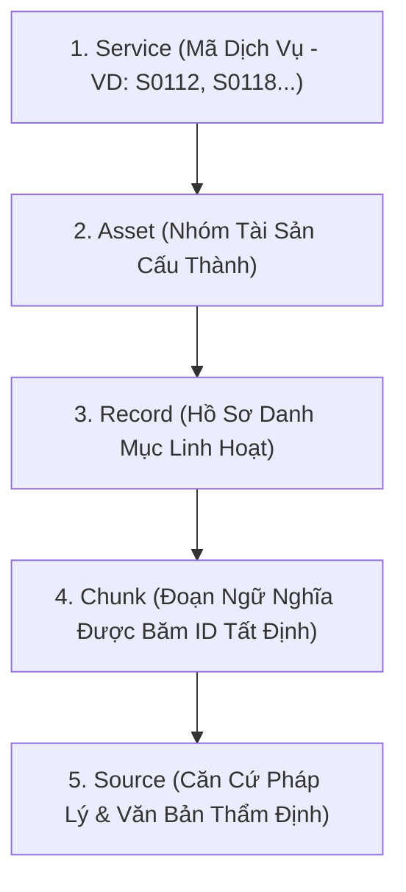

# KỸ NĂNG CHUẨN HÓA DỮ LIỆU & SEMANTIC CHUNKING (canonical-chunker)

## 1. MỤC ĐÍCH & NGUYÊN TẮC THIẾT KẾ MỀM
Trong dự án **GASCOLAE SkyLink**, tri thức về các gói dịch vụ máy bay không người lái (Drone Service Assets) rất đa dạng và phức tạp. Nếu chia mảnh theo kích thước cố định (fixed-size chunking như 500 ký tự), các thông tin ràng buộc về điều kiện bay, thông số cảm biến, diện tích và SLA sẽ bị cắt vụn, gây mất ngữ cảnh nghiêm trọng khi truy vấn.

Kỹ năng này hướng dẫn triển khai **Schema-Aware Semantic Chunking** có khả năng tùy biến cao:
- **Mô hình Canonical 5 cấp mở rộng**: Cấu trúc linh hoạt từ Dịch vụ đến Nguồn tham chiếu, cho phép bổ sung các loại bản ghi (Record Types) mới mà không làm vỡ schema.
- **Thuật toán băm Deterministic tham số hóa**: Cho phép cấu hình độ dài hash, tiền tố (prefix), và ký tự phân cách linh hoạt.
- **Metadata thích ứng**: Tự động kế thừa và làm giàu thuộc tính theo từng nhóm nghiệp vụ.

---

## 2. KIẾN TRÚC MÔ HÌNH DỮ LIỆU CANONICAL 5 CẤP



### Các nhóm Record Type chuẩn & Khả năng mở rộng:
Hệ thống hỗ trợ danh mục Record Types phong phú và cho phép đăng ký thêm loại mới:
- `overview`: Giới thiệu tổng quan dịch vụ.
- `customer_problem`: Vấn đề khách hàng gặp phải (nấm bệnh, đồi dốc, thiếu nhân công).
- `capability`: Năng lực thực thi (cảm biến đa phổ, độ phân giải GSD, diện tích quét/ngày).
- `use_case`: Tình huống ứng dụng thực tế theo từng ngành nghề.
- `service_level`: Mức độ cam kết chất lượng dịch vụ (SLA, thời gian xử lý ảnh).
- `deliverable`: Sản phẩm bàn giao (bản đồ trực giao Orthomosaic, báo cáo phân tích NDVI).
- `condition`: Điều kiện triển khai (giới hạn gió cấp 5, góc nghiêng đồi dốc, giấy phép bay).
- `faq_and_gap`: Câu hỏi thường gặp và khoảng trống cần khảo sát thêm.
- *(Mở rộng)*: Hỗ trợ thêm các loại record đặc thù như `telemetry_spec`, `flight_zone_permit` khi mở rộng quy mô.

---

## 3. THUẬT TOÁN BĂM TẤT ĐỊNH THAM SỐ HÓA (`chunkIdGenerator.ts`)

Mã `chunk_id` được sinh từ thuật toán băm tất định (Deterministic Hash) có thể điều chỉnh qua tham số:

```typescript
import { createHash } from 'crypto';

export interface ChunkIdOptions {
  prefix?: string;         // Mặc định: 'CHK'
  separator?: string;      // Mặc định: '-'
  hashLength?: number;     // Mặc định: 16 ký tự
  algorithm?: string;      // Mặc định: 'sha256'
  recordTypeAbbrLen?: number; // Mặc định: 4 ký tự viết tắt
}

export function generateDeterministicChunkId(
  serviceId: string,
  recordType: string,
  normalizedIndex: number,
  content: string,
  options: ChunkIdOptions = {}
): string {
  const prefix = options.prefix ?? (process.env.CHUNK_ID_PREFIX || 'CHK');
  const sep = options.separator ?? '-';
  const hashLength = options.hashLength ?? 16;
  const algo = options.algorithm ?? 'sha256';
  const abbrLen = options.recordTypeAbbrLen ?? 4;

  // 1. Chuẩn hóa nội dung (xóa khoảng trắng thừa, đưa về chữ thường)
  const cleanContent = content.trim().toLowerCase().replace(/\s+/g, ' ');

  // 2. Tạo chuỗi seed hạt giống duy nhất
  const rawSeed = `${serviceId}:${recordType}:${normalizedIndex}:${cleanContent}`;

  // 3. Tính toán hash
  const hash = createHash(algo).update(rawSeed, 'utf8').digest('hex').substring(0, hashLength);

  // 4. Định dạng mã định danh
  const typeAbbr = recordType.replace(/[^a-zA-Z0-9]/g, '').toUpperCase().substring(0, abbrLen);
  return `${prefix}${sep}${serviceId}${sep}${typeAbbr}${sep}${hash}`;
}
```

---

## 4. SCHEMA METADATA LINH HOẠT CỦA MỖI CHUNK

```json
{
  "chunk_id": "CHK-S0112-COND-8f4b2a1c0d9e3f7a",
  "service_id": "S0112",
  "asset_code": "CODE_02",
  "record_type": "condition",
  "section_title": "Điều Kiện Địa Hình & Thời Tiết Khai Thác",
  "content": "Khu vực quét đồi dốc tối đa 30 độ. Không triển khai bay khi sức gió vượt quá cấp 5 (>10.7 m/s) hoặc trời có mưa phùn/độ ẩm không khí trên 90%. Bắt buộc có giấy phép bay từ Cơ quan Quản lý Không phận Quân khu sở tại.",
  "evidence_source_ids": ["SRC-VN-CAAV-2024", "SRC-TECH-SPEC-S0112"],
  "visibility": "internal",
  "status": "verified",
  "version": 1,
  "custom_attributes": {
    "max_slope_degrees": 30,
    "max_wind_speed_ms": 10.7
  }
}
```

---

## 5. CHECKLIST NGHIỆM THU CHUNKING
- [ ] Hàm sinh `chunk_id` có thể cấu hình prefix và hashLength linh hoạt.
- [ ] Không giới hạn cứng danh sách record types, cho phép mở rộng các trường đặc thù vào `custom_attributes`.
- [ ] Toàn bộ chunk hợp lệ đều có ít nhất một mã nguồn tham chiếu `evidence_source_ids`.
