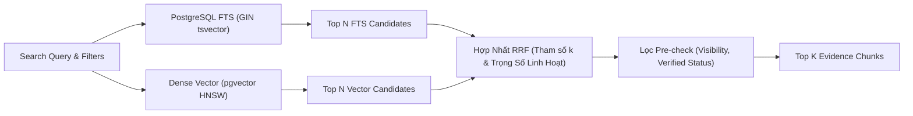

# KỸ NĂNG TRUY VẤN LAI HYBRID RETRIEVAL (hybrid-retrieval)

## 1. NGUYÊN LÝ KỸ THUẬT & TÍNH LINH HOẠT CỦA BỘ TRỘN RRF
Trong bài toán tư vấn dịch vụ SkyLink:
- **Vector Search (pgvector)**: Rất mạnh về hiểu ngữ nghĩa, từ đồng nghĩa và ý định của khách hàng (ví dụ: "bệnh đốm lá" khớp với "nhiễm nấm hại cây trồng").
- **Full-Text Search (GIN tsvector)**: Rất mạnh về khớp từ khóa chính xác, mã hiệu kỹ thuật và con số cụ thể (ví dụ: mã `S0112`, cảm biến `RedEdge-P`, diện tích `500ha`).
- **Thiết kế tham số hóa (Configurable Hybrid Engine)**: Không ghi cứng hệ số xếp hạng. Hệ số điều hòa $k$ trong RRF, trọng số giữa FTS và Vector (`weights`), giới hạn số lượng ứng viên (`candidate_limit`) đều được cấu hình động thông qua đối tượng tùy chọn.

---

## 2. KIẾN TRÚC TRUY VẤN HYBRID THAM SỐ HÓA



---

## 3. CÚ PHÁP SQL HYBRID THAM SỐ HÓA TRÊN POSTGRESQL

```sql
-- Cú pháp Hybrid Search hỗ trợ tham số hóa toàn diện
WITH fts_search AS (
  SELECT 
    id, chunk_id, service_id, content, evidence_source_ids, visibility, status,
    ROW_NUMBER() OVER (
      ORDER BY ts_rank_cd(fts_tokens, websearch_to_tsquery('simple', :search_query)) DESC
    ) AS fts_rank
  FROM service_chunks
  WHERE 
    status = 'verified'
    AND visibility = ANY(:allowed_visibilities)
    AND fts_tokens @@ websearch_to_tsquery('simple', :search_query)
  LIMIT :candidate_limit
),
vector_search AS (
  SELECT 
    id, chunk_id, service_id, content, evidence_source_ids, visibility, status,
    ROW_NUMBER() OVER (
      ORDER BY embedding <=> :query_vector
    ) AS vec_rank
  FROM service_chunks
  WHERE 
    status = 'verified'
    AND visibility = ANY(:allowed_visibilities)
  LIMIT :candidate_limit
)
SELECT 
  COALESCE(f.chunk_id, v.chunk_id) AS chunk_id,
  COALESCE(f.service_id, v.service_id) AS service_id,
  COALESCE(f.content, v.content) AS content,
  COALESCE(f.evidence_source_ids, v.evidence_source_ids) AS evidence_source_ids,
  COALESCE(f.visibility, v.visibility) AS visibility,
  (
    COALESCE(:fts_weight / (:rrf_k + f.fts_rank), 0.0) +
    COALESCE(:vector_weight / (:rrf_k + v.vec_rank), 0.0)
  ) AS rrf_score
FROM fts_search f
FULL OUTER JOIN vector_search v ON f.id = v.id
ORDER BY rrf_score DESC
LIMIT :limit_top_chunks;
```

---

## 4. DỊCH VỤ TRUY VẤN LINH HOẠT TRONG NESTJS (`hybridRetrieval.service.ts`)

```typescript
export interface HybridSearchOptions {
  rrfK?: number;             // Mặc định: 60 (giá trị chuẩn công nghiệp)
  ftsWeight?: number;        // Mặc định: 1.0 (có thể tăng nếu cần ưu tiên từ khóa chính xác)
  vectorWeight?: number;     // Mặc định: 1.0 (có thể tăng nếu cần ưu tiên ngữ nghĩa rộng)
  candidateLimit?: number;   // Số ứng viên mỗi nhánh (mặc định: 25)
  topK?: number;             // Số chunk trả về cuối cùng (mặc định: 5)
}

export class HybridRetrievalService {
  async executeHybridSearch(
    queryText: string,
    queryVector: number[],
    allowedVisibilities: string[],
    options: HybridSearchOptions = {}
  ) {
    const rrfK = options.rrfK ?? Number(process.env.HYBRID_RRF_K) || 60;
    const ftsWeight = options.ftsWeight ?? Number(process.env.HYBRID_FTS_WEIGHT) || 1.0;
    const vectorWeight = options.vectorWeight ?? Number(process.env.HYBRID_VECTOR_WEIGHT) || 1.0;
    const candidateLimit = options.candidateLimit ?? 25;
    const limitTopChunks = options.topK ?? 5;

    // Thực thi query với các tham số linh hoạt
    return await this.prisma.$queryRawUnsafe(
      /* SQL query parameterized */
      queryText,
      queryVector,
      allowedVisibilities,
      candidateLimit,
      ftsWeight,
      vectorWeight,
      rrfK,
      limitTopChunks
    );
  }
}
```

---

## 5. NGUYÊN TẮC BẢO MẬT & TRẢI NGHIỆM NGƯỜI DÙNG
1. **Phân quyền động**: Danh sách `:allowed_visibilities` được gán động theo quyền thực tế của người dùng từ Token payload (`['public', 'internal']` cho Sales, mở rộng thêm `'restricted'` nếu có quyền `SERVICE_VIEW_RESTRICTED`).
2. **Ẩn điểm số kỹ thuật**: Trường `rrf_score` chỉ dùng để sort nội bộ trên Database, không trả về Mobile UI để tránh gây khó hiểu cho Sales.
