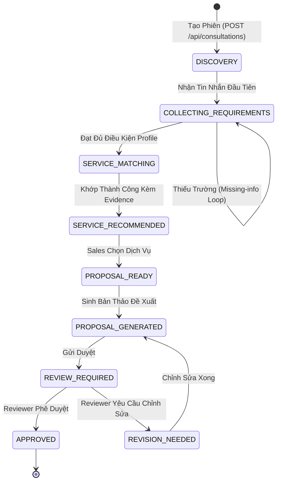

# KỸ NĂNG QUẢN TRỊ MÁY TRẠNG THÁI TƯ VẤN (stateful-consultation)

## 1. NGUYÊN TẮC THIẾT KẾ ĐỘNG (PROFILE-DRIVEN CONSULTATION)
Trong hệ thống GASCOLAE SkyLink, các gói dịch vụ có thể thuộc nhiều lĩnh vực khác nhau (Bay quét viễn thám, Phun thuốc bảo vệ thực vật, Phân tích dữ liệu AI). Nếu gán cứng danh sách trường bắt buộc trong code, hệ thống sẽ không thể mở rộng sang các dịch vụ mới.

Kỹ năng này cung cấp kiến trúc **Hồ Sơ Nhu Cầu Cấu Hình (Requirement Profile Driven)**:
- **Quản lý danh sách trường qua Profile**: Mỗi nhóm dịch vụ định nghĩa danh sách trường cần thu thập kèm điều kiện xác thực riêng.
- **Bộ kiểm tra tất định động**: Hàm `detectMissingFields` nhận động hồ sơ cấu hình thay vì kiểm tra if-else cố định.
- **Clarification Loop động**: Prompt sinh câu hỏi làm rõ thích ứng với ngữ cảnh hội thoại và danh sách trường thiếu thực tế.

---

## 2. MÔ HÌNH VÒNG ĐỜI TRẠNG THÁI (STATE MACHINE)



---

## 3. ĐỊNH NGHĨA PROFILE NHU CẦU LINH HOẠT (`schemas/requirementProfile.ts`)

```typescript
import { z } from 'zod';

export interface FieldRequirementRule {
  key: string;
  label: string;
  minTextLength?: number;
  isRequired: boolean;
  clarificationPromptGuide: string;
}

export interface ServiceRequirementProfile {
  domain: string;
  requiredFields: FieldRequirementRule[];
}

// Hồ sơ mặc định cho nhóm dịch vụ Khảo Sát Drone Nông Nghiệp
export const defaultDroneSurveyProfile: ServiceRequirementProfile = {
  domain: 'DRONE_SURVEY',
  requiredFields: [
    {
      key: 'problem',
      label: 'Vấn đề khách hàng gặp phải',
      minTextLength: 10,
      isRequired: true,
      clarificationPromptGuide: 'Hỏi rõ về hiện tượng dịch bệnh, thất thoát hay nhu cầu khảo sát cụ thể.',
    },
    {
      key: 'objective',
      label: 'Mục tiêu giải pháp',
      minTextLength: 5,
      isRequired: true,
      clarificationPromptGuide: 'Xác định rõ mong muốn đo đạc, lập bản đồ hay phát hiện nấm bệnh.',
    },
    {
      key: 'deployment_context',
      label: 'Bối cảnh địa hình & diện tích',
      minTextLength: 3,
      isRequired: true,
      clarificationPromptGuide: 'Khảo sát địa hình (đồi dốc, đồng bằng) và diện tích canh tác (ha).',
    },
    {
      key: 'timeline_expectation',
      label: 'Thời gian mong muốn triển khai',
      minTextLength: 2,
      isRequired: true,
      clarificationPromptGuide: 'Thời điểm khách hàng mong muốn bắt đầu thực hiện chuyến bay.',
    }
  ],
};

export function detectMissingFieldsByProfile(
  extractedData: Record<string, any>,
  profile: ServiceRequirementProfile = defaultDroneSurveyProfile
): string[] {
  const missing: string[] = [];

  for (const rule of profile.requiredFields) {
    if (!rule.isRequired) continue;

    const value = extractedData[rule.key];
    if (value === undefined || value === null) {
      missing.push(rule.key);
      continue;
    }

    if (typeof value === 'string') {
      const minLength = rule.minTextLength || 1;
      if (value.trim().length < minLength) {
        missing.push(rule.key);
      }
    }
  }

  return missing;
}
```

---

## 4. CƠ CHẾ SINH CÂU HỎI LÀM RÕ ĐỘNG (DYNAMIC CLARIFICATION)

- Khi `missing_fields.length > 0`:
  - Trạng thái phiên giữ nguyên: `COLLECTING_REQUIREMENTS`.
  - Prompt tạo câu hỏi làm rõ được xây dựng động bằng cách nối các hướng dẫn `clarificationPromptGuide` của các trường còn thiếu:
    ```typescript
    export function buildClarificationPrompt(
      missingKeys: string[],
      profile: ServiceRequirementProfile,
      customerHistory: string
    ): string {
      const guidance = missingKeys
        .map(key => {
          const rule = profile.requiredFields.find(r => r.key === key);
          return `- ${rule?.label}: ${rule?.clarificationPromptGuide}`;
        })
        .join('\n');

      return `Khách hàng vừa trao đổi: "${customerHistory}".\n` +
             `Hiện tại hệ thống cần bổ sung các thông tin sau để chọn đúng dịch vụ:\n${guidance}\n` +
             `Hãy đặt 1 câu hỏi ngắn gọn, lịch thiệp, tự nhiên để thu thập đúng các thông tin này.`;
    }
    ```
- Khi `missing_fields.length === 0`:
  - Backend tự động kích hoạt chuyển trạng thái sang `SERVICE_MATCHING`.
