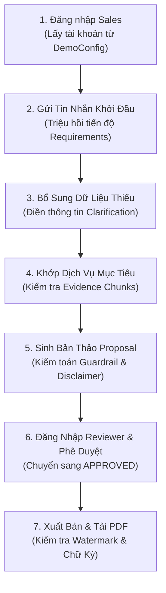

# KỸ NĂNG ĐIỀU PHỐI KỊCH BẢN DEMO END-TO-END (e2e-demo-orchestrator)

## 1. MỤC TIÊU NGHIỆM THU NGÀY 7 & THIẾT KẾ KỊCH BẢN THAM SỐ HÓA
Theo kế hoạch 7 ngày (D7-1 đến D7-6), cả 3 thành viên phải thực hiện bài diễn tập Demo 10 phút khép kín (Full Happy Path & Failure Paths) chứng minh tính khả thi của hệ thống trước Ban Lãnh đạo GASCOLAE.

Để tránh việc kịch bản bị "đóng cứng" vào một dịch vụ duy nhất, kỹ năng này cung cấp:
1. **Mô hình Kịch bản Cấu hình (Scenario Configuration)**: Cho phép thay đổi mã dịch vụ mục tiêu, thông tin người dùng và bộ tham số khảo sát thông qua tệp cấu hình JSON mà không cần viết lại quy trình.
2. **Kịch bản Mẫu 7 Bước Tiêu Chuẩn**: Sử dụng dịch vụ chuẩn **S0112** (hoặc bất kỳ dịch vụ nào trong catalog) làm dữ liệu thử nghiệm.
3. **Bộ Kiểm tra Hợp đồng Dữ liệu (Contract Drift Sentinel)**: Phát hiện sớm sự không tương thích giữa Zod Schema và Mobile UI.

---

## 2. ĐỊNH NGHĨA KỊCH BẢN THAM SỐ HÓA (`config/demoScenario.config.ts`)

```typescript
export interface DemoScenarioConfig {
  scenarioId: string;
  targetServiceId: string;
  targetServiceName: string;
  salesAccount: {
    email: string;
    role: string;
  };
  reviewerAccount: {
    email: string;
    role: string;
  };
  simulatedInputs: {
    initialMessage: string;
    clarificationResponses: Record<string, string>;
  };
  expectedEvidenceSourceIds: string[];
}

// Cấu hình kịch bản mẫu S0112 (có thể chuyển đổi sang S0118 hoặc dịch vụ khác)
export const activeDemoScenario: DemoScenarioConfig = {
  scenarioId: process.env.DEMO_SCENARIO_ID || 'SCENARIO-S0112-NDVI',
  targetServiceId: process.env.DEMO_TARGET_SERVICE_ID || 'S0112',
  targetServiceName: 'Dịch Vụ Bay Quét & Phân Tích Chỉ Số Thực Vật NDVI',
  salesAccount: {
    email: process.env.DEMO_SALES_EMAIL || 'sales@gascolae.internal',
    role: 'SALES',
  },
  reviewerAccount: {
    email: process.env.DEMO_REVIEWER_EMAIL || 'reviewer@gascolae.internal',
    role: 'REVIEWER',
  },
  simulatedInputs: {
    initialMessage: 'Tôi có khách hàng cần tìm giải pháp khảo sát bệnh hại cây trồng trên diện tích lớn.',
    clarificationResponses: {
      deployment_context: 'Khu vực đồi dốc khoảng 500ha tại Lâm Đồng.',
      timeline_expectation: 'Cần triển khai khảo sát trong tháng tới.',
    },
  },
  expectedEvidenceSourceIds: ['SRC-VN-CAAV-2024', 'SRC-TECH-SPEC-S0112'],
};
```

---

## 3. KỊCH BẢN DIỄN TẬP 10 PHÚT CHUẨN



### Chi tiết các bước thực hiện linh hoạt:
- **Phút 00:00 - 01:30 | Bước 1 & 2**: Đăng nhập tài khoản Sales cấu hình, gửi `initialMessage`. Giao diện hiển thị thanh tiến độ thu thập yêu cầu tính toán động.
- **Phút 01:30 - 03:00 | Bước 3**: Phản hồi các câu hỏi làm rõ theo `clarificationResponses`. Khi đạt 100% trường yêu cầu, mở khóa nút Khớp Dịch Vụ.
- **Phút 03:00 - 05:00 | Bước 4**: Hiển thị Card dịch vụ tương ứng với `targetServiceId`, mở Evidence Drawer kiểm tra các mã nguồn `expectedEvidenceSourceIds`.
- **Phút 05:00 - 07:00 | Bước 5**: Tạo Proposal Draft. Kiểm tra sự hiện diện của Tuyên bố miễn trừ pháp lý sơ bộ và danh mục `items_to_confirm`.
- **Phút 07:00 - 09:00 | Bước 6**: Đăng nhập tài khoản Reviewer, kiểm tra Audit report và bấm Approve.
- **Phút 09:00 - 10:00 | Bước 7**: Tải và hiển thị tệp PDF chính thức có dấu xác thực và định dạng chuẩn.

---

## 4. CHECKLIST NGHIỆM THU KHÔNG LỖI TRƯỚC GIỜ G (GO/NO-GO GATE)
- [ ] Tham số kịch bản được nạp qua file config, cho phép đổi service thử nghiệm trong 30 giây.
- [ ] Không có thao tác gõ lệnh terminal thủ công nào cần thực hiện trong suốt 10 phút demo.
- [ ] Đường truyền mạng nội bộ giữa client Expo và máy chủ NestJS được thử nghiệm sẵn sàng.
- [ ] Template DOCX và worker LibreOffice đã được cấp quyền ghi và đọc trong môi trường triển khai.
