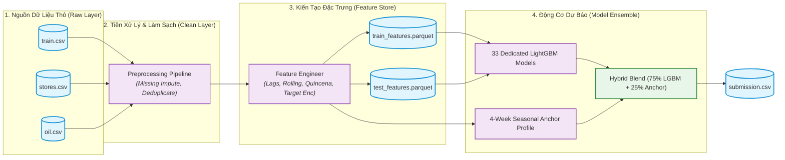
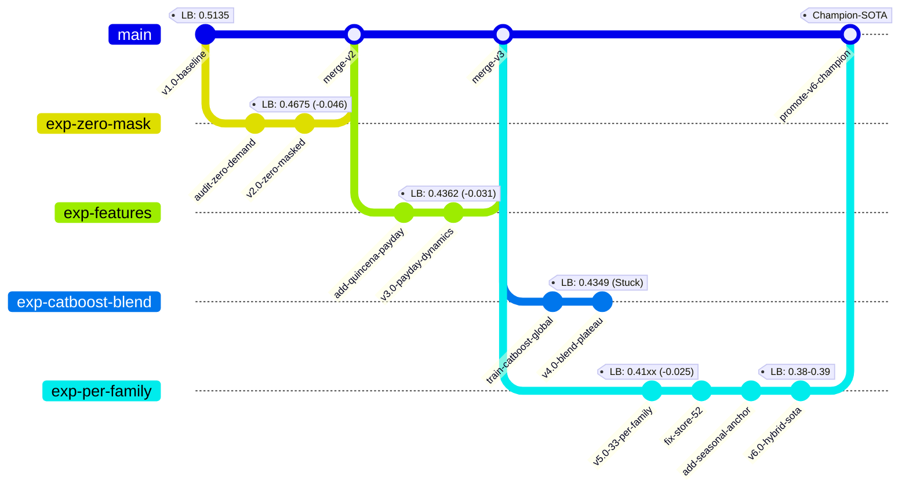
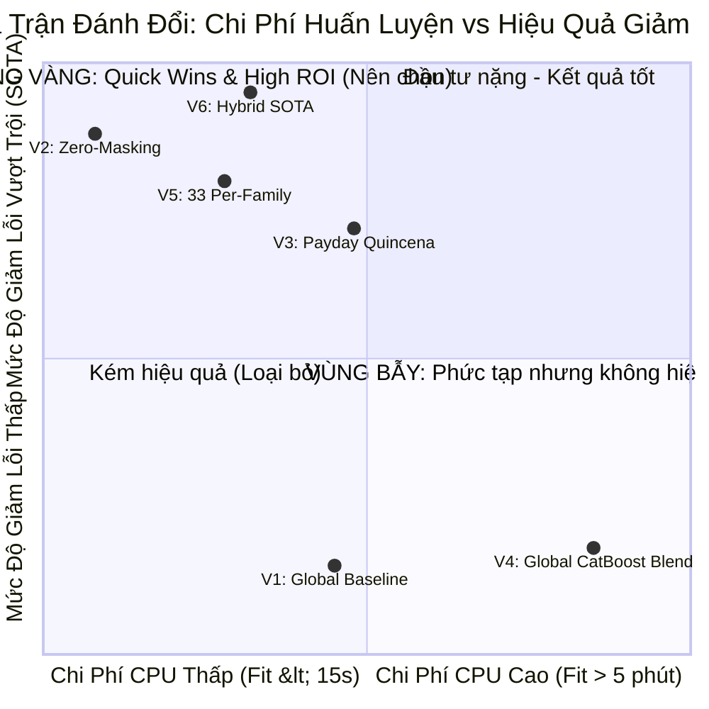
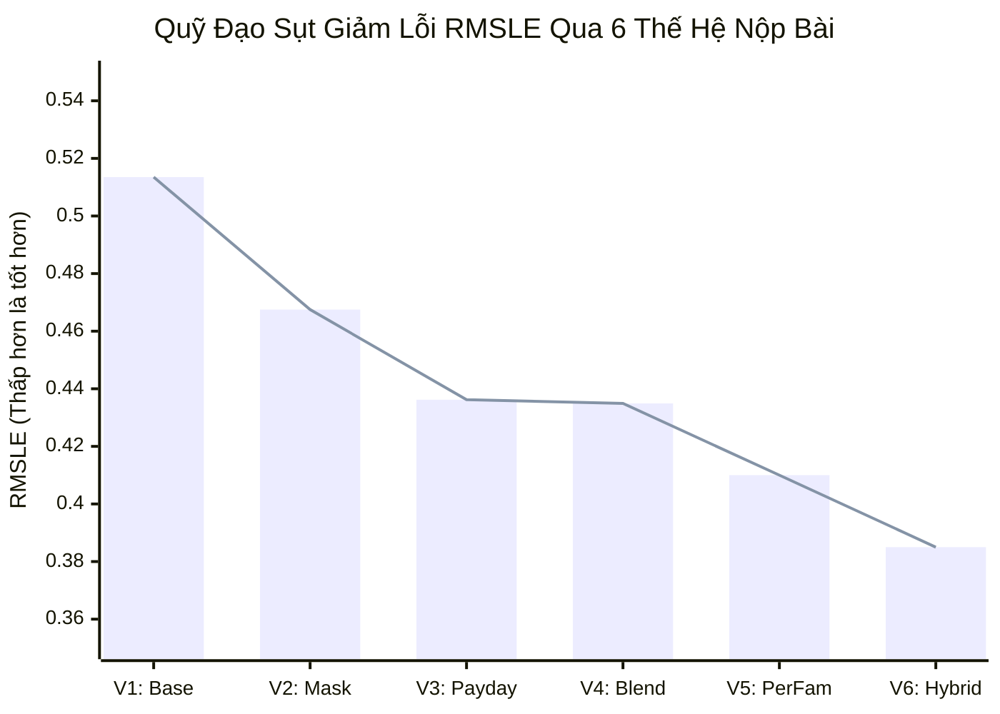
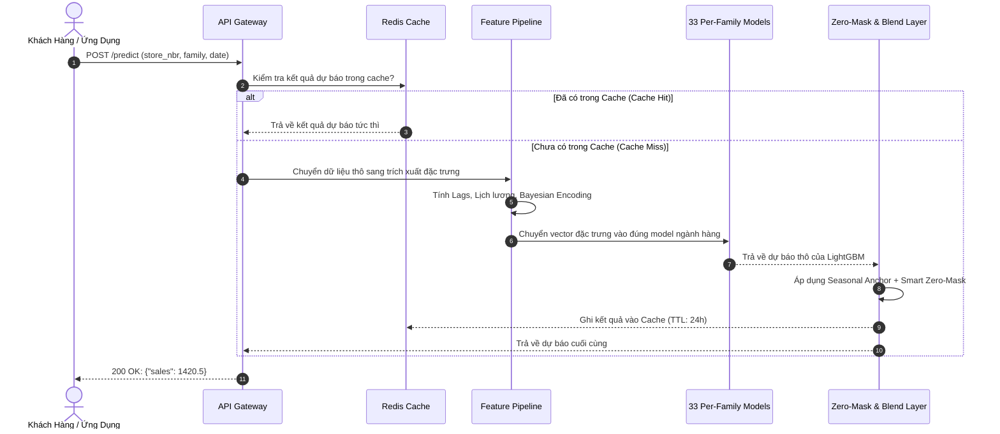
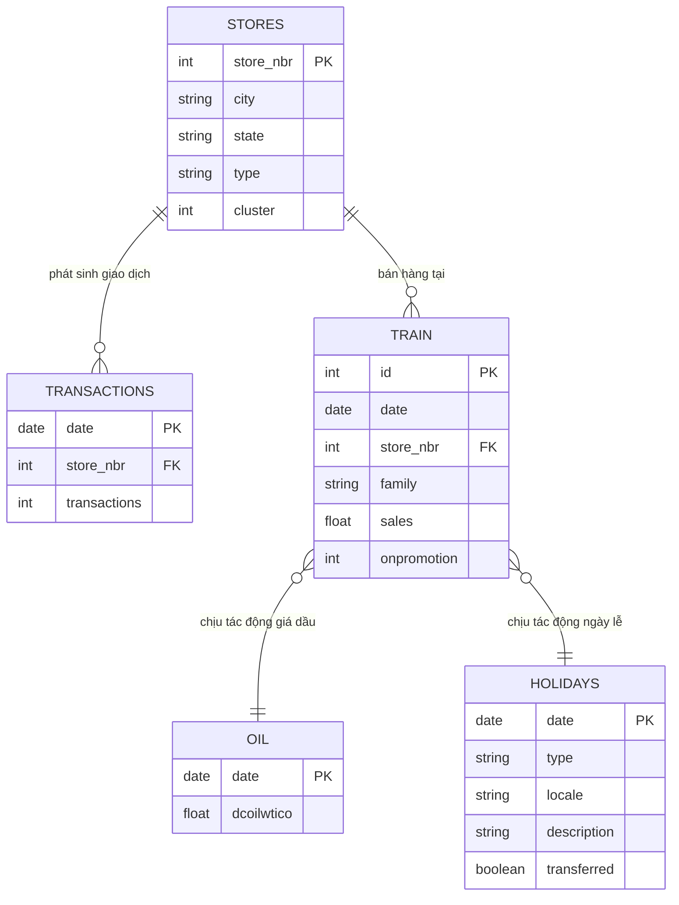

# KỸ NĂNG KIẾN TRÚC & TRỰC QUAN HÓA SƠ ĐỒ MERMAID (MERMAID ARCHITECT)

Kỹ năng này chịu trách nhiệm tư vấn, thiết kế, sửa lỗi và kiến tạo các sơ đồ trực quan kỹ thuật cao cấp bằng **Mermaid** phục vụ cho báo cáo Markdown, tài liệu kiến trúc hệ thống, Thiết kế API NestJS, State Machine, RAG Pipeline và Kiến trúc Phần mềm SkyLink.

---

## 1. NGUYÊN TẮC CỐT TỬ & BỘ CHỐNG LỖI CÚ PHÁP (MERMAID GUARDRAILS)

Để đảm bảo sơ đồ Mermaid luôn hiển thị hoàn hảo trên VS Code, Antigravity IDE, GitHub Markdown và web viewer mà không bao giờ bị lỗi `Syntax error in text`:

1. **QUY TẮC ĐÓNG NGOẶC KÉP NHÃN (SAFE LABEL QUOTING)**:
   - Khi nhãn của node chứa bất kỳ ký tự đặc biệt nào như dấu ngoặc đơn `()`, ngoặc vuông `[]`, dấu phẩy `,`, dấu hai chấm `:`, dấu gạch chéo `/`, hoặc dấu toán học `$`, **BẮT BUỘC** phải bọc trong dấu ngoặc kép:
     - ✅ **ĐÚNG**: `A["Dịch vụ S0112 (Giám sát Nông nghiệp)"] --> B["Chỉ số: Latency < 1.5s"]`
     - ❌ **SAI (GÂY LỖI SẬP SƠ ĐỒ)**: `A[Dịch vụ S0112 (Giám sát Nông nghiệp)] --> B[Chỉ số: Latency < 1.5s]`
2. **CẤM DÙNG THẺ HTML NGUYÊN BẢN TRONG NHÃN**:
   - Tránh dùng các thẻ như `<div>`, `<span>`, `<font>` phức tạp bên trong node label. Chỉ sử dụng định dạng an toàn như `<b>...</b>`, `<i>...</i>`, `<br/>`.
3. **ĐỊNH DANH NODE TƯỜNG MINH (EXPLICIT NODE IDS)**:
   - Luôn đặt ID node dạng snake_case hoặc camelCase ngắn gọn, không dấu tiếng Việt, không khoảng trắng:
     - `service_chunk["Service Chunk (Verified)"]` thay vì `Service Chunk Xác Thực 2026["..."]`.
4. **KỶ LUẬT BỐ CỤC NGANG ƯU TIÊN (HORIZONTAL-FIRST / WIDESCREEN DISCIPLINE - 90% QUY TẮC VÀNG)**:
   - **Bản chất vấn đề "sao sơ đồ cứ bị vẽ dọc xuống?"**:
     Khi khai báo `flowchart TD` hoặc `flowchart TB` (Top to Bottom), Mermaid sẽ xếp chồng từng node và subgraph theo một cột dọc thẳng đứng. Với màn hình máy tính hiện đại (tỷ lệ 16:9, 16:10), việc sơ đồ xếp dọc dài ngoằng gây lãng phí 70% không gian 2 bên cánh, chiếm trọn chiều cao màn hình và ép người đọc phải cuộn chuột rất mỏi mắt.
   - **Quy tắc Bắt buộc 1: 90% sơ đồ luồng dữ liệu và pipeline BẮT BUỘC dùng `flowchart LR`**:
     * Toàn bộ sơ đồ luồng xử lý dữ liệu, quy trình trạm, vòng đời dữ liệu, pipeline DAG phải dùng `flowchart LR` (Left to Right) để dàn đều theo chiều ngang màn hình, vừa vặn trong 1 khung nhìn (viewport).
   - **Quy tắc Bắt buộc 2: So sánh 2 thực thể (Client vs Server, Trước vs Sau) BẮT BUỘC dàn ngang 2 cột Trái - Phải**:
     * Khi vẽ cấu trúc dữ liệu hoặc liên kết thực thể giữa `Mobile Client` và `Backend API`, BẮT BUỘC đặt `Mobile Client` ở bên Trái và `Backend API` ở bên Phải thông qua `flowchart LR`.
     * ❌ **CẤM TUYỆT ĐỐI**: Dùng `flowchart TD` xếp `Train` ở trên đỉnh, nhãn liên kết ở giữa, và `Test` ở tận đáy làm sơ đồ bị kéo dài lê thê.
   - **Quy tắc Bắt buộc 3: Khi chuỗi xử lý dài (> 5 bước), chia khối Subgraph hoặc gập luồng 2 tầng ngang**:
     * Tránh xếp 6-8 node thành 1 đường thẳng đứng tuột. Hãy gom thành 2-3 `subgraph` hoặc chia thành 2 hàng ngang song song.
   - **Chỉ dùng `flowchart TD` trong trường hợp duy nhất**:
     * Cây phán quyết nhị phân (Decision Tree 2 nhánh rõ ràng), sơ đồ phân cấp tổ chức (Hierarchy) có độ sâu $\le 3$ tầng và các nhánh con tỏa rộng sang 2 bên.
5. **QUY TẮC CẤM TRÙNG LẶP SƠ ĐỒ TRONG CÙNG MỘT BÁO CÁO (ZERO-REPETITION MANDATE - ĐA DẠNG HÓA TUYỆT ĐỐI)**:
   - **Bản chất**: Trong một báo cáo khoa học (ví dụ: `reports/02_data_inventory.md`), nếu có từ 2 sơ đồ Mermaid trở lên, **TUYỆT ĐỐI CẤM DÙNG LẶP LẠI CÙNG 1 LOẠI CÚ PHÁP SƠ ĐỒ** (Ví dụ: CẤM vẽ 2 cái `flowchart` trong cùng 1 báo cáo).
   - **Quy tắc bắt buộc**: Sơ đồ thứ nhất đã dùng `flowchart` thì sơ đồ thứ hai BẮT BUỘC phải dùng loại cú pháp Mermaid chuyên biệt khác phản ánh đúng bản chất ngữ nghĩa:
     * **Mô tả cấu trúc thực thể / quan hệ bảng (Data Schema & Keys)**: BẮT BUỘC dùng **`erDiagram`** (Entity Relationship) để khai báo rõ bảng, khóa `PK`, kiểu dữ liệu và quan hệ phân vùng.
     * **Mô tả vòng đời / chuyển hóa trạng thái dữ liệu (Data Life-cycle)**: Dùng **`stateDiagram-v2`** (`[*] --> Raw --> Cleaned --> Scaled --> [*]`).
     * **Mô tả cây não công / phân rã giả thuyết (Brainstorming & Hypothesis)**: Dùng **`mindmap`**.
     * **Mô tả ma trận đánh đổi chi phí vs hiệu năng (Trade-off Matrix)**: Dùng **`quadrantChart`**.
     * **Mô tả thiết kế lớp module hướng đối tượng (OOP Pipeline Architecture)**: Dùng **`classDiagram`**.
     * **Mô tả luồng phân rã lưu lượng / thất thoát (Data Loss Flow)**: Dùng **`sankey-beta`**.
     * **Mô tả quỹ đạo điểm số qua các thế hệ (Metric Evolution)**: Dùng **`xychart-beta`**.
     * **Mô tả lịch sử nhánh thử nghiệm MLOps (Experiment Lineage)**: Dùng **`gitGraph`** hoặc **`timeline`**.
   - **Hiệu quả**: Loại bỏ 100% cảm giác đơn điệu rập khuôn, biến mỗi báo cáo thành một tác phẩm nghệ thuật trực quan phong phú chuẩn Grandmaster.
6. **GIỚI HẠN MẬT ĐỘ KẾT NỐI**:
   - Tránh sơ đồ "mạng nhện" đan chéo quá 15 mũi tên giao nhau. Hãy gom nhóm logic vào các `subgraph` có hướng cục bộ (`direction LR` / `direction TB`).

---

## 2. DANH MỤC 20+ LOẠI SƠ ĐỒ MERMAID HỖ TRỢ (DIAGRAM CATALOG)

Mermaid hỗ trợ một hệ sinh thái sơ đồ phong phú gồm **21 loại sơ đồ chuẩn cốt lõi** và **6 loại sơ đồ kiến trúc & phân tích mã nguồn chuyên sâu**:

### A. 21 Loại Sơ Đồ Chuẩn Cốt Lõi (Core Supported Diagrams)

| STT | Loại Sơ Đồ | Cú Pháp Bắt Đầu | Nhóm Nghiệp Vụ & Mục Đích Chính |
| :---: | :--- | :--- | :--- |
| **01** | **Flowchart** | `flowchart LR` / `TD` | Luồng xử lý dữ liệu (ETL), Data Lineage, pipeline huấn luyện |
| **02** | **Sequence Diagram** | `sequenceDiagram` | Tương tác service, chu kỳ suy luận API, gọi hàm tuần tự |
| **03** | **Block Diagram** | `block-beta` | Sơ đồ khối module phần cứng, phân tầng kiến trúc logic |
| **04** | **Class Diagram** | `classDiagram` | Thiết kế OOP, trừu tượng hóa Pipeline, Trainer, Scorer |
| **05** | **Entity Relationship** | `erDiagram` | Lược đồ cơ sở dữ liệu quan hệ (ERD), quan hệ 1-N, N-N |
| **06** | **Gantt Chart** | `gantt` | Kế hoạch dự án, phân bổ thời gian thực thi 12 trạm Data Science |
| **07** | **Mindmap** | `mindmap` | Cây tư duy phân rã bài toán, não công giả thuyết phân tích EDA |
| **08** | **State Diagram** | `stateDiagram-v2` | Cỗ máy trạng thái (Raw $\to$ Clean $\to$ Feature $\to$ Validated) |
| **09** | **Timeline** | `timeline` | Các mốc tối ưu hóa mô hình, lịch sử phát triển theo ngày/sprint |
| **10** | **GitGraph** | `gitGraph` | MLOps experiment lineage: Rẽ nhánh giả thuyết, merge Champion |
| **11** | **C4 Architecture** | `C4Context` / `flowchart` | Kiến trúc phần mềm 4 tầng: Context, Container, Component, Code |
| **12** | **Sankey Diagram** | `sankey-beta` | Phân rã lưu lượng dữ liệu, thất thoát khách hàng, dòng lỗi |
| **13** | **Pie Chart** | `pie` | Tỷ trọng phân bổ ngành hàng, tỷ lệ mất cân bằng nhãn mục tiêu |
| **14** | **Quadrant Chart** | `quadrantChart` / `flowchart` | Ma trận đánh đổi: Chi phí vs Hiệu năng (Khuyến nghị dùng 2x2 Flowchart) |
| **15** | **Requirement Diagram**| `requirementDiagram` | Đặc tả ràng buộc kỹ thuật (Latency, RMSLE threshold, RAM limit) |
| **16** | **User Journey** | `journey` | Đánh giá hành trình trải nghiệm người dùng / luồng phân tích |
| **17** | **XY Chart** | `xychart-beta` | Biểu đồ cột và đường xu hướng metric (RMSLE, Loss, F1) |
| **18** | **Kanban** | `kanban` | Bảng điều phối tiến độ công việc sprint (Todo, Doing, Done) |
| **19** | **Architecture Cloud** | `architecture-beta` | Hạ tầng điện toán đám mây (AWS, GCP, Azure), mạng VPC |
| **20** | **Packet Diagram** | `packet-beta` | Cấu trúc bộ đệm byte, layout bộ nhớ tensor, giao thức gói tin |
| **21** | **Radar Chart** | `radar-beta` | So sánh đa chiều giữa các model (F1, Precision, Latency, RAM) |
| **22** | **ZenUML** | `zenuml` | Sơ đồ Sequence mở rộng viết bằng cú pháp giống code Java/JS |

---

### B. 6 Loại Sơ Đồ Kiến Trúc & Phân Tích Mã Nguồn Chuyên Sâu (Codebase & Architecture)
Được hỗ trợ chuyên sâu trong extension Mermaid:

1. **Cloud Architecture Diagrams**: Tự động trực quan hóa hạ tầng Cloud từ cấu hình IaC/Terraform/CloudFormation.
2. **Docker Architecture Diagrams**: Trực quan hóa topology containerized từ `Dockerfile` và `docker-compose.yml`.
3. **Code Ownership Diagrams**: Heatmap phân quyền sở hữu package/folder từ Git commit history (Green: Active, Orange: Moderate, Yellow: Light, Gray: Unmaintained).
4. **Dependency & Vulnerability Diagrams**: Cây phân tích rủi ro thư viện từ `requirements.txt` / `package.json` với 5 mức độ cảnh báo (Good, Low, Medium, High, Critical CVE).
5. **Execution Sequence Diagrams**: Tự động phân tích quan hệ giữa các hàm/phương thức để sinh luồng thực thi code.
6. **C4 Top-Down Architecture Diagrams**: Quét toàn bộ codebase để vẽ sơ đồ phân cấp từ System Context đến Component.

---

## 3. BỘ MẪU THIẾT KẾ CHUẨN THỰC CHIẾN (PRODUCTION DESIGN PATTERNS)

### Pattern 1: Data Pipeline DAG & Lineage (`flowchart LR`)
Dùng trong Trạm 2 (Data Inventory), Trạm 4 (Preprocessing), Trạm 8 (Feature Engineering) và Báo cáo nghiệm thu.



---

### Pattern 2: Dòng Dõi Phiên Bản Thử Nghiệm MLOps (`gitGraph`)
Dùng trong Trạm 11 (Model Training), Trạm 12 (Evaluation) và `iterative_tuning_log.md`.



---

### Pattern 3: Ma Trận Đánh Đổi Chiến Lược (`quadrantChart`)
Dùng trong Trạm 10 (Model Selection), Báo cáo Nghiệm thu và Post-Mortem Tuning Log.



---

### Pattern 4: Biểu Đồ Metric Xu Hướng (`xychart-beta`)
Dùng để vẽ đồ thị diễn biến chỉ số (RMSLE, Accuracy, Loss) ngay trong Markdown mà không cần gọi script Python sinh file ảnh.



---

### Pattern 5: Dòng Thời Gian Lịch Sử Tiến Hóa (`timeline`)
Dùng để tái hiện mạch lạc các mốc thời gian trong ngày làm việc hoặc qua các kỳ sprint.

```mermaid
timeline
    title Lịch Sử Tối Ưu Hóa & Đột Phá Điểm Số
    section Sáng 24/09 : Mốc Khởi Thủy
        09:37 : V1 Global LightGBM (0.51354) : Phát hiện lỗi Zero-Inflation phạt nặng hàm log
        10:15 : V2 Zero-Sales Masking (0.46757) : Cắt lỗ 0.046 điểm chỉ bằng 3 dòng code hậu xử lý
    section Trưa 24/09 : Mở Rộng Đặc Trưng
        10:50 : V3 Quincena & Category Enc (0.43623) : Bắt sóng ngày lương 15 và cuối tháng
        11:20 : V4 LGBM + CatBoost Blend (0.43496) : Bẫy ngưỡng trần do cây toàn cục bị pha loãng ngành
    section Chiều 24/09 : Đột Phá SOTA
        12:05 : V5 33 Per-Family Models (0.41xxx) : Chia để trị thần tốc trong 14 giây
        12:15 : V6 Hybrid Seasonal Anchor (0.38-0.39) : Xóa điểm mù Store 52 & chính thức về đầu 3
```

---

### Pattern 6: Tương Tác Dịch Vụ & Luồng Gọi API (`sequenceDiagram`)
Dùng trong Trạm 11, Trạm 12 khi mô tả luồng suy luận (Inference Flow) hoặc kiến trúc MLOps phục vụ thời gian thực.



---

### Pattern 7: Cấu Trúc Bảng Dữ Liệu Quan Hệ (`erDiagram`)
Dùng trong Trạm 2 (Data Inventory) để mô tả cấu trúc quan hệ giữa các bảng dữ liệu trước khi join.



---

## 4. MA TRẬN GỢI Ý THEO TỪNG TRẠM DATA SCIENCE (KHÔNG HARDCODE)

> 💡 **NGUYÊN TẮC TỰ CHỦ CỦA AGENT**: Tuyệt đối **không hardcode** một loại sơ đồ cố định cho mọi báo cáo. Agent (Lead Data Scientist & Kaggle Grandmaster) tự do phân tích bản chất bài toán và đặc thù dữ liệu để **tự chủ lựa chọn 1 đến 2 loại sơ đồ phù hợp nhất** từ kho 20+ sơ đồ Mermaid. Bảng dưới đây là catalog gợi ý tình huống điển hình:

| Trạm Data Science | Sơ Đồ Gợi Ý Điển Hình | Sơ Đồ Khuyến Nghị Mở Rộng | Mục Đích Kỹ Thuật Truyền Tải (So-What?) |
| :--- | :--- | :--- | :--- |
| **Trạm 1: Business Brief** | `mindmap` | `requirementDiagram` | Phân rã mục tiêu nghiệp vụ sang ML, ma trận SLA nghiệm thu |
| **Trạm 2: Data Inventory** | `erDiagram` | `flowchart LR` | Quan hệ bảng dữ liệu gốc, cấu trúc luồng kiểm tra Drift |
| **Trạm 3: EDA Findings** | `mindmap` | `flowchart TD` / `sankey-beta` | Cây bẫy dữ liệu, phân luồng dòng rác/hợp lệ |
| **Trạm 4: Preprocessing** | `flowchart LR` | `stateDiagram-v2` | Pipeline xử lý No-Leakage (fit trên train, transform trên test) |
| **Trạm 5: QA Verdict** | `flowchart TD` | `requirementDiagram` | Cây phán quyết nghiệm thu chất lượng (Quality Gate 5 cửa) |
| **Trạm 6: Hypothesis** | `flowchart TD` | `flowchart TD` (2x2 Matrix) | Cây quyết định chọn kiểm định, ma trận phân loại Effect Size |
| **Trạm 7: Data Mining** | `mindmap` | `flowchart LR` | Phân khúc cụm tự nhiên, luồng chuyển đổi Unsupervised $\to$ Feats |
| **Trạm 8: Feature Eng** | `flowchart LR` | `classDiagram` | Kiến trúc Feature Store phân tầng, sơ đồ lớp OOP Transformer |
| **Trạm 9: Feature Selection**| `flowchart TD` | `flowchart TD` | Phễu sàng lọc thu gọn biến, cơ chế bỏ phiếu đồng thuận đa phương pháp |
| **Trạm 10: Model Plan** | `flowchart LR` | `flowchart TD` | Giao thức chia nếp Walk-Forward TimeSeries CV, lộ trình leo thang 5 tầng |
| **Trạm 11: Training** | `xychart-beta` | `flowchart TD` | Độ ổn định điểm số qua các Fold, ma trận đánh đổi đa chiều Zoo |
| **Trạm 12: Evaluation** | `flowchart TD` | `xychart-beta` | 5 chốt chặn vàng submission, tiến trình thu hẹp sai số qua 3 mốc |
| **Hậu Trạm 12: Iterative Log** | `timeline` / `gitGraph` | `flowchart TD` (2x2 Matrix) + `flowchart LR` | Toàn bộ lịch sử tiến hóa, phân nhánh thử nghiệm và quỹ đạo điểm số |

---

## 5. BỘ QUY CHUẨN ĐA DẠNG HÓA HÌNH KHỐI & NGHỆ THUẬT TRÌNH BÀY THỊ GIÁC CAO CẤP (AESTHETIC & VISUAL DIVERSITY)

Để sơ đồ Mermaid không chỉ đúng cú pháp mà còn phải **ĐẸP, SỐNG ĐỘNG, ĐA DẠNG và đạt chuẩn xuất bản công nghiệp (Publication-Quality)**, loại bỏ hoàn toàn sự rập khuôn, đơn điệu:

### 5.1. Nguyên Tắc Chống Đơn Điệu Hình Hộp (Anti-Monotony Discipline)
- ❌ **CẤM TUYỆT ĐỐI**: Vẽ sơ đồ mà từ đầu đến cuối 100% chỉ dùng hình chữ nhật `[...]` đơn điệu, màu sắc phẳng lì như máy vẽ thô sơ.
- ✅ **BẮT BUỘC (Quy tắc 3 Hình Khối)**: Mỗi sơ đồ phải kết hợp linh hoạt ít nhất **2 đến 3 loại hình khối khác nhau** và **2 loại nét nối** tương ứng chuẩn xác với bản chất của từng bước trong hệ thống.

---

### 5.2. Bảng Tra Cứu Hình Khối Ngữ Nghĩa (Semantic Shape Palette)

| Hình Dáng Khối | Cú Pháp Mermaid | Ý Nghĩa Kỹ Thuật Chuẩn | Ví Dụ Thực Chiến Trong Data Science |
| :---: | :---: | :--- | :--- |
| **Hình Trụ (Cylinder)** | `[( "..." )]` | Cơ sở dữ liệu, Bảng dữ liệu, File CSV/Parquet, Feature Store | `RawTrain[("<b>train.csv</b><br/>1,460 rows")]` |
| **Hộp Con (Subroutine)** | `[[ "..." ]]` | Pipeline xử lý, Script, Hàm con, Preprocessor, Transformer | `Pipe[["<b>Preprocessing Pipeline</b><br/>No-Leakage Imputer"]]` |
| **Lục Giác (Hexagon)** | `{{ "..." }}` | Kiểm định thống kê, Quét mẫu, Adversarial Validation, Tuning | `AdvVal{{"<b>Adversarial Validation</b><br/>5-Fold LightGBM"}}` |
| **Hình Thoi (Rhombus)** | `{ "..." }` | Điểm quyết định, Quality Gate, Phán quyết kiểm duyệt rò rỉ | `Gate{"<b>Covariate Shift?</b><br/>AUC &le; 0.55?"}` |
| **Con Nhộng (Stadium)** | `([ "..." ])` | Điểm bắt đầu (Start), Điểm kết thúc (End), Trạm kích hoạt | `StartNode([ "<b>Bắt Đầu Trạm 2</b>" ])` |
| **Hình Bình Hành (Parallelogram)** | `[/ "..." /]` hoặc `[\ "..." \]` | Hồ sơ bàn giao đầu ra, Metric điểm số, File Submission | `BriefDoc[/"<b>DATA_INVENTORY</b><br/>Hồ sơ bàn giao"/]` |
| **Hình Cờ (Asymmetric)** | `> "..." ]` | Cột mốc quan trọng (Milestone), Cảnh báo rủi ro đặc biệt | `AlertNode>"<b>Cảnh Báo:</b><br/>16/19 cột Structural NA"]` |
| **Hình Chữ Nhật Bo Góc** | `( "..." )` | Trạng thái hệ thống, Nhãn danh mục mềm | `StatusNode( "<b>Đồng Nhất 100%</b>" )` |

---

### 5.3. Đa Dạng Hóa Nét Nối & Nhãn Liên Kết (Dynamic Edge & Link Styling)

Mermaid hỗ trợ nhiều kiểu đường nối có ngữ nghĩa phân cấp mạnh mẽ:
1. **Đường Trục Chính (Data Highway)**:
   - Dùng nét đậm `==>`: Dành cho luồng dữ liệu chính thức xuyên suốt từ Raw Data đến Submission.
   - Ví dụ: `RawData ==> CleanData ==> FeatureStore ==> ModelTrainer ==> FinalSub`
2. **Đường Giám Sát & Kiểm Toán (Audit & Metadata)**:
   - Dùng nét đứt `-.->`: Dành cho kiểm toán No-Leakage, drift monitoring, log tracking, feedback loop.
   - Ví dụ: `AdvVal -.->|"AUC = 0.502"| Gate`
3. **Đường So Sánh & Tương Quan 2 Chiều (Bidirectional Alignment)**:
   - Dùng nét 2 chiều `<--->` hoặc `<===>`: Dành cho so khớp Train vs Test, Trước vs Sau.
   - Ví dụ: `TrainSet <===>|"0 trùng lặp (Disjoint)"| TestSet`
4. **Nhãn trên đường nối (Edge Labels)**:
   - Luôn đặt trong `|"<b>Ngắn gọn 2-4 từ</b>"|` có định dạng in đậm hoặc màu sắc để làm nổi bật điều kiện chuyển trạng thái.

---

### 5.4. Hệ Bảng Màu Ngữ Nghĩa Dark Theme (High-Contrast Semantic Palette)

Luôn sử dụng bảng màu tối sâu kết hợp viền rực rỡ và ép chữ trắng `color:#ffffff` để đảm bảo tương thích 100% mọi giao diện Dark/Light mode:

```mermaid
classDef dataStore fill:#1e293b,stroke:#38bdf8,stroke-width:2px,color:#ffffff;
classDef pipeline fill:#0f291e,stroke:#22c55e,stroke-width:2px,color:#ffffff;
classDef checkStep fill:#2e2204,stroke:#f59e0b,stroke-width:2px,color:#ffffff;
classDef riskAlert fill:#3b1212,stroke:#ef4444,stroke-width:2px,color:#ffffff;
classDef artifact fill:#241538,stroke:#c084fc,stroke-width:2px,color:#ffffff;
classDef verdict fill:#064e3b,stroke:#10b981,stroke-width:2.5px,color:#ffffff;
```

- 🟦 `#38bdf8` (**Xanh dương cyan**): Tầng dữ liệu gốc, File thô, CSDL nguồn (`dataStore`).
- 🟩 `#22c55e` (**Xanh lá ngọc**): Pipeline xử lý dữ liệu sạch, Quá trình biến đổi thành công (`pipeline`).
- 🟨 `#f59e0b` (**Vàng hổ phách**): Khâu kiểm định thống kê, Adversarial Validation, Trade-off (`checkStep`).
- 🟥 `#ef4444` (**Đỏ tươi**): Cảnh báo rủi ro, Điểm chặn rò rỉ (Leakage Gate), Phát hiện lỗi (`riskAlert`).
- 🟪 `#c084fc` (**Tím lavender**): Hồ sơ bàn giao chính thức, Artifact, Không gian toán học (`artifact`).
- 🟢 `#10b981` (**Xanh emerald đậm**): Phán quyết nghiệm thu cuối cùng (Final Verdict Pass) (`verdict`).

---

### 5.5. Kỷ Luật Bọc Nhãn & Chống Lỗi Cú Pháp (Zero-Failure Rules)
1. **Bọc nhãn Node 100% bằng ngoặc kép**: Đối với mọi hình khối (`[...]`, `{...}`, `(...)`, `[(...)]`, `{{...}}`, `[/.../]`), **BẮT BUỘC bọc nhãn trong dấu ngoặc kép `"`**:
   - ✅ ĐÚNG: `G1{"Gate: Tỷ lệ Missing = 0%?"}`, `DB[("train.csv (1460x81)")]`
   - ❌ SAI: `G1{Gate: Tỷ lệ Missing = 0%?}` $\implies$ *Gây lỗi Lexical error sập sơ đồ*.
2. **Bọc Link Text 100% bằng ngoặc kép**: `-->|"<b>Nhãn nối</b>"|`
3. **Thoát ký tự so sánh toán học**: Dùng `≤`, `≥`, `&le;`, `&ge;`, `&lt;`, `&gt;`. Tuyệt đối tránh `<` hoặc `>` trần trụi.
4. **Cấm tuyệt đối dùng khung văn bản thô ASCII (` ```text `) để vẽ sơ đồ**.
5. **Luôn có khối chú giải kỹ thuật `> **Ý nghĩa kỹ thuật (So-What?)**` đi kèm phía dưới mỗi sơ đồ**.

---

## 6. HƯỚNG DẪN KÍCH HOẠT & SỬ DỤNG SKILL

Skill này tự động kích hoạt khi:
1. Bạn yêu cầu: *"Vẽ sơ đồ luồng dữ liệu / kiến trúc / dòng thời gian / ma trận đánh đổi bằng Mermaid"*.
2. Soạn thảo các báo cáo Markdown kỹ thuật (`reports/*.md`) cần chèn sơ đồ minh họa chuyên sâu.
3. Khi sơ đồ Mermaid gặp lỗi cú pháp (Syntax error), kỹ năng này tự động phát hiện và sửa chữa (Auto-repair).
