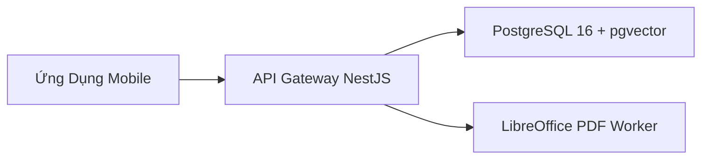
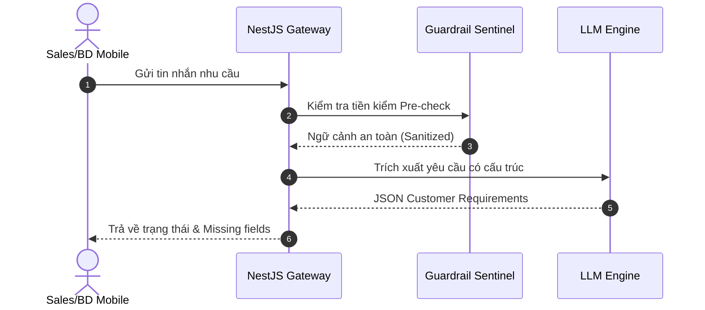

# MẪU BIỂU ĐỒ MERMAID CHUẨN THỰC CHIẾN (complete_diagram_samples.md)

## 1. Flowchart Horizontal-First (Khuyên Dùng)


## 2. Sequence Diagram (Xác Thực & Tư Vấn)


## 3. Git Graph (Phân Nhánh Kế Hoạch 7 Ngày)
```mermaid
gitgraph
    commit id: "init-repo"
    branch develop
    checkout develop
    commit id: "day1-foundation"
    commit id: "day2-knowledge-retrieval"
    commit id: "day3-consultation-flow"
    checkout main
    merge develop id: "mvp-v0.1-release" tag: "v0.1"
```
