# 📑 SỔ TAY CÚ PHÁP TOÀN DIỆN 20+ LOẠI SƠ ĐỒ MERMAID CHO DỰ ÁN SKYLINK (GASCOLAE)

> **MỤC ĐÍCH CỦA TỆP NÀY**: 
> Đây là kho mẫu cú pháp **Copy-Paste Nhanh** chuẩn 100% dành cho AI Agent và các thành viên dự án **GASCOLAE SkyLink** (Mai Tấn Giáp, Lê Phúc Khang, Nguyễn Quyết Giang Sơn).
> Toàn bộ các ví dụ được ánh xạ thực tế theo bài toán: **Ứng dụng Mobile Tư vấn Dịch vụ Nội bộ, Backend NestJS, PostgreSQL/Prisma + pgvector, Hybrid Retrieval, Stateful Consultation, 2 Tầng Guardrail Chống Ảo Giác và Pipeline Sinh Proposal DOCX/PDF**.
> Mọi sơ đồ đều tuân thủ nguyên tắc: **Horizontal-First (`flowchart LR`)** và **Safe Label Quoting (`["..."]`)** để không bao giờ bị lỗi cú pháp (`Syntax error`).

---

## 📌 BẢNG MỤC LỤC NHANH 20 LOẠI SƠ ĐỒ THỰC CHIẾN SKYLINK

| STT | Tên Sơ Đồ | Từ Khóa Cú Pháp | Trường Hợp Ứng Dụng Trong Dự Án SkyLink |
| :---: | :--- | :--- | :--- |
| **01** | [Flowchart (Đường Ống Dữ Liệu & RAG)](#1-flowchart-duong-ong-nap-du-lieu-va-hybrid-retrieval) | `flowchart LR` | Pipeline nạp Service Assets, Schema-Aware Chunking, Hybrid Search |
| **02** | [GitGraph (Nhánh Phát Triển Sprint MVP)](#2-gitgraph-quy-trinh-re-nhanh-sprint-mvp-7-ngay) | `gitGraph` | Quản lý nhánh tính năng Monorepo (`api`, `mobile`, `shared`, `ai`) |
| **03** | [Quadrant Chart (Ma Trận Đánh Đổi Kiến Trúc)](#3-quadrant-chart-ma-tran-danh-doi-giai-phap-ky-thuat) | `quadrantChart` | Đánh đổi: Độ an toàn AI vs Tốc độ triển khai, Quick Wins vs Bẫy kỹ thuật |
| **04** | [XY Chart (Đánh Giá Chất Lượng AI)](#4-xy-chart-bieu-do-danh-gia-chat-luong-ai--rag-metrics) | `xychart-beta` | Diễn biến Precision, Recall, Grounded Rate qua các phiên bản Prompt |
| **05** | [Timeline (Tiến Trình 7 Ngày MVP)](#5-timeline-tien-trinh-7-ngay-phat-trien-mvp) | `timeline` | Các mốc Checkpoint từng ngày từ Nền tảng (N1) đến Phát hành (N7) |
| **06** | [Sequence (Vòng Đời Gọi API & Tư Vấn)](#6-sequence-diagram-vong-doi-api-tu-van--doi-sanh-dich-vu) | `sequenceDiagram` | Luồng tương tác: Mobile App $\leftrightarrow$ NestJS Gateway $\leftrightarrow$ AI $\leftrightarrow$ Guardrail |
| **07** | [Entity Relationship (Lược Đồ Cơ Sở Dữ Liệu)](#7-entity-relationship-diagram-co-so-du-lieu-canonical-skylink) | `erDiagram` | Quan hệ bảng: `services`, `service_chunks`, `sessions`, `proposals` |
| **08** | [State Diagram (Máy Trạng Thái Tư Vấn)](#8-state-diagram-vong-doi-phien-tu-van-stateful-consultation) | `stateDiagram-v2` | Trạng thái: `DISCOVERY` $\to$ `REQUIREMENTS` $\to$ `MATCHING` $\to$ `APPROVED` |
| **09** | [Mindmap (Danh Mục Dịch Vụ GASCOLAE)](#9-mindmap-cay-phan-ra-danh-muc-dich-vu-gascolae) | `mindmap` | Cấu trúc phân rã dịch vụ: Drone nông nghiệp, logistics, an ninh, đo đạc |
| **10** | [Pie Chart (Phân Bổ Record Tri Thức)](#10-pie-chart-ty-le-phan-bo-loai-record-tri-thuc) | `pie` | Tỷ trọng các loại record: Overview, Capability, Problem, SLA, Deliverable |
| **11** | [Gantt Chart (Tiến Độ 3 Thành Viên)](#11-gantt-chart-ke-hoach-phan-bo-cong-viec-3-thanh-vien) | `gantt` | Lộ trình song song của Thành viên A (Mobile), B (Backend), C (AI/Data) |
| **12** | [Class Diagram (Kiến Trúc Module NestJS)](#12-class-diagram-thiet-ke-module-backend-nestjs) | `classDiagram` | Cấu trúc OOP: Controllers, Services, Adapters, Guardrails |
| **13** | [User Journey (Hành Trình Nhân Viên Sales)](#13-user-journey-hanh-trinh-tu-van-cua-sales-tren-mobile) | `journey` | Trải nghiệm Sales: Đăng nhập $\to$ Thu thập nhu cầu $\to$ Lập Proposal |
| **14** | [Sankey (Dòng Chảy Lọc Context Guardrail)](#14-sankey-diagram-dong-chay-thanh-loc-ngu-canh-qua-guardrail) | `sankey-beta` | Lọc Context: 100 Chunks $\to$ Pre-check $\to$ LLM $\to$ Post-check $\to$ Proposal |
| **15** | [Kanban (Bảng Điều Phối Task MVP)](#15-kanban-bang-dieu-phoi-nhiem-vu-sprint-mvp) | `kanban` | Quản lý tiến độ đầu việc P0 (Backlog, In Progress, Review, Done) |
| **16** | [Requirement Diagram (Đặc Tả Phi Chức Năng)](#16-requirement-diagram-dac-ta-yeu-cau-phi-chuc-nang--bao-mat) | `requirementDiagram` | Ràng buộc: Latency < 3s, Zero Hallucination, RBAC Sales/Admin |
| **17** | [C4 Architecture (Kiến Trúc Container C4)](#17-c4-architecture-kien-truc-he-thong-skylink-c4-container) | `flowchart TB` | Phân tầng: Expo App, NestJS API, PostgreSQL pgvector, Gemini API |
| **18** | [Block Diagram (Khối Service Intelligence Core)](#18-block-diagram-kien-truc-khoi-service-intelligence-core) | `block-beta` | Layout module: Ingestion, Chunker, Hybrid Engine, Orchestrator |
| **19** | [Packet Diagram (Cấu Trúc JWT & Token Header)](#19-packet-diagram-layout-goi-tin-jwt-access-token) | `packet-beta` | Cấu trúc byte/trường của JWT Token Payload cho Auth & RBAC |
| **20** | [Architecture Cloud (Môi Trường Triển Khai Docker)](#20-architecture-cloud-ha-tang-trien-khai-docker--production) | `flowchart TD` | Kết nối: Mobile Expo $\to$ Nginx Proxy $\to$ Docker Containers $\to$ DB |

---

## 1. Flowchart (Đường Ống Nạp Dữ Liệu và Hybrid Retrieval)
> **Ứng dụng**: Luồng xử lý từ Service Assets thô $\to$ Chuẩn hóa Canonical $\to$ Semantic Chunker $\to$ Hybrid Retrieval.
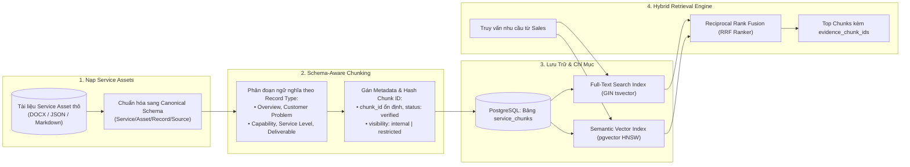

---

## 2. GitGraph (Quy Trình Rẽ Nhánh Sprint MVP 7 Ngày)
> **Ứng dụng**: Theo dõi quy trình branching phát triển Monorepo của 3 thành viên theo từng ngày.
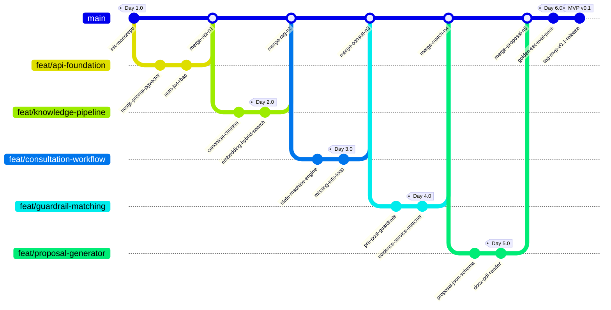

---

## 3. Quadrant Chart (Ma Trận Đánh Đổi Giải Pháp Kỹ Thuật)
> **Ứng dụng**: Đánh giá các quyết định kỹ thuật trong MVP SkyLink giữa Độ Phức Tạp Triển Khai vs Độ An Toàn & Tin Cậy Nghiệp Vụ.
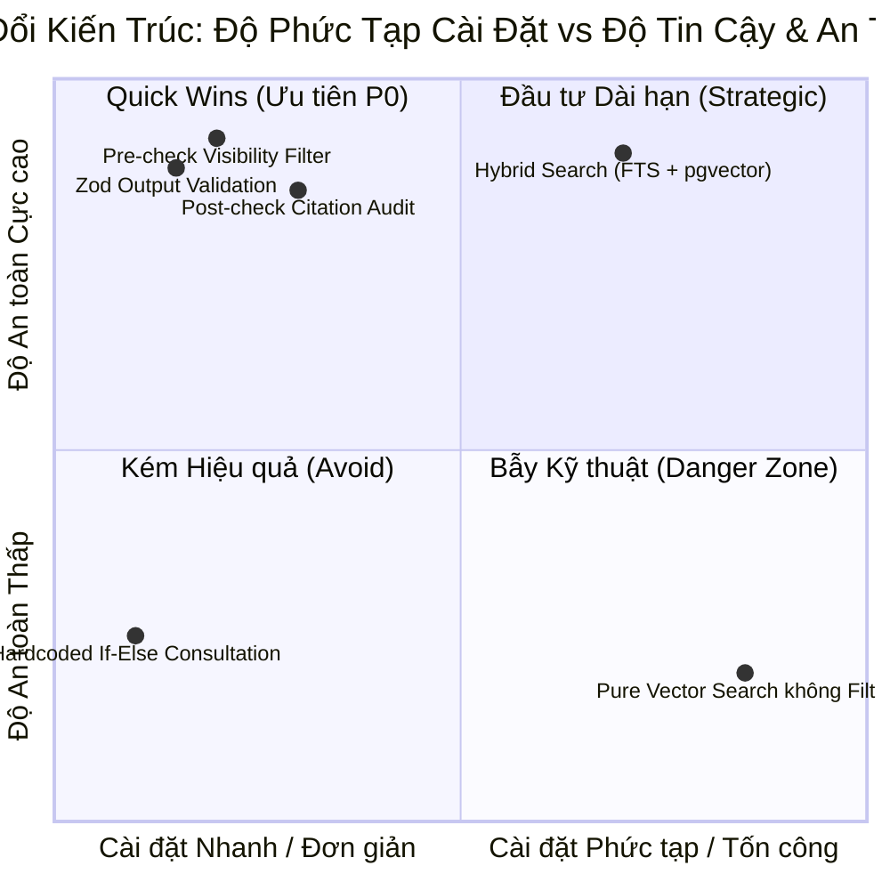

> [!TIP]
> **Khuyến Nghị Thiết Kế Giao Diện Tối: Dùng Ma Trận 2x2 bằng `flowchart TD` (Chống Đè Chữ)**:
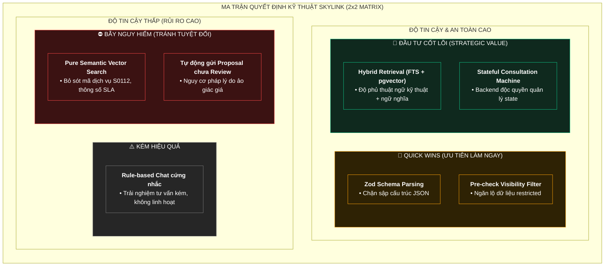

---

## 4. XY Chart (Biểu Đồ Đánh Giá Chất Lượng AI / RAG Metrics)
> **Ứng dụng**: Trực quan hóa kết quả kiểm thử bộ Golden Evaluation Set qua 4 phiên bản prompt/retrieval.
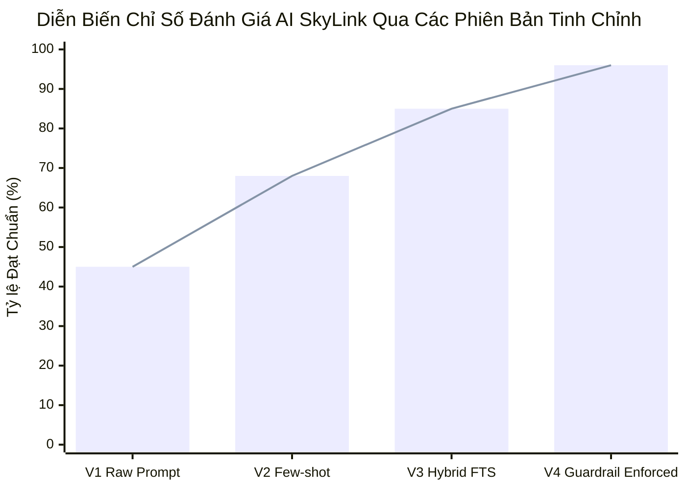

---

## 5. Timeline (Tiến Trình 7 Ngày Phát Triển MVP)
> **Ứng dụng**: Lịch trình thực thi chi tiết 7 ngày theo tài liệu `GASCOLAE_Ke_Hoach_MVP_7_Ngay_VI.md`.
```mermaid
timeline
    title Kế Hoạch 7 Ngày Triển Khai MVP SkyLink
    section Giai Đoạn 1: Khởi Tạo
        Ngày 1 : Nghiên Cứu Stack & Khởi Tạo Workspace : NestJS API + Expo Mobile Shell + Canonical Prototype
        Ngày 2 : Tra Cứu Tri Thức End-to-End : Nạp Full Services + Batch Embedding pgvector + Hybrid Search API
    section Giai Đoạn 2: Nghiệp Vụ Cốt Lõi
        Ngày 3 : Phiên Tư Vấn Stateful Consultation : Chat Session + Trích xuất Requirements + Missing-info Loop
        Ngày 4 : Service Matching Có Bằng Chứng : Matching Engine + Pre-check / Post-check Guardrails
    section Giai Đoạn 3: Sinh Đề Xuất & Bàn Giao
        Ngày 5 : Sinh Proposal Bản Thảo : Proposal Readiness + Sinh Structured JSON + Validation
        Ngày 6 : Human Review & Xuất Tài Liệu : Quyền Duyệt PROPOSAL_APPROVE + Render DOCX / PDF
        Ngày 7 : Kiểm Thử Golden Set & Phát Hành : Chốt Golden Eval Set + Hardening Secret + Tag Release v0.1
```

---

## 6. Sequence Diagram (Vòng Đời API Tư Vấn & Đối Sánh Dịch Vụ)
> **Ứng dụng**: Tương tác tuần tự giữa Sales Mobile App, NestJS API Gateway, RAG Retrieval, LLM Engine và Guardrail.
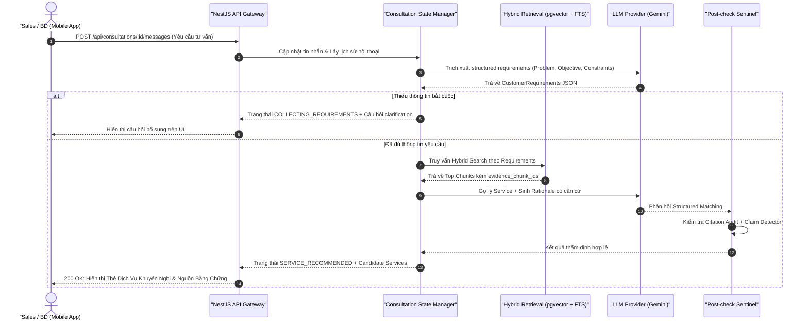

---

## 7. Entity Relationship Diagram (Cơ Sở Dữ Liệu Canonical SkyLink)
> **Ứng dụng**: Lược đồ quan hệ chuẩn hóa trong PostgreSQL/Prisma phục vụ cả nghiệp vụ lẫn RAG.
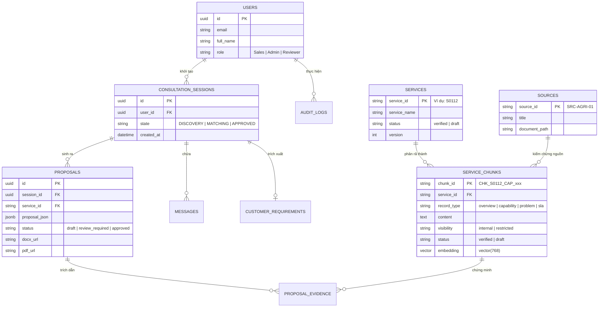

---

## 8. State Diagram (Vòng Đời Phiên Tư Vấn Stateful Consultation)
> **Ứng dụng**: Kiểm soát chặt chẽ máy trạng thái trên Backend; Mobile không thể tự đổi state.
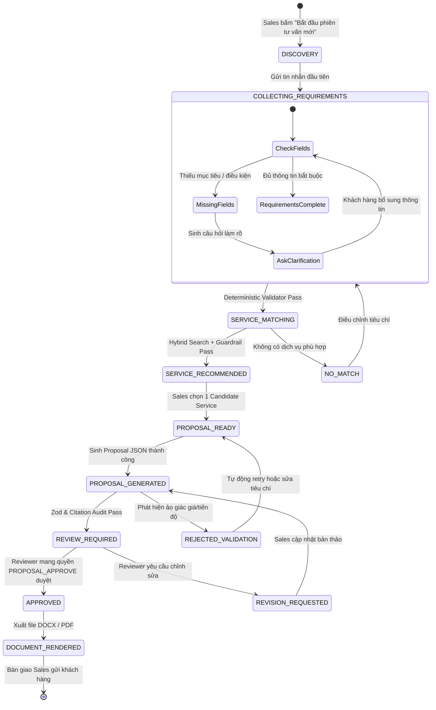

---

## 9. Mindmap (Cây Phân Rã Danh Mục Dịch Vụ GASCOLAE)
> **Ứng dụng**: Sơ đồ cấu trúc tri thức các dòng dịch vụ không phận & giải pháp Drone của GASCOLAE.
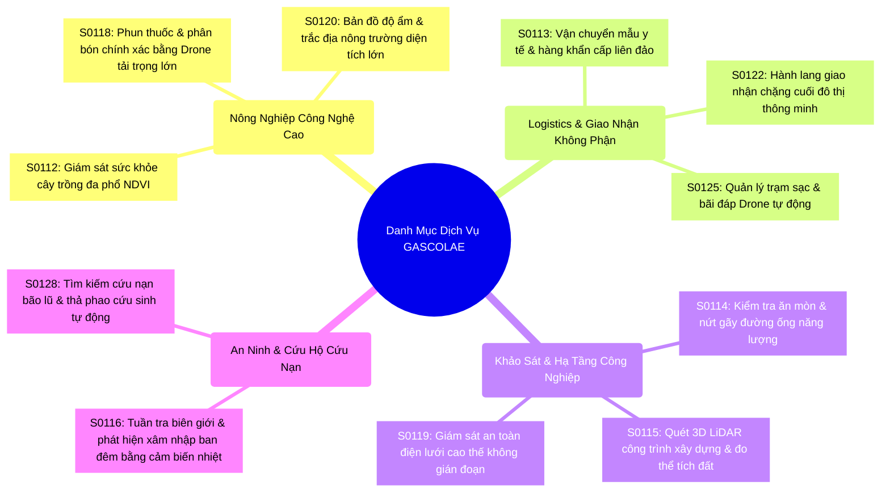

---

## 10. Pie Chart (Tỷ Lệ Phân Bổ Loại Record Tri Thức)
> **Ứng dụng**: Phân tích tỷ trọng các đơn vị tri thức trong Knowledge Base đã chuẩn hóa.
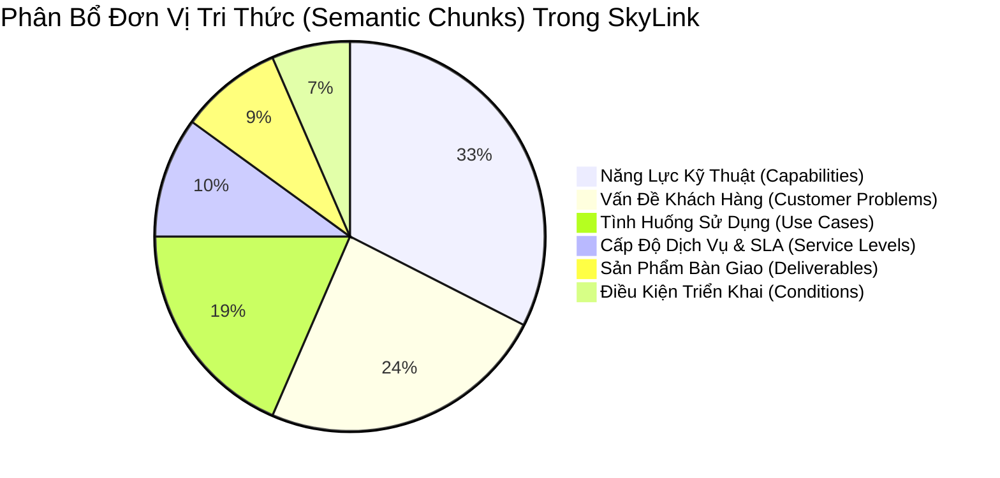

---

## 11. Gantt Chart (Kế Hoạch Phân Bổ Công Việc 3 Thành Viên)
> **Ứng dụng**: Quản lý tiến độ song song của 3 thành viên trong 7 ngày Sprint MVP.
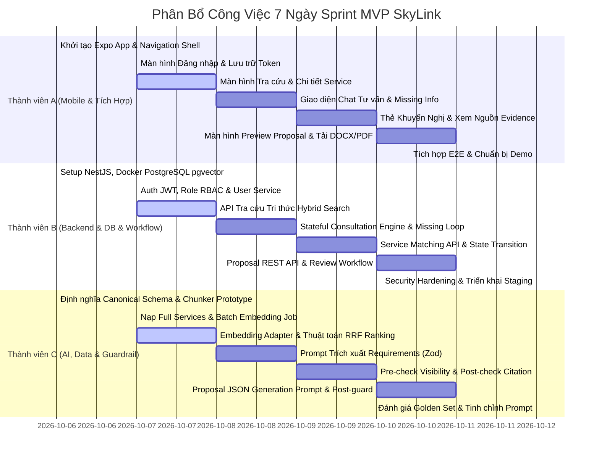

---

## 12. Class Diagram (Thiết Kế Module Backend NestJS)
> **Ứng dụng**: Kiến trúc mã nguồn hướng đối tượng của NestJS Backend.
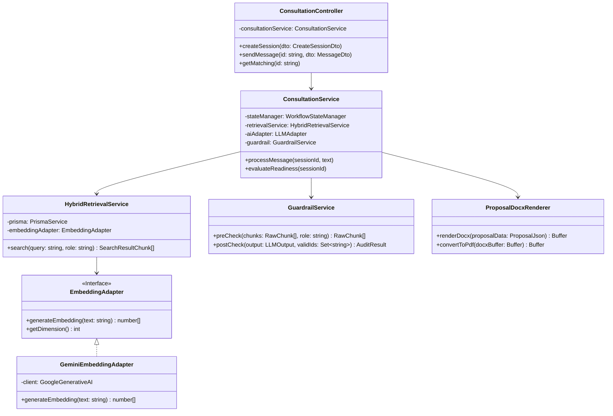

---

## 13. User Journey (Hành Trình Tư Vấn Của Sales Trên Mobile)
> **Ứng dụng**: Đánh giá trải nghiệm người dùng của nhân viên Sales từ lúc nhận khách đến khi có Proposal.
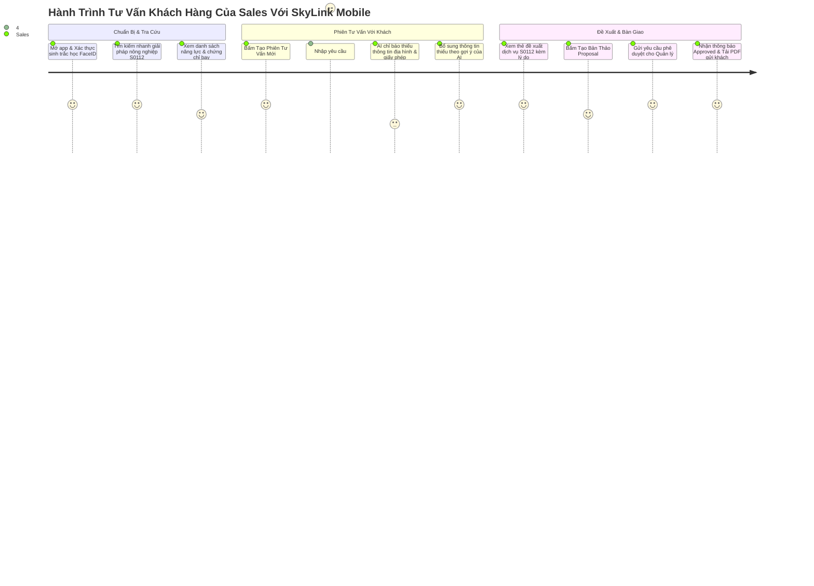

---

## 14. Sankey Diagram (Dòng Chảy Thanh Lọc Ngữ Cảnh Qua Guardrail)
> **Ứng dụng**: Trực quan hóa số lượng chunk dữ liệu được thanh lọc qua 2 tầng bảo vệ để triệt tiêu ảo giác.
```mermaid
sankey-beta
    Kho Tri Thức Toàn Cục (500 Chunks),Khớp Lệnh Hybrid Search (50 Chunks),50
    Kho Tri Thức Toàn Cục (500 Chunks),Không Liên Quan (450 Chunks),450
    Khớp Lệnh Hybrid Search (50 Chunks),Pre-check: Loại Bỏ Restricted (10 Chunks),10
    Khớp Lệnh Hybrid Search (50 Chunks),Pre-check: Giữ Lại Verified Chunks (40 Chunks),40
    Pre-check: Giữ Lại Verified Chunks (40 Chunks),Đưa Vào Prompt Context (40 Chunks),40
    Đưa Vào Prompt Context (40 Chunks),Post-check: Trích Dẫn Hợp Lệ Trong Proposal (8 Chunks),8
    Đưa Vào Prompt Context (40 Chunks),Không Trích Dẫn Nhưng Hỗ Trợ Ngữ Cảnh (32 Chunks),32
```

---

## 15. Kanban (Bảng Điều Phối Nhiệm Vụ Sprint MVP)
> **Ứng dụng**: Theo dõi trạng thái các đầu việc P0 trong bảng phân công 7 ngày.
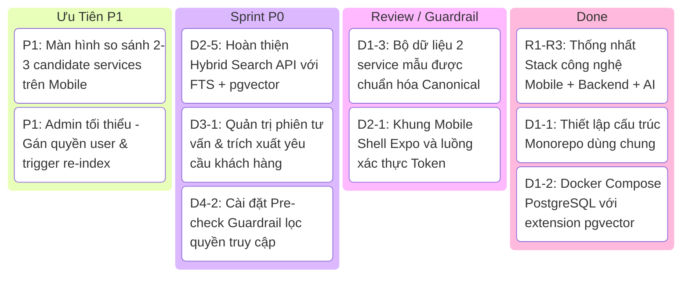

---

## 16. Requirement Diagram (Đặc Tả Yêu Cầu Phi Chức Năng & Bảo Mật)
> **Ứng dụng**: Quản lý ràng buộc kỹ thuật nghiêm ngặt trước khi đóng gói bản phát hành MVP v0.1.
```mermaid
requirementDiagram

    requirement req_hallucination {
        id: REQ-SAFE-01
        text: Tỷ lệ ảo giác (Hallucination) về Giá bán và Tiến độ phải bằng 0%
        risk: High
        verifymethod: Test
    }

    requirement req_grounding {
        id: REQ-SAFE-02
        text: 100% đề xuất trong Proposal phải gắn kèm chunk_id kiểm chứng
        risk: High
        verifymethod: Inspection
    }

    requirement req_latency {
        id: REQ-PERF-01
        text: Thời gian phản hồi API Hybrid Search phải dưới 1.5 giây
        risk: Medium
        verifymethod: Demonstration
    }

    requirement req_rbac {
        id: REQ-SEC-01
        text: User quyền Sales không thể truy cập chunk có visibility = restricted
        risk: High
        verifymethod: Test
    }

    element skylink_guardrail_system {
        type: Software Component
        docref: guardrail_discipline.md
    }

    skylink_guardrail_system - satisfies -> req_hallucination
    skylink_guardrail_system - satisfies -> req_grounding
    skylink_guardrail_system - satisfies -> req_rbac
```

---

## 17. C4 Architecture (Kiến Trúc Hệ Thống SkyLink C4 Container)
> **Ứng dụng**: Sơ đồ phân tầng kiến trúc tổng thể toàn hệ thống ở mức Container.
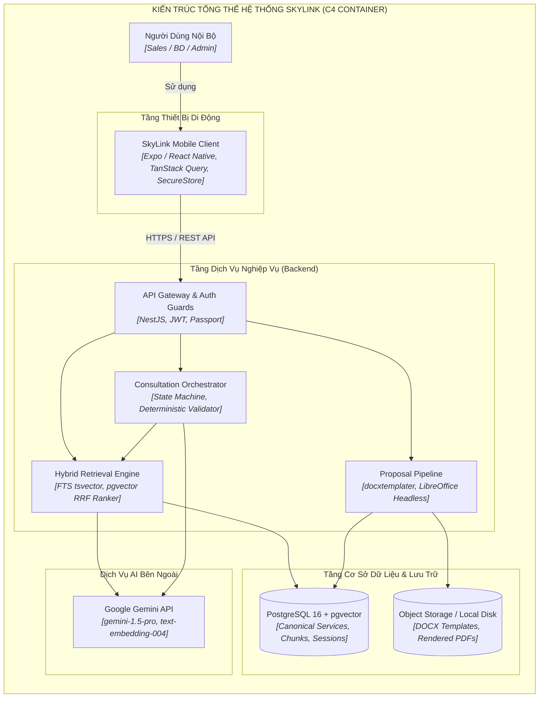

---

## 18. Block Diagram (Kiến Trúc Khối Service Intelligence Core)
> **Ứng dụng**: Sơ đồ cấu trúc các khối chức năng bên trong lõi Service Intelligence của SkyLink.
```mermaid
block-beta
    columns 3
    block:header:3
        h["LÕI TRÍ TUỆ DỊCH VỤ SKYLINK (SERVICE INTELLIGENCE CORE)"]
    end
    block:ingest["1. TẦNG NẠP TRI THỨC"]:1
        A["Service Asset Parser"]
        B["Canonical Normalizer"]
        C["Semantic Chunker"]
    end
    block:retrieval["2. TẦNG TRUY VẤN LAI"]:1
        D["FTS tsvector Search"]
        E["pgvector Cosine Search"]
        F["RRF Fusion Ranker"]
    end
    block:guard["3. TẦNG BẢO VỆ & OUTPUT"]:1
        G["Pre-check Visibility Filter"]
        H["Post-check Citation Auditor"]
        I["DOCX / PDF Generator"]
    end
    ingest --> retrieval
    retrieval --> guard
```

---

## 19. Packet Diagram (Layout Gói Tin JWT Access Token)
> **Ứng dụng**: Mô tả cấu trúc các trường trong Payload của JWT Token dùng cho Authentication & RBAC.
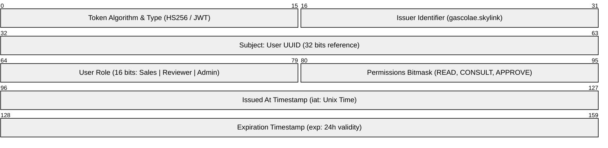

---

## 20. Architecture Cloud (Hạ Tầng Triển Khai Docker & Production)
> **Ứng dụng**: Trực quan hóa cấu trúc container hóa triển khai trên máy chủ môi trường Staging/Production.
```mermaid
flowchart TD
    subgraph ClientSide["Môi Trường Thiết Bị Đầu Cuối"]
        direction TB
        MobileApp["Ứng Dụng Mobile SkyLink<br/><i>[Android APK / iOS Internal Build]</i>"]
    end

    subgraph HostServer["Máy Chủ Triển Khai (Linux Host Server)"]
        direction TB
        Nginx["Reverse Proxy & SSL Termination<br/><i>[Nginx Container - Port 80/443]</i>"]
        
        subgraph DockerCompose["Docker Compose Stack"]
            direction LR
            NestApp["NestJS API Container<br/><i>[Node 20, Port 3000]</i>"]
            PostgresDB[("PostgreSQL 16 + pgvector<br/><i>[Port 5432, Persistent Volume]</i>")]
            LibreOffice["LibreOffice Headless<br/><i>[PDF Render Service]</i>"]
        end
    end

    subgraph ExternalCloud["Cloud Services"]
        GeminiAPI["Google Gemini AI Platform<br/><i>[REST HTTPS]</i>"]
    end

    MobileApp -->|HTTPS / WSS| Nginx
    Nginx --> NestApp
    NestApp --> PostgresDB
    NestApp --> LibreOffice
    NestApp --> GeminiAPI
```

---

## 💡 3 QUY TẮC BẤT BIẾN ĐỂ SƠ ĐỒ LUÔN HIỂN THỊ HOÀN HẢO:
1. **Luôn đóng ngoặc kép nhãn node**: `A["Tên nhãn có (ngoặc), dấu cách, số S0112"]` $\to$ Tránh 100% lỗi vỡ cú pháp.
2. **Quy tắc Bố cục Ngang Ưu Tiên (Horizontal-First)**: Luôn dùng `flowchart LR` cho luồng dữ liệu, RAG pipeline, và quy trình xử lý để tận dụng toàn bộ chiều rộng màn hình.
3. **Màu sắc Dark Theme độ tương phản cao**: Không dùng nền màu nhạt; luôn dùng viền đậm và màu chữ trắng sáng để chống tàng hình chữ trên màn hình tối.
