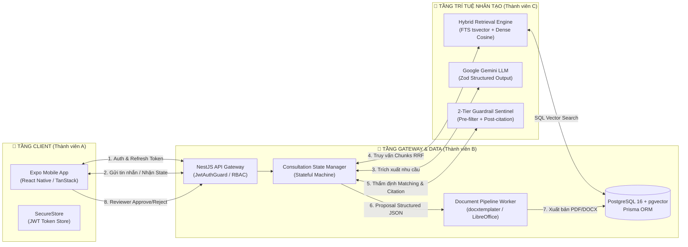

# 🚀 GASCOLAE SKYLINK — TRỢ LÝ DI ĐỘNG TƯ VẤN & LẬP ĐỀ XUẤT DỊCH VỤ

> **Dự án**: Extra Innovation Project — CT Group Internship 2026  
> **Đơn vị thực hiện**: Nhóm Thực tập sinh 03  
> **Mục tiêu**: Xây dựng trợ lý di động nội bộ thông minh hỗ trợ đội ngũ Sales/BD tư vấn giải pháp máy bay không người lái (UAV/Drone), đối sánh dịch vụ và tự động lập Proposal có kiểm chứng (anti-hallucination) trong 7 ngày.

---

## 👥 1. BẢNG PHÂN CÔNG TRÁCH NHIỆM THÀNH VIÊN (TEAM ASSIGNMENT MATRIX)

Dự án được phân bổ khoa học theo **3 trục năng lực kỹ thuật độc lập nhưng hiệp đồng chặt chẽ** với tổng quỹ thời gian **168 giờ (56 giờ/thành viên)** qua 42 đầu việc chuẩn:

| Thành Viên | Họ và Tên | Trục Trách Nhiệm Kỹ Thuật Chính | Phạm Vi Nghiệp Vụ & Mã Module Phụ Trách | Plugin / Kỹ Năng Agent Hỗ Trợ |
| :---: | :--- | :--- | :--- | :--- |
| **Thành viên A** | **Mai Tấn Giáp**<br/>*(56 giờ)* | **Mobile Client<br/>(Expo / React Native)** | • Khởi tạo Repo, Monorepo Workspace & Shared Types ([D1-1](./docs/GASCOLAE_Ke_Hoach_MVP_7_Ngay_VI.md))<br/>• Mobile Shell, Navigation Guard & Lưu trữ Token an toàn ([00_auth_rbac_spec.md](./docs/spec/00_auth_rbac_spec.md))<br/>• Danh mục Catalog, Tra cứu & Verification Badge ([06_knowledge_catalog_ingestion_spec.md](./docs/spec/06_knowledge_catalog_ingestion_spec.md))<br/>• Màn hình Chat tư vấn & Form Missing-Info ([01_consultation_workflow_spec.md](./docs/spec/01_consultation_workflow_spec.md))<br/>• Recommendation Cards & Evidence Drawer ([03_service_matching_guardrail_spec.md](./docs/spec/03_service_matching_guardrail_spec.md))<br/>• So sánh dịch vụ đa chiều P1 ([07_service_comparison_spec.md](./docs/spec/07_service_comparison_spec.md))<br/>• Proposal Preview, Review Queue & Trình đọc PDF nội bộ ([04_proposal_pipeline_spec.md](./docs/spec/04_proposal_pipeline_spec.md)) | **[`skylink-mobile-client`](./.agents/plugins/skylink-mobile-client/plugin.json)**<br/>• [`expo-mobile-architect`](./.agents/plugins/skylink-mobile-client/skills/expo-mobile-architect/SKILL.md)<br/>• [`mobile-ui-components`](./.agents/plugins/skylink-mobile-client/skills/mobile-ui-components/SKILL.md) |
| **Thành viên B** | **Lê Phúc Khang**<br/>*(56 giờ)* | **Backend Gateway & Database<br/>(NestJS / PostgreSQL / pgvector)** | • Kiến trúc Monorepo NestJS, Prisma ORM raw migration ([D1-2](./docs/GASCOLAE_Ke_Hoach_MVP_7_Ngay_VI.md))<br/>• Cấu hình Docker Compose: PostgreSQL 16 + pgvector ([devops-docker-libreoffice](./.agents/plugins/skylink-workflow-engine/skills/devops-docker-libreoffice/SKILL.md))<br/>• Xác thực JWT, Silent Refresh Token & Phân quyền RBAC 11 quyền ([00_auth_rbac_spec.md](./docs/spec/00_auth_rbac_spec.md))<br/>• Quản trị Máy trạng thái tư vấn (Stateful Machine) & Session Resume ([01_consultation_workflow_spec.md](./docs/spec/01_consultation_workflow_spec.md))<br/>• Pipeline sinh tài liệu DOCX (docxtemplater) & PDF (LibreOffice worker) ([04_proposal_pipeline_spec.md](./docs/spec/04_proposal_pipeline_spec.md))<br/>• Human-in-the-loop: Review Queue & Quyết định Approve/Reject ([04_proposal_pipeline_spec.md](./docs/spec/04_proposal_pipeline_spec.md))<br/>• Hệ thống Structured Logging & Vết kiểm toán bất biến ([08_audit_telemetry_spec.md](./docs/spec/08_audit_telemetry_spec.md)) | **[`skylink-workflow-engine`](./.agents/plugins/skylink-workflow-engine/plugin.json)**<br/>• [`stateful-consultation`](./.agents/plugins/skylink-workflow-engine/skills/stateful-consultation/SKILL.md)<br/>• [`proposal-pipeline`](./.agents/plugins/skylink-workflow-engine/skills/proposal-pipeline/SKILL.md)<br/>• [`devops-docker-libreoffice`](./.agents/plugins/skylink-workflow-engine/skills/devops-docker-libreoffice/SKILL.md)<br/>• [`rbac-audit-sentinel`](./.agents/plugins/skylink-workflow-engine/skills/rbac-audit-sentinel/SKILL.md) |
| **Thành viên C** | **Nguyễn Quyết Giang Sơn**<br/>*(56 giờ)* | **AI Intelligence & Knowledge Pipeline<br/>(Data Ingestion / RAG / Guardrail)** | • Chuẩn hóa dữ liệu Service Assets theo mô hình Canonical 5 cấp ([canonical-chunker](./.agents/plugins/skylink-service-intelligence/skills/canonical-chunker/SKILL.md))<br/>• Schema-Aware Semantic Chunking & băm ổn định `chunk_id` ([06_knowledge_catalog_ingestion_spec.md](./docs/spec/06_knowledge_catalog_ingestion_spec.md))<br/>• Hybrid Retrieval Engine: FTS (`tsvector`) + Dense Vector (`pgvector`) với xếp hạng RRF ($k=60$) ([02_hybrid_retrieval_spec.md](./docs/spec/02_hybrid_retrieval_spec.md))<br/>• Prompt Engineering Zod Structured Output cho Google Gemini LLM ([01_consultation_workflow_spec.md](./docs/spec/01_consultation_workflow_spec.md))<br/>• 2 Tầng Guardrails: Pre-check lọc quyền + Post-check kiểm toán Citation ([03_service_matching_guardrail_spec.md](./docs/spec/03_service_matching_guardrail_spec.md))<br/>• Từ điển Dữ liệu dùng chung & Ma trận rủi ro ảo giác ([05_data_dictionary_risk_matrix.md](./docs/spec/05_data_dictionary_risk_matrix.md))<br/>• Xây dựng Golden Test Set & Đánh giá định lượng AI (Retrieval Precision, Hallucination Rate) ([ai-golden-evaluator](./.agents/plugins/skylink-service-intelligence/skills/ai-golden-evaluator/SKILL.md)) | **[`skylink-service-intelligence`](./.agents/plugins/skylink-service-intelligence/plugin.json)**<br/>• [`canonical-chunker`](./.agents/plugins/skylink-service-intelligence/skills/canonical-chunker/SKILL.md)<br/>• [`hybrid-retrieval`](./.agents/plugins/skylink-service-intelligence/skills/hybrid-retrieval/SKILL.md)<br/>• [`guardrail-sentinel`](./.agents/plugins/skylink-service-intelligence/skills/guardrail-sentinel/SKILL.md)<br/>• [`ai-golden-evaluator`](./.agents/plugins/skylink-service-intelligence/skills/ai-golden-evaluator/SKILL.md) |

---

## 🏛️ 2. KIẾN TRÚC TỔNG THỂ & LUỒNG DỮ LIỆU LIÊN THÀNH VIÊN



---

## 📚 3. HỆ THỐNG ĐẶC TẢ HỢP ĐỒNG DỮ LIỆU (DATA CONTRACTS)

Toàn bộ giao thức giao tiếp giữa 3 thành viên được chuẩn hóa thành 9 tệp đặc tả chi tiết tại thư mục **[`docs/spec/`](./docs/spec/README.md)**:

| Module | Tệp Đặc Tả Chi Tiết | Trọng Tâm Kỹ Thuật | Phụ Trách Chính |
| :---: | :--- | :--- | :---: |
| **00** | [00_auth_rbac_spec.md](./docs/spec/00_auth_rbac_spec.md) | Cặp JWT Token, Silent Refresh Rotation, 11 quyền RBAC. | Thành viên B + A |
| **01** | [01_consultation_workflow_spec.md](./docs/spec/01_consultation_workflow_spec.md) | Máy trạng thái tư vấn, Zod validation, Lịch sử phiên & Resume session. | Thành viên B + C + A |
| **02** | [02_hybrid_retrieval_spec.md](./docs/spec/02_hybrid_retrieval_spec.md) | Giao thức FTS (`tsvector`) + Dense Vector (`pgvector`), RRF ranking. | Thành viên C + B |
| **03** | [03_service_matching_guardrail_spec.md](./docs/spec/03_service_matching_guardrail_spec.md) | Đối sánh dịch vụ, 2 tầng Guardrails phòng chống ảo giác về giá/SLA. | Thành viên C + B |
| **04** | [04_proposal_pipeline_spec.md](./docs/spec/04_proposal_pipeline_spec.md) | Proposal JSON Schema, biên dịch PDF qua LibreOffice headless, Review flow. | Thành viên B + A |
| **05** | [05_data_dictionary_risk_matrix.md](./docs/spec/05_data_dictionary_risk_matrix.md) | Từ điển dữ liệu toàn hệ thống, Ma trận rủi ro ảo giác. | Cả 3 Thành viên |
| **06** | [06_knowledge_catalog_ingestion_spec.md](./docs/spec/06_knowledge_catalog_ingestion_spec.md) | Danh mục Catalog dịch vụ, nguồn dẫn chứng `sources`, Ingestion API. | Thành viên C + B |
| **07** | [07_service_comparison_spec.md](./docs/spec/07_service_comparison_spec.md) | Tính năng P1 so sánh đa chiều 2-3 gói dịch vụ, hiệp đồng giải pháp. | Thành viên C + A + B |
| **08** | [08_audit_telemetry_spec.md](./docs/spec/08_audit_telemetry_spec.md) | Vết kiểm toán bất biến: State, Retrieval, Guardrail, Proposal. | Thành viên B + C |

---

## 🛠️ 4. HỆ SINH THÁI AGENT & KỶ LUẬT ANTIGRAVITY (`.agents/`)

Dự án được trang bị hệ thống Customization Agent đạt chuẩn của Google DeepMind Antigravity:
- **Cấu hình & Bảng điều khiển**: [AGENTS.md](./.agents/AGENTS.md) | [GEMINI.md](./.agents/GEMINI.md) | [plugins.json](./.agents/plugins.json).
- **Quy tắc Quản trị Workspace (Workspace Rules)**:
  - [`skylink_monorepo.md`](./.agents/rules/skylink_monorepo.md): TypeScript Strict, `no any`, Zod DTO single source of truth.
  - [`security_data_sanitization.md`](./.agents/rules/security_data_sanitization.md): Chống rò rỉ dữ liệu `restricted`, ẩn vector score thô.
  - [`proposal_legal_compliance.md`](./.agents/rules/proposal_legal_compliance.md): Bắt buộc điều khoản miễn trừ pháp lý & cách ly số liệu chưa thẩm định.
- **Kỹ năng Dùng chung (Workspace Skills)**:
  - [`mermaid-architect`](./.agents/skills/mermaid-architect/SKILL.md): Chuyên gia sơ đồ kỹ thuật Mermaid.
  - [`e2e-demo-orchestrator`](./.agents/skills/e2e-demo-orchestrator/SKILL.md): Kịch bản diễn tập Demo 10 phút ngày thứ 7.
- **Plugin Bảo trì**: [`antigravity-system-updater`](./.agents/plugins/antigravity-system-updater/plugin.json) lưu trữ 13 tài liệu tham chiếu gốc Antigravity IDE.

---

## 📁 5. CẤU TRÚC THƯ MỤC KHÔNG GIAN LÀM VIỆC (WORKSPACE LAYOUT)

```text
CT_Group_Intern_project/
├── .agents/                                # Hệ sinh thái tùy biến Agent (Plugins, Skills, Rules)
│   ├── plugins/                            # 4 Plugins nghiệp vụ chuyên biệt
│   │   ├── antigravity-system-updater/     # Plugin bảo trì hệ thống & 13 tài liệu tham chiếu
│   │   ├── skylink-mobile-client/          # Plugin hỗ trợ Thành viên A (Mobile Client)
│   │   ├── skylink-workflow-engine/        # Plugin hỗ trợ Thành viên B (Backend Gateway)
│   │   └── skylink-service-intelligence/   # Plugin hỗ trợ Thành viên C (AI Pipeline)
│   ├── skills/                             # Kỹ năng dùng chung (mermaid-architect, e2e-demo)
│   ├── rules/                              # 3 Quy tắc quản trị kỹ thuật workspace
│   ├── plugins.json                        # Bảng điều khiển plugin
│   ├── AGENTS.md                           # Bộ quy tắc điều hành Agent chính
│   └── GEMINI.md                           # Chỉ dẫn hệ thống cho Google Gemini
├── docs/                                   # Tài liệu nghiệp vụ & kỹ thuật dự án
│   ├── spec/                               # 9 Tệp đặc tả hợp đồng dữ liệu chi tiết (00 -> 08)
│   ├── GASCOLAE_Ke_Hoach_MVP_7_Ngay_VI.md  # Kế hoạch chi tiết 7 ngày 42 đầu việc
│   └── SkyLink_Bao_Cao_De_Xuat_Du_An.md    # Báo cáo đề xuất dự án ban đầu
├── reports/                                # Báo cáo đánh giá, kiểm thử, nghiệm thu
├── scratch/                                # Vùng đệm kỹ thuật (Zero root pollution, tự dọn dẹp)
│   ├── agent_observations.md               # Sổ tay quan sát & học tập Git minh bạch
│   └── agent_observations.template.md      # Mẫu ghi nhận quan sát chuẩn
└── README.md                               # Tài liệu hướng dẫn chính của dự án
```

---

## 🏁 6. LỘ TRÌNH TRIỂN KHAI MVP 7 NGÀY (7-DAY ROADMAP)

- **Ngày 1**: Khởi tạo workspace, Docker Compose (PostgreSQL 16 + pgvector), Hợp đồng dữ liệu dùng chung.
- **Ngày 2**: Mobile shell & Đăng nhập JWT; Catalog Service API & màn hình tra cứu tri thức.
- **Ngày 3**: Tư vấn stateful: Máy trạng thái NestJS, Chat UI & Luồng bổ sung thông tin thiếu (Missing-Info Loop).
- **Ngày 4**: Hybrid Retrieval RRF + Dense Vector; Gợi ý dịch vụ kèm bằng chứng (Evidence Drawer).
- **Ngày 5**: Proposal generation engine: Structured JSON, 2 Tầng Guardrails thẩm định & Preview draft.
- **Ngày 6**: Xuất bản DOCX/PDF qua LibreOffice headless; Màn hình Reviewer duyệt và tải tài liệu.
- **Ngày 7**: Kiểm thử tích hợp E2E, Đánh giá Golden Test Set & Chuẩn bị kịch bản Demo 10 phút hoàn chỉnh.

---

## 🚦 7. HƯỚNG DẪN KHỞI CHẠY KIỂM ĐỊNH HỆ THỐNG (VERIFICATION)

Để kiểm toán toàn diện tính toàn vẹn cấu trúc dự án và hệ sinh thái Agent, chạy lệnh:

```powershell
powershell -ExecutionPolicy Bypass -File .agents/scripts/verify_refactoring.ps1
```

*Kết quả mong đợi: `100% TẤT CẢ CÁC TIÊU CHÍ KIỂM TOÁN ĐỀU PASSED! (Exit code: 0)`.*
