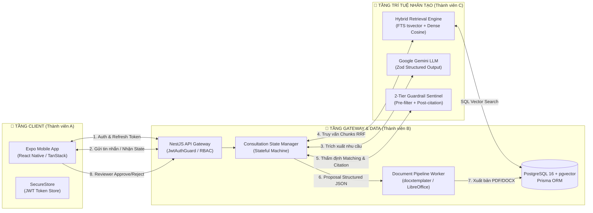

# 🚀 GASCOLAE SKYLINK — TRỢ LÝ DI ĐỘNG TƯ VẤN & LẬP ĐỀ XUẤT DỊCH VỤ

> **Dự án**: Extra Innovation Project — CT Group Internship 2026  
> **Đơn vị thực hiện**: Nhóm Thực tập sinh 03  
> **Mục tiêu**: Xây dựng trợ lý di động nội bộ thông minh hỗ trợ đội ngũ Sales/BD tư vấn giải pháp máy bay không người lái (UAV/Drone), đối sánh dịch vụ và tự động lập Proposal có kiểm chứng (anti-hallucination) trong 7 ngày.

---

## 👥 1. BẢNG PHÂN CÔNG TRÁCH NHIỆM THÀNH VIÊN (TEAM ASSIGNMENT MATRIX)

Dự án được phân bổ khoa học theo **3 trục năng lực kỹ thuật độc lập nhưng hiệp đồng chặt chẽ** với tổng quỹ thời gian **168 giờ (56 giờ/thành viên)** qua 42 đầu việc chuẩn:

| Thành Viên | Họ và Tên | Trục Trách Nhiệm Kỹ Thuật Chính | Phạm Vi Nghiệp Vụ & Mã Module Phụ Trách | Plugin / Kỹ Năng Agent Hỗ Trợ |
| :---: | :--- | :--- | :--- | :--- |
| **Thành viên A** | **Mai Tấn Giáp**<br/>*(56 giờ)* | **Mobile Client<br/>(Expo / React Native)** | • Khởi tạo Repo, Monorepo Workspace & Shared Types ([D1-1](./docs/GASCOLAE_Ke_Hoach_MVP_7_Ngay_VI.md))<br/>• Mobile Shell, Navigation Guard & Lưu trữ Token an toàn ([00_auth_rbac_spec.md](./docs/spec/00_auth_rbac_spec.md))<br/>• Danh mục Catalog, Tra cứu & Verification Badge ([06_knowledge_catalog_ingestion_spec.md](./docs/spec/06_knowledge_catalog_ingestion_spec.md))<br/>• Màn hình Chat tư vấn & Form Missing-Info ([01_consultation_workflow_spec.md](./docs/spec/01_consultation_workflow_spec.md))<br/>• Recommendation Cards & Evidence Drawer ([03_service_matching_guardrail_spec.md](./docs/spec/03_service_matching_guardrail_spec.md))<br/>• So sánh dịch vụ đa chiều P1 ([07_service_comparison_spec.md](./docs/spec/07_service_comparison_spec.md))<br/>• Proposal Preview, Review Queue & Trình đọc PDF nội bộ ([04_proposal_pipeline_spec.md](./docs/spec/04_proposal_pipeline_spec.md)) | **[`skylink-mobile-client`](./.agents/plugins/skylink-mobile-client/plugin.json)**<br/>• [`expo-mobile-architect`](./.agents/plugins/skylink-mobile-client/skills/expo-mobile-architect/SKILL.md)<br/>• [`mobile-ui-components`](./.agents/plugins/skylink-mobile-client/skills/mobile-ui-components/SKILL.md) |
| **Thành viên B** | **Lê Phúc Khang**<br/>*(56 giờ)* | **Backend Gateway & Database<br/>(NestJS / PostgreSQL / pgvector)** | • Kiến trúc Monorepo NestJS, Prisma ORM raw migration ([D1-2](./docs/GASCOLAE_Ke_Hoach_MVP_7_Ngay_VI.md))<br/>• Cấu hình Docker Compose: PostgreSQL 16 + pgvector ([devops-docker-libreoffice](./.agents/plugins/skylink-workflow-engine/skills/devops-docker-libreoffice/SKILL.md))<br/>• Xác thực JWT, Silent Refresh Token & Phân quyền RBAC 11 quyền ([00_auth_rbac_spec.md](./docs/spec/00_auth_rbac_spec.md))<br/>• Quản trị Máy trạng thái tư vấn (Stateful Machine) & Session Resume ([01_consultation_workflow_spec.md](./docs/spec/01_consultation_workflow_spec.md))<br/>• Pipeline sinh tài liệu DOCX (docxtemplater) & PDF (LibreOffice worker) ([04_proposal_pipeline_spec.md](./docs/spec/04_proposal_pipeline_spec.md))<br/>• Human-in-the-loop: Review Queue & Quyết định Approve/Reject ([04_proposal_pipeline_spec.md](./docs/spec/04_proposal_pipeline_spec.md))<br/>• Hệ thống Structured Logging & Vết kiểm toán bất biến ([08_audit_telemetry_spec.md](./docs/spec/08_audit_telemetry_spec.md)) | **[`skylink-workflow-engine`](./.agents/plugins/skylink-workflow-engine/plugin.json)**<br/>• [`stateful-consultation`](./.agents/plugins/skylink-workflow-engine/skills/stateful-consultation/SKILL.md)<br/>• [`proposal-pipeline`](./.agents/plugins/skylink-workflow-engine/skills/proposal-pipeline/SKILL.md)<br/>• [`devops-docker-libreoffice`](./.agents/plugins/skylink-workflow-engine/skills/devops-docker-libreoffice/SKILL.md)<br/>• [`rbac-audit-sentinel`](./.agents/plugins/skylink-workflow-engine/skills/rbac-audit-sentinel/SKILL.md) |
| **Thành viên C** | **Nguyễn Quyết Giang Sơn**<br/>*(56 giờ)* | **AI Intelligence & Knowledge Pipeline<br/>(Data Ingestion / RAG / Guardrail)** | • Chuẩn hóa dữ liệu Service Assets theo mô hình Canonical 5 cấp ([canonical-chunker](./.agents/plugins/skylink-service-intelligence/skills/canonical-chunker/SKILL.md))<br/>• Schema-Aware Semantic Chunking & băm ổn định `chunk_id` ([06_knowledge_catalog_ingestion_spec.md](./docs/spec/06_knowledge_catalog_ingestion_spec.md))<br/>• Hybrid Retrieval Engine: FTS (`tsvector`) + Dense Vector (`pgvector`) với xếp hạng RRF ($k=60$) ([02_hybrid_retrieval_spec.md](./docs/spec/02_hybrid_retrieval_spec.md))<br/>• Prompt Engineering Zod Structured Output cho Google Gemini LLM ([01_consultation_workflow_spec.md](./docs/spec/01_consultation_workflow_spec.md))<br/>• 2 Tầng Guardrails: Pre-check lọc quyền + Post-check kiểm toán Citation ([03_service_matching_guardrail_spec.md](./docs/spec/03_service_matching_guardrail_spec.md))<br/>• Từ điển Dữ liệu dùng chung & Ma trận rủi ro ảo giác ([05_data_dictionary_risk_matrix.md](./docs/spec/05_data_dictionary_risk_matrix.md))<br/>• Xây dựng Golden Test Set & Đánh giá định lượng AI (Retrieval Precision, Hallucination Rate) ([ai-golden-evaluator](./.agents/plugins/skylink-service-intelligence/skills/ai-golden-evaluator/SKILL.md)) | **[`skylink-service-intelligence`](./.agents/plugins/skylink-service-intelligence/plugin.json)**<br/>• [`canonical-chunker`](./.agents/plugins/skylink-service-intelligence/skills/canonical-chunker/SKILL.md)<br/>• [`hybrid-retrieval`](./.agents/plugins/skylink-service-intelligence/skills/hybrid-retrieval/SKILL.md)<br/>• [`guardrail-sentinel`](./.agents/plugins/skylink-service-intelligence/skills/guardrail-sentinel/SKILL.md)<br/>• [`ai-golden-evaluator`](./.agents/plugins/skylink-service-intelligence/skills/ai-golden-evaluator/SKILL.md) |

---

## 🏛️ 2. KIẾN TRÚC TỔNG THỂ & LUỒNG DỮ LIỆU LIÊN THÀNH VIÊN



---

## 📚 3. HỆ THỐNG ĐẶC TẢ HỢP ĐỒNG DỮ LIỆU (DATA CONTRACTS)

Toàn bộ giao thức giao tiếp giữa 3 thành viên được chuẩn hóa thành 9 tệp đặc tả chi tiết tại thư mục **[`docs/spec/`](./docs/spec/README.md)**:

| Module | Tệp Đặc Tả Chi Tiết | Trọng Tâm Kỹ Thuật | Phụ Trách Chính |
| :---: | :--- | :--- | :---: |
| **00** | [00_auth_rbac_spec.md](./docs/spec/00_auth_rbac_spec.md) | Cặp JWT Token, Silent Refresh Rotation, 11 quyền RBAC. | Thành viên B + A |
| **01** | [01_consultation_workflow_spec.md](./docs/spec/01_consultation_workflow_spec.md) | Máy trạng thái tư vấn, Zod validation, Lịch sử phiên & Resume session. | Thành viên B + C + A |
| **02** | [02_hybrid_retrieval_spec.md](./docs/spec/02_hybrid_retrieval_spec.md) | Giao thức FTS (`tsvector`) + Dense Vector (`pgvector`), RRF ranking. | Thành viên C + B |
| **03** | [03_service_matching_guardrail_spec.md](./docs/spec/03_service_matching_guardrail_spec.md) | Đối sánh dịch vụ, 2 tầng Guardrails phòng chống ảo giác về giá/SLA. | Thành viên C + B |
| **04** | [04_proposal_pipeline_spec.md](./docs/spec/04_proposal_pipeline_spec.md) | Proposal JSON Schema, biên dịch PDF qua LibreOffice headless, Review flow. | Thành viên B + A |
| **05** | [05_data_dictionary_risk_matrix.md](./docs/spec/05_data_dictionary_risk_matrix.md) | Từ điển dữ liệu toàn hệ thống, Ma trận rủi ro ảo giác. | Cả 3 Thành viên |
| **06** | [06_knowledge_catalog_ingestion_spec.md](./docs/spec/06_knowledge_catalog_ingestion_spec.md) | Danh mục Catalog dịch vụ, nguồn dẫn chứng `sources`, Ingestion API. | Thành viên C + B |
| **07** | [07_service_comparison_spec.md](./docs/spec/07_service_comparison_spec.md) | Tính năng P1 so sánh đa chiều 2-3 gói dịch vụ, hiệp đồng giải pháp. | Thành viên C + A + B |
| **08** | [08_audit_telemetry_spec.md](./docs/spec/08_audit_telemetry_spec.md) | Vết kiểm toán bất biến: State, Retrieval, Guardrail, Proposal. | Thành viên B + C |

---

## 🛠️ 4. HỆ SINH THÁI AGENT & KỶ LUẬT ANTIGRAVITY (`.agents/`)

Dự án được trang bị hệ thống Customization Agent đạt chuẩn của Google DeepMind Antigravity:
- **Cấu hình & Bảng điều khiển**: [AGENTS.md](./.agents/AGENTS.md) | [GEMINI.md](./.agents/GEMINI.md) | [plugins.json](./.agents/plugins.json).
- **Quy tắc Quản trị Workspace (Workspace Rules)**:
  - [`skylink_monorepo.md`](./.agents/rules/skylink_monorepo.md): TypeScript Strict, `no any`, Zod DTO single source of truth.
  - [`security_data_sanitization.md`](./.agents/rules/security_data_sanitization.md): Chống rò rỉ dữ liệu `restricted`, ẩn vector score thô.
  - [`proposal_legal_compliance.md`](./.agents/rules/proposal_legal_compliance.md): Bắt buộc điều khoản miễn trừ pháp lý & cách ly số liệu chưa thẩm định.
  - [`git_mutation_guardrail.md`](./.agents/rules/git_mutation_guardrail.md): Kỷ luật Git chỉ-đọc (Read-Only Git), cấm Agent tự ý commit/push, bảo vệ quyền kiểm soát kho mã nguồn tuyệt đối của Người Dùng.
- **Kỹ năng Dùng chung (Workspace Skills)**:
  - [`mermaid-architect`](./.agents/skills/mermaid-architect/SKILL.md): Chuyên gia sơ đồ kỹ thuật Mermaid.
  - [`e2e-demo-orchestrator`](./.agents/skills/e2e-demo-orchestrator/SKILL.md): Kịch bản diễn tập Demo 10 phút ngày thứ 7.
- **Plugin Bảo trì**: [`antigravity-system-updater`](./.agents/plugins/antigravity-system-updater/plugin.json) lưu trữ 13 tài liệu tham chiếu gốc Antigravity IDE.

---

## 📁 5. CẤU TRÚC THƯ MỤC KHÔNG GIAN LÀM VIỆC (WORKSPACE LAYOUT)

```text
CT_Group_Intern_project/
├── .agents/                                # Hệ sinh thái tùy biến Agent (Plugins, Skills, Rules)
│   ├── plugins/                            # 4 Plugins nghiệp vụ chuyên biệt
│   │   ├── antigravity-system-updater/     # Plugin bảo trì hệ thống & 13 tài liệu tham chiếu
│   │   ├── skylink-mobile-client/          # Plugin hỗ trợ Thành viên A (Mobile Client)
│   │   ├── skylink-workflow-engine/        # Plugin hỗ trợ Thành viên B (Backend Gateway)
│   │   └── skylink-service-intelligence/   # Plugin hỗ trợ Thành viên C (AI Pipeline)
│   ├── skills/                             # Kỹ năng dùng chung (mermaid-architect, e2e-demo)
│   ├── rules/                              # 3 Quy tắc quản trị kỹ thuật workspace
│   ├── plugins.json                        # Bảng điều khiển plugin
│   ├── AGENTS.md                           # Bộ quy tắc điều hành Agent chính
│   └── GEMINI.md                           # Chỉ dẫn hệ thống cho Google Gemini
├── docs/                                   # Tài liệu nghiệp vụ & kỹ thuật dự án
│   ├── spec/                               # 9 Tệp đặc tả hợp đồng dữ liệu chi tiết (00 -> 08)
│   ├── GASCOLAE_Ke_Hoach_MVP_7_Ngay_VI.md  # Kế hoạch chi tiết 7 ngày 42 đầu việc
│   └── SkyLink_Bao_Cao_De_Xuat_Du_An.md    # Báo cáo đề xuất dự án ban đầu
├── reports/                                # Báo cáo đánh giá, kiểm thử, nghiệm thu
├── scratch/                                # Vùng đệm kỹ thuật (Zero root pollution, tự dọn dẹp)
│   ├── agent_observations.md               # Sổ tay quan sát & học tập Git minh bạch
│   └── agent_observations.template.md      # Mẫu ghi nhận quan sát chuẩn
└── README.md                               # Tài liệu hướng dẫn chính của dự án
```

---

## 🏁 6. LỘ TRÌNH TRIỂN KHAI MVP 7 NGÀY (7-DAY ROADMAP)

- **Ngày 1**: Khởi tạo workspace, Docker Compose (PostgreSQL 16 + pgvector), Hợp đồng dữ liệu dùng chung.
- **Ngày 2**: Mobile shell & Đăng nhập JWT; Catalog Service API & màn hình tra cứu tri thức.
- **Ngày 3**: Tư vấn stateful: Máy trạng thái NestJS, Chat UI & Luồng bổ sung thông tin thiếu (Missing-Info Loop).
- **Ngày 4**: Hybrid Retrieval RRF + Dense Vector; Gợi ý dịch vụ kèm bằng chứng (Evidence Drawer).
- **Ngày 5**: Proposal generation engine: Structured JSON, 2 Tầng Guardrails thẩm định & Preview draft.
- **Ngày 6**: Xuất bản DOCX/PDF qua LibreOffice headless; Màn hình Reviewer duyệt và tải tài liệu.
- **Ngày 7**: Kiểm thử tích hợp E2E, Đánh giá Golden Test Set & Chuẩn bị kịch bản Demo 10 phút hoàn chỉnh.

---

## 🚦 7. HƯỚNG DẪN KHỞI CHẠY KIỂM ĐỊNH HỆ THỐNG (VERIFICATION)

Để kiểm toán toàn diện tính toàn vẹn cấu trúc dự án và hệ sinh thái Agent, chạy lệnh:

```powershell
powershell -ExecutionPolicy Bypass -File .agents/scripts/verify_refactoring.ps1
```

*Kết quả mong đợi: `100% TẤT CẢ CÁC TIÊU CHÍ KIỂM TOÁN ĐỀU PASSED! (Exit code: 0)`.*

---

## 💡 8. CẨM NANG SỬ DỤNG AGENT CHO 3 THÀNH VIÊN KHI LẬP TRÌNH (AGENT PAIR PROGRAMMING GUIDE)

Hệ thống Agent trong `.agents/` được thiết kế như một **Lập trình viên Cặp (Pair Programmer) chuẩn mực** cho từng thành viên. Khi mở dự án trong IDE Antigravity, Agent tự động nạp toàn bộ Plugin, Kỹ năng và Quy tắc vào ngữ cảnh làm việc.

Dưới đây là cẩm nang chi tiết giúp từng thành viên ra lệnh (prompt) chính xác cho Agent trong từng ngày phát triển:

### 📱 8.1. Hướng Dẫn Dành Cho Thành Viên A: Mai Tấn Giáp (Mobile Client)
- **Plugin phụ trách**: [`skylink-mobile-client`](./.agents/plugins/skylink-mobile-client/plugin.json)
- **Kỹ năng chủ lực**:
  - [`expo-mobile-architect`](./.agents/plugins/skylink-mobile-client/skills/expo-mobile-architect/SKILL.md): Kiến trúc Expo, Axios Interceptor với hàng đợi Silent Refresh Token chống race condition, lưu trữ Token an toàn qua `expo-secure-store`, quản lý cache TanStack Query.
  - [`mobile-ui-components`](./.agents/plugins/skylink-mobile-client/skills/mobile-ui-components/SKILL.md): Xây dựng UI React Native chuyên dụng: Màn hình Chat tư vấn, Thanh tiến độ nhu cầu (`RequirementsProgressBar`), Form bổ sung thông tin thiếu (`MissingFieldsForm`), Ngăn kéo bằng chứng (`EvidenceDrawer`), Thẻ đề xuất dịch vụ, và Trình xem PDF nội bộ.
- **Mẫu câu lệnh (Prompt) gợi ý khi code**:
  - *"Áp dụng skill `expo-mobile-architect`, hãy xây dựng Axios client kèm cơ chế Silent Refresh Queue lưu token trong `expo-secure-store` theo đúng [00_auth_rbac_spec.md](./docs/spec/00_auth_rbac_spec.md)."*
  - *"Áp dụng skill `mobile-ui-components`, hãy code component `EvidenceDrawer` trượt từ đáy màn hình hiển thị danh sách trích dẫn chunk nguồn cho proposal theo [03_service_matching_guardrail_spec.md](./docs/spec/03_service_matching_guardrail_spec.md)."*
  - *"Hãy code màn hình so sánh 2 dịch vụ Drone Candidate Services P1 theo đúng hợp đồng [07_service_comparison_spec.md](./docs/spec/07_service_comparison_spec.md)."*
- **Quy tắc kỷ luật bắt buộc**: [`mobile_architecture_discipline.md`](./.agents/plugins/skylink-mobile-client/rules/mobile_architecture_discipline.md) — Không hardcode API URL (dùng `EXPO_PUBLIC_*`), ẩn điểm số vector thô khỏi UI, và không để client tự ý quyết định chuyển trạng thái tư vấn.

---

### 🚪 8.2. Hướng Dẫn Dành Cho Thành Viên B: Lê Phúc Khang (Backend & Workflow Engine)
- **Plugin phụ trách**: [`skylink-workflow-engine`](./.agents/plugins/skylink-workflow-engine/plugin.json)
- **Kỹ năng chủ lực**:
  - [`stateful-consultation`](./.agents/plugins/skylink-workflow-engine/skills/stateful-consultation/SKILL.md): Quản trị Máy trạng thái tư vấn (State Machine), kiểm tra hợp lệ Zod schema và logic vòng lặp làm rõ Missing-Info Loop.
  - [`devops-docker-libreoffice`](./.agents/plugins/skylink-workflow-engine/skills/devops-docker-libreoffice/SKILL.md): Cấu hình Docker Compose cho PostgreSQL 16 + pgvector, Prisma raw migration và worker LibreOffice headless chuyển đổi DOCX sang PDF không lỗi font.
  - [`proposal-pipeline`](./.agents/plugins/skylink-workflow-engine/skills/proposal-pipeline/SKILL.md): Quy trình sinh Proposal từ JSON có cấu trúc qua docxtemplater/PizZip và xuất bản PDF chuẩn qua LibreOffice.
  - [`rbac-audit-sentinel`](./.agents/plugins/skylink-workflow-engine/skills/rbac-audit-sentinel/SKILL.md): Bảo vệ các endpoint API bằng NestJS Guards phân quyền 11 quyền và ghi nhật ký kiểm toán bất biến (Audit Telemetry).
- **Mẫu câu lệnh (Prompt) gợi ý khi code**:
  - *"Áp dụng skill `devops-docker-libreoffice`, hãy cấu hình tệp `docker-compose.yml` khởi chạy PostgreSQL 16 kèm extension pgvector và worker LibreOffice headless ổn định."*
  - *"Áp dụng skill `stateful-consultation`, hãy viết `ConsultationStateMachine` quản lý chuyển đổi từ `DISCOVERY` -> `COLLECTING` -> `MATCHING` -> `PROPOSAL_READY` theo [01_consultation_workflow_spec.md](./docs/spec/01_consultation_workflow_spec.md)."*
  - *"Áp dụng skill `proposal-pipeline`, hãy tạo service ánh xạ dữ liệu `proposal_data.json` vào template DOCX và kích hoạt worker LibreOffice xuất ra file PDF hoàn chỉnh."*
  - *"Áp dụng skill `rbac-audit-sentinel`, hãy tạo Guard `@RequirePermissions('proposal:approve')` và hàm ghi nhận sự kiện `AUDIT_PROPOSAL_EVENT` theo [08_audit_telemetry_spec.md](./docs/spec/08_audit_telemetry_spec.md)."*
- **Quy tắc kỷ luật bắt buộc**: [`workflow_state_discipline.md`](./.agents/plugins/skylink-workflow-engine/rules/workflow_state_discipline.md) — Backend giữ thẩm quyền tối cao về chuyển đổi trạng thái; nhật ký kiểm toán phải là bất biến (append-only).

---

### 🧠 8.3. Hướng Dẫn Dành Cho Thành Viên C: Nguyễn Quyết Giang Sơn (AI Pipeline & Knowledge)
- **Plugin phụ trách**: [`skylink-service-intelligence`](./.agents/plugins/skylink-service-intelligence/plugin.json)
- **Kỹ năng chủ lực**:
  - [`canonical-chunker`](./.agents/plugins/skylink-service-intelligence/skills/canonical-chunker/SKILL.md): Chuẩn hóa dữ liệu Service Assets theo mô hình Canonical 5 cấp & Schema-Aware Semantic Chunking với thuật toán băm ổn định `chunk_id`.
  - [`hybrid-retrieval`](./.agents/plugins/skylink-service-intelligence/skills/hybrid-retrieval/SKILL.md): Thiết kế và tối ưu truy vấn lai kết hợp PostgreSQL FTS (`tsvector`) + Dense Vector (`pgvector`) với thuật toán xếp hạng Reciprocal Rank Fusion (RRF với $k=60$).
  - [`guardrail-sentinel`](./.agents/plugins/skylink-service-intelligence/skills/guardrail-sentinel/SKILL.md): Thiết lập 2 tầng Guardrails (Pre-check Policy Filter & Post-check Citation Grounding Auditor) chặn đứng 100% ảo giác về giá, tiến độ, SLA.
  - [`ai-golden-evaluator`](./.agents/plugins/skylink-service-intelligence/skills/ai-golden-evaluator/SKILL.md): Thiết kế và đo lường định lượng Golden Test Set (Precision, Recall, Grounding Rate, Hallucination Rate).
- **Mẫu câu lệnh (Prompt) gợi ý khi code**:
  - *"Áp dụng skill `canonical-chunker`, hãy viết script băm dữ liệu dịch vụ drone nông nghiệp S0112 thành các chunks chuẩn kèm `chunk_id` định danh duy nhất."*
  - *"Áp dụng skill `hybrid-retrieval`, hãy viết câu truy vấn SQL lai Prisma kết hợp FTS và pgvector Cosine similarity với thuật toán RRF theo [02_hybrid_retrieval_spec.md](./docs/spec/02_hybrid_retrieval_spec.md)."*
  - *"Áp dụng skill `guardrail-sentinel`, hãy tạo bộ lọc kiểm toán Citation hậu kỳ để bắt lỗi các tuyên bố về giá hoặc thời gian bay không có bằng chứng chunk kiểm chứng."*
  - *"Áp dụng skill `ai-golden-evaluator`, hãy thiết lập kịch bản chạy Golden Test Set 15 ca kiểm thử và xuất bảng báo cáo định lượng rủi ro ảo giác."*
- **Quy tắc kỷ luật bắt buộc**: [`guardrail_discipline.md`](./.agents/plugins/skylink-service-intelligence/rules/guardrail_discipline.md) — Tuyệt đối không để AI tự ý hứa hẹn về giá và SLA; mọi dữ liệu chưa kiểm chứng bắt buộc phải cô lập vào mục `items_to_confirm`.

---

### 🤝 8.4. Kỹ Năng Dùng Chung Cho Cả 3 Thành Viên
1. **Thiết kế Sơ đồ Kỹ thuật ([`mermaid-architect`](./.agents/skills/mermaid-architect/SKILL.md))**:
   - Khi cần vẽ sơ đồ kiến trúc, luồng nghiệp vụ hoặc state machine: *"Hãy dùng skill `mermaid-architect` vẽ sơ đồ Sequence Flowchart Horizontal-First mô tả quy trình..."*
2. **Diễn tập Demo 10 Phút ([`e2e-demo-orchestrator`](./.agents/skills/e2e-demo-orchestrator/SKILL.md))**:
   - Khi chuẩn bị nghiệm thu Ngày 7: *"Hãy dùng skill `e2e-demo-orchestrator` chạy kiểm tra hợp đồng dữ liệu kịch bản demo gói S0112 xem có blocker nào không."*

---

### 🛡️ 8.5. Kỷ Luật An Toàn Git Khi Làm Việc Với Agent
Tuân thủ quy tắc [`git_mutation_guardrail.md`](./.agents/rules/git_mutation_guardrail.md):
- **Agent tuyệt đối KHÔNG tự ý chạy các lệnh thay đổi kho chứa (`git add`, `git commit`, `git push`, `git reset`)**.
- Sau khi hoàn thành viết mã, Agent sẽ hiển thị sẵn thông điệp commit và khối lệnh trong chat.
- **Thành viên chỉ cần sao chép và tự chạy trên terminal cá nhân** để toàn quyền kiểm soát mã nguồn của mình:
  ```bash
  git add <cac_file_vua_sua>
  git commit -m "feat(module): mo ta ngan gon"
  git push origin main
  ```

