# 🏛️ SƠ ĐỒ KIẾN TRÚC TỔNG THỂ HỆ THỐNG GASCOLAE SKYLINK (MERMAID ARCHITECTURE)

> **Căn cứ chuyển hóa**: Tệp thiết kế gốc [`gascolae-system-architecture.drawio.png`](./architecture/diagrams/gascolae-system-architecture.drawio.png)  
> **Chuẩn thiết kế**: Mermaid Architect — Safe Label Quoting, Semantic Shapes & Dark High-Contrast Theme  
> **Dự án**: GASCOLAE SkyLink — Extra Innovation Project (CT Group 2026)

---

## 1. BIỂU ĐỒ KIẾN TRÚC TOÀN HỆ THỐNG (FULL SYSTEM ARCHITECTURE)

```mermaid
flowchart TB
    %% =========================================================================
    %% GASCOLAE SKYLINK - KIẾN TRÚC HỆ THỐNG ĐA TẦNG TOÀN DIỆN
    %% Chuyển hóa 100% nguyên vẹn từ architecture/diagrams/gascolae-system-architecture.drawio.png
    %% =========================================================================

    %% -------------------------------------------------------------------------
    %% 1. APPLICATION LAYER (TẦNG ỨNG DỤNG NGƯỜI DÙNG)
    %% -------------------------------------------------------------------------
    subgraph AppLayer ["📱 Application Layer"]
        direction TB
        svc_cmp["Service Comparison"]
        svc_consult_ui["Service Consultation UI"]
        web_app["Web Application"]
        proposal_review["Proposal Review / Download"]
    end

    %% -------------------------------------------------------------------------
    %% 2. SERVICE INTELLIGENCE BACKEND (TẦNG XỬ LÝ TRUNG TÂM & ĐIỀU PHỐI)
    %% -------------------------------------------------------------------------
    subgraph BackendLayer ["⚙️ Service Intelligence Backend"]
        direction TB
        api_gw["API Gateway"]
        auth_rbac["Auth / RBAC"]
        intent_router["Intent Router"]
        hybrid_retrieval["Hybrid Retrieval Engine"]

        consult_orchestrator["Consultation Orchestrator"]
        conv_state_mgr["Conversation State Manager"]
        svc_matcher["Service Matcher"]
        proposal_readiness["Proposal Readiness Validator"]
    end

    %% -------------------------------------------------------------------------
    %% 3. AI LAYER (TẦNG TRÍ TUỆ NHÂN TẠO & HẬU KIỂM)
    %% -------------------------------------------------------------------------
    subgraph AILayer ["🧠 AI Layer"]
        direction TB
        llm_adapter["LLM Adapter<br/><i>(Gemini / Approved Provider)</i>"]
        struct_parser["Structured Output Parser"]
        post_check_guardrail["Post-check Guardrail<br/><i>(Grounding / Claims / Citation)</i>"]
    end

    %% -------------------------------------------------------------------------
    %% 4. GOVERNANCE & OBSERVABILITY (QUẢN TRỊ, TRUY VẾT & ĐÁNH GIÁ)
    %% -------------------------------------------------------------------------
    subgraph GovernanceLayer ["📊 Governance & Observability"]
        direction TB
        retrieval_trace["Retrieval Trace"]
        audit_log[("Audit Log")]
        ai_eval["AI Evaluation"]
    end

    %% -------------------------------------------------------------------------
    %% 5. PROPOSAL GENERATION (PIPELINE XUẤT BẢN ĐỀ XUẤT DỊCH VỤ)
    %% -------------------------------------------------------------------------
    subgraph ProposalGenLayer ["📄 Proposal Generation"]
        direction TB
        proposal_builder["Proposal Builder"]
        proposal_schema[/"Proposal JSON Schema"/]
        biz_val{"Business Validation"}
        docx_renderer["DOCX Template Renderer"]
        pdf_gen["PDF Generator"]
    end

    %% -------------------------------------------------------------------------
    %% 6. RETRIEVAL & GUARDRAILS (TRUY VẤN LAI & TIỀN KIỂM PHÒNG VỆ)
    %% -------------------------------------------------------------------------
    subgraph RetrievalGuardrailLayer ["🛡️ Retrieval & Guardrails"]
        direction TB
        meta_filter["Metadata Filter"]
        vec_search["Vector Search"]
        kw_search["Keyword / Full-text Search"]
        rank_rerank["Rank / Rerank"]
        pre_check_guardrail["Pre-check Guardrail<br/><i>(Permission / Visibility / Status)</i>"]
    end

    %% -------------------------------------------------------------------------
    %% 7. DATA INGESTION & KNOWLEDGE PREPARATION (NẠP & CHUẨN HÓA TRI THỨC)
    %% -------------------------------------------------------------------------
    subgraph IngestionLayer ["🔄 Data Ingestion & Knowledge Preparation"]
        direction TB
        schema_val["Schema Validator"]
        normalizer["Normalizer"]
        change_detector["Version / Change Detector"]
        semantic_chunker["Semantic Chunking Engine"]
        meta_enrich["Metadata Enrichment"]
        embedding_svc["Embedding Service"]
    end

    %% -------------------------------------------------------------------------
    %% 8. CANONICAL DATA & KNOWLEDGE LAYER (KHO DỮ LIỆU ĐÃ CHUẨN HÓA)
    %% -------------------------------------------------------------------------
    subgraph CanonicalDataLayer ["💾 Canonical Data & Knowledge Layer"]
        direction TB
        pgvector[("pgvector<br/>Semantic Vector Index")]
        postgres[("PostgreSQL<br/>Canonical Service Data")]
        obj_storage[("Object Storage<br/>(DOCX / XLSX / PDF)")]
    end

    %% -------------------------------------------------------------------------
    %% 9. SERVICE DATA SOURCES (NGUỒN TÀI NGUYÊN DỊCH VỤ GỐC)
    %% -------------------------------------------------------------------------
    subgraph DataSourcesLayer ["📂 Service Data Sources"]
        direction TB
        future_assets["Future Service Assets"]
        current_assets["15 Service Assets<br/><code>CODE_00 → CODE_10</code>"]
    end

    %% =========================================================================
    %% CÁC LIÊN KẾT & LUỒNG DỮ LIỆU XUYÊN TẦNG (INTER-LAYER DATA FLOWS)
    %% =========================================================================

    %% 1. Tầng Ứng Dụng kết nối vào API Gateway
    svc_cmp --> api_gw
    svc_consult_ui --> api_gw
    web_app --> api_gw

    %% 2. Xác thực & Điều hướng yêu cầu bên trong Backend
    api_gw --> auth_rbac
    auth_rbac --> intent_router
    intent_router --> hybrid_retrieval
    api_gw --> consult_orchestrator

    %% 3. Máy trạng thái, Phối hợp tư vấn & Thẩm định sẵn sàng
    consult_orchestrator <--> conv_state_mgr
    consult_orchestrator --> svc_matcher
    svc_matcher --> hybrid_retrieval
    consult_orchestrator --> proposal_readiness
    conv_state_mgr --> proposal_readiness
    proposal_readiness --> svc_matcher

    %% 4. Tương tác với Tầng AI (Gemini LLM Adapter)
    consult_orchestrator <--> llm_adapter
    llm_adapter --> struct_parser
    struct_parser --> post_check_guardrail
    post_check_guardrail --> consult_orchestrator

    %% 5. Luồng Truy vấn Lai & Tiền kiểm Guardrail
    hybrid_retrieval --> meta_filter
    meta_filter --> vec_search
    meta_filter --> kw_search
    vec_search --> rank_rerank
    kw_search --> rank_rerank
    rank_rerank --> pre_check_guardrail
    pre_check_guardrail --> hybrid_retrieval
    pre_check_guardrail --> llm_adapter

    %% 6. Truy vấn Dữ liệu từ Cơ sở dữ liệu & Vector Store
    vec_search <--> pgvector
    kw_search <--> postgres

    %% 7. Pipeline Sinh Đề Xuất Proposal
    proposal_readiness --> proposal_builder
    proposal_builder --> proposal_schema
    proposal_schema --> biz_val
    biz_val --> docx_renderer
    docx_renderer --> pdf_gen
    pdf_gen --> obj_storage
    pdf_gen --> proposal_review
    proposal_review --> api_gw

    %% 8. Pipeline Nạp & Chuẩn hóa Dữ liệu (Ingestion Pipeline)
    current_assets --> schema_val
    future_assets --> schema_val
    current_assets --> obj_storage
    future_assets --> obj_storage

    schema_val --> normalizer
    change_detector --> semantic_chunker
    normalizer --> semantic_chunker
    normalizer --> postgres
    semantic_chunker --> meta_enrich
    meta_enrich --> embedding_svc
    embedding_svc --> pgvector

    %% 9. Vết kiểm toán & Quan sát hệ thống (Governance Logging)
    hybrid_retrieval --> retrieval_trace
    api_gw --> audit_log
    auth_rbac --> audit_log
    consult_orchestrator --> audit_log
    post_check_guardrail --> ai_eval
    retrieval_trace --> ai_eval

    %% =========================================================================
    %% ĐỊNH NGHĨA PHONG CÁCH BẢNG MÀU NGỮ NGHĨA ĐỘ TƯƠNG PHẢN CAO
    %% =========================================================================
    classDef appNode fill:#0c242c,stroke:#2dd4bf,stroke-width:1.5px,color:#ffffff;
    classDef backendNode fill:#0f172a,stroke:#60a5fa,stroke-width:1.5px,color:#ffffff;
    classDef aiNode fill:#241538,stroke:#c084fc,stroke-width:1.5px,color:#ffffff;
    classDef guardrailNode fill:#2e2204,stroke:#f59e0b,stroke-width:1.5px,color:#ffffff;
    classDef storeNode fill:#1e293b,stroke:#38bdf8,stroke-width:2px,color:#ffffff;
    classDef ingestionNode fill:#0f291e,stroke:#22c55e,stroke-width:1.5px,color:#ffffff;
    classDef proposalNode fill:#2a1320,stroke:#f43f5e,stroke-width:1.5px,color:#ffffff;
    classDef govNode fill:#1f2937,stroke:#eab308,stroke-width:1.5px,color:#ffffff;
    classDef sourceNode fill:#18181b,stroke:#a1a1aa,stroke-width:1.5px,color:#ffffff;

    class svc_cmp,svc_consult_ui,web_app,proposal_review appNode;
    class api_gw,auth_rbac,intent_router,hybrid_retrieval,consult_orchestrator,conv_state_mgr,svc_matcher,proposal_readiness backendNode;
    class llm_adapter,struct_parser aiNode;
    class post_check_guardrail,pre_check_guardrail,meta_filter,rank_rerank,biz_val guardrailNode;
    class pgvector,postgres,obj_storage storeNode;
    class schema_val,normalizer,change_detector,semantic_chunker,meta_enrich,embedding_svc,vec_search,kw_search ingestionNode;
    class proposal_builder,proposal_schema,docx_renderer,pdf_gen proposalNode;
    class retrieval_trace,audit_log,ai_eval govNode;
    class future_assets,current_assets sourceNode;
```

---

## 2. BẢNG ĐỐI CHIẾU 9 PHÂN VÙNG KIẾN TRÚC (SUBSYSTEM BREAKDOWN)

| STT | Phân Vùng Kiến Trúc (Subsystem) | Các Thành Phần Cốt Lõi | Trách Nhiệm Kỹ Thuật Chính | Phụ Trách |
| :---: | :--- | :--- | :--- | :---: |
| **1** | **Application Layer** | `Service Comparison`, `Service Consultation UI`, `Web Application`, `Proposal Review / Download` | Giao diện di động Expo & Web tương tác với Sales/BD và Reviewer. | Thành viên A |
| **2** | **Service Intelligence Backend** | `API Gateway`, `Auth / RBAC`, `Intent Router`, `Hybrid Retrieval Engine`, `Consultation Orchestrator`, `Conversation State Manager`, `Service Matcher`, `Proposal Readiness Validator` | Cổng API NestJS, quản trị máy trạng thái tư vấn có phiên và điều phối luồng nghiệp vụ. | Thành viên B |
| **3** | **AI Layer** | `LLM Adapter (Gemini)`, `Structured Output Parser`, `Post-check Guardrail` | Giao tiếp Gemini LLM sinh phản hồi cấu trúc Zod và kiểm toán Citation chống ảo giác. | Thành viên C |
| **4** | **Retrieval & Guardrails** | `Metadata Filter`, `Vector Search`, `Keyword / Full-text Search`, `Rank / Rerank`, `Pre-check Guardrail` | Truy vấn lai RRF kết hợp FTS + pgvector, tiền kiểm lọc quyền truy cập dữ liệu. | Thành viên C + B |
| **5** | **Proposal Generation** | `Proposal Builder`, `Proposal JSON Schema`, `Business Validation`, `DOCX Template Renderer`, `PDF Generator` | Sinh bản thảo Proposal JSON, ánh xạ template DOCX và xuất bản PDF qua LibreOffice. | Thành viên B + A |
| **6** | **Data Ingestion & Preparation** | `Schema Validator`, `Normalizer`, `Version Detector`, `Semantic Chunking Engine`, `Metadata Enrichment`, `Embedding Service` | Pipeline chuẩn hóa Canonical 5 cấp, cắt đoạn ngữ nghĩa và băm `chunk_id`. | Thành viên C |
| **7** | **Canonical Data & Knowledge** | `pgvector Semantic Vector Index`, `PostgreSQL Canonical Service Data`, `Object Storage` | Lưu trữ dữ liệu cấu trúc, vector embedding và tệp tài liệu gốc DOCX/PDF. | Thành viên B + C |
| **8** | **Governance & Observability** | `Retrieval Trace`, `Audit Log`, `AI Evaluation` | Vết kiểm toán bất biến (Audit Trail), ghi log truy vấn và đánh giá định lượng AI. | Thành viên B + C |
| **9** | **Service Data Sources** | `15 Service Assets (CODE_00 → CODE_10)`, `Future Service Assets` | Kho tài nguyên dịch vụ máy bay không người lái đầu vào chưa xử lý. | Cả nhóm |
