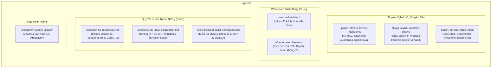

# KẾ HOẠCH THIẾT KẾ HỆ SINH THÁI PLUGIN, SKILL & RULE CHO DỰ ÁN SKYLINK (GASCOLAE)

> **Căn cứ tài liệu gốc**:
> - [docs/SkyLink_Bao_Cao_De_Xuat_Du_An.md](file:///c:/Users/Admin/Desktop/CT_Group_Intern_project/docs/SkyLink_Bao_Cao_De_Xuat_Du_An.md)
> - [docs/GASCOLAE_Ke_Hoach_MVP_7_Ngay_VI.md](file:///c:/Users/Admin/Desktop/CT_Group_Intern_project/docs/GASCOLAE_Ke_Hoach_MVP_7_Ngay_VI.md)
> - [docs/spec/README.md](file:///c:/Users/Admin/Desktop/CT_Group_Intern_project/docs/spec/README.md) (Hệ thống 9 tệp đặc tả kỹ thuật và hợp đồng dữ liệu JSON)

---

## 1. MỤC TIÊU & BỐI CẢNH DỰ ÁN

Hệ thống **GASCOLAE SkyLink** là trợ lý di động nội bộ thông minh hỗ trợ đội ngũ Sales / Business Development tư vấn dịch vụ và lập Proposal có kiểm chứng dựa trên nền tảng Service Assets đã chuẩn hóa.

### 1.1. Ba trục trách nhiệm kỹ thuật (3 Thành viên — 42 Đầu việc trong 7 Ngày):
- **Thành viên A (Mai Tấn Giáp - 56h)**: Mobile Client (Expo / React Native), Navigation Role Guard, SecureStore Token, TanStack Query, UI Consultation, Proposal Preview, Native PDF Viewer.
- **Thành viên B (Lê Phúc Khang - 56h)**: Backend NestJS, PostgreSQL + Prisma, pgvector, Auth/RBAC, Quản trị State Machine, Docker Compose, Worker headless LibreOffice & Human Review.
- **Thành viên C (Nguyễn Quyết Giang Sơn - 56h)**: Data Pipeline, Canonical Normalization, Semantic Chunking, Hybrid Retrieval, Prompt Engineering, 2 Tầng Guardrails & AI Evaluation (Golden set).

### 1.2. Mục tiêu kiến trúc Agent:
Trang bị cho AI Assistant bộ tri thức chuyên sâu (Plugin + Skill + Rule) tương ứng để đóng vai trò lập trình viên cặp (Pair Programmer) chuẩn mực, hỗ trợ đắc lực cho cả 3 thành viên hoàn thành toàn bộ 42 đầu việc trong 7 ngày mà không gặp rủi ro lệch hợp đồng dữ liệu hay nghẽn blocker.

---

## 2. KIẾN TRÚC TỔNG THỂ HỆ THỐNG AGENT

---

## 3. CHI TIẾT ĐẶC TẢ TỪNG GÓI TÙY BIẾN

### 3.1. GÓI 1: Plugin `skylink-service-intelligence`
- **Mục tiêu**: Phục vụ trực tiếp khâu Chuẩn hóa dữ liệu, Semantic Chunking, Hybrid Retrieval, Guardrail chống ảo giác và Đo lường AI Golden Set (Thành viên C - Trọng tâm Ngày 1, 2, 4, 6, 7).
- **Thư mục**: `.agents/plugins/skylink-service-intelligence/`
- **Quy tắc nội bộ (Rule)**: `rules/guardrail_discipline.md` ("Không bằng chứng - Không phát ngôn", "Chân lý thuộc về Canonical Data").
- **Các kỹ năng (Skills)**:
  1. `canonical-chunker`: 
     - Chuẩn hóa Service Assets sang cấu trúc Canonical 5 cấp: `Service` $\rightarrow$ `Asset` $\rightarrow$ `Record` $\rightarrow$ `Chunk` $\rightarrow$ `Source`.
     - Kỹ thuật Schema-Aware Semantic Chunking (phân mảnh theo Overview, Problem, Capability, Use Case, Service Level, Deliverable, Condition...).
     - Sinh `chunk_id` ổn định bằng thuật toán băm (Deterministic Hash SHA-256) và gắn nhãn metadata (`visibility`, `status`).
  2. `hybrid-retrieval`:
     - Thiết kế hệ thống Hybrid Search cho NestJS + PostgreSQL.
     - Kết hợp Full-Text Search (`tsvector`), pgvector Cosine Distance (`vector(1536)`), Metadata Filter (`visibility`, `status`).
     - Hợp nhất và xếp hạng kết quả bằng thuật toán Reciprocal Rank Fusion (RRF với $k=60$) để trả về đúng `evidence_chunk_ids`.
  3. `guardrail-sentinel`:
     - **Pre-check**: Lọc sạch chunk `restricted` và `draft` trước khi nạp vào context của LLM.
     - **Post-check**: Zod Schema Validation, kiểm toán Citation (toàn bộ `evidence_chunk_ids` trích dẫn phải tồn tại thực trong DB), phát hiện và chặn đứng mọi tuyên bố bịa đặt về Giá (Price), Tiến độ (Timeline), SLA hay Pháp lý.
  4. `ai-golden-evaluator`:
     - Bộ công cụ chạy kịch bản kiểm thử Golden Test Set (Ngày 6.0 & 7.0).
     - Đo lường định lượng 5 chỉ số: Retrieval Precision, Retrieval Recall, Grounded Response Rate, Hallucination Rate, Proposal Validation Pass Rate.

---

### 3.2. GÓI 2: Plugin `skylink-workflow-engine`
- **Mục tiêu**: Phục vụ khâu xây dựng State Machine cho phiên tư vấn, xử lý requirement, quy trình render Proposal DOCX/PDF, hạ tầng Docker & kiểm toán (Thành viên B - Trọng tâm Ngày 1, 2, 3, 5, 6).
- **Thư mục**: `.agents/plugins/skylink-workflow-engine/`
- **Quy tắc nội bộ (Rule)**: `rules/workflow_state_discipline.md` (Backend độc quyền sở hữu State; Bắt buộc Human Review mới sang `APPROVED`).
- **Các kỹ năng (Skills)**:
  1. `stateful-consultation`:
     - Thiết kế và kiểm soát Máy trạng thái tư vấn:
       `DISCOVERY` $\rightarrow$ `COLLECTING_REQUIREMENTS` $\rightarrow$ `SERVICE_MATCHING` $\rightarrow$ `SERVICE_RECOMMENDED` $\rightarrow$ `PROPOSAL_READY` $\rightarrow$ `PROPOSAL_GENERATED` $\rightarrow$ `REVIEW_REQUIRED` $\rightarrow$ `APPROVED`.
     - Logic Deterministic Requirement Validator: Bắt buộc đủ 4 trường cốt lõi (`problem`, `objective`, `deployment_context`, `timeline_expectation`) và chỉ sinh câu hỏi làm rõ (clarification question) vào đúng trường thiếu.
  2. `proposal-pipeline`:
     - Quy trình chuyển hóa Structured Proposal JSON thành tài liệu doanh nghiệp hoàn chỉnh.
     - Ánh xạ Proposal JSON vào file template DOCX bằng `docxtemplater` + `PizZip`.
  3. `devops-docker-libreoffice`:
     - Docker Compose chuẩn hóa cho PostgreSQL 16 + `pgvector` extension + Prisma migration.
     - Worker LibreOffice headless an toàn (`soffice --headless --convert-to pdf`): cài đặt font tiếng Việt (Roboto/Noto Sans), thiết lập timeout 30s chống zombie process và dọn dẹp file tạm tự động.
  4. `rbac-audit-sentinel`:
     - Quản trị ma trận 11 quyền (Sales vs Reviewer vs Admin), kiểm soát endpoint theo Role Guards.
     - Ghi nhận nhật ký kiểm toán bất biến (Audit Trail) cho 4 sự kiện: `STATE_TRANSITION`, `RETRIEVAL_TRACE`, `GUARDRAIL_VIOLATION`, `PROPOSAL_EVENT`.

---

### 3.3. GÓI 3: Plugin `skylink-mobile-client`
- **Mục tiêu**: Hỗ trợ thiết kế và hoàn thiện ứng dụng di động cho đội ngũ Sales/BD hoạt động tại hiện trường (Thành viên A - Trọng tâm Ngày 1, 2, 3, 4, 5, 6, 7).
- **Thư mục**: `.agents/plugins/skylink-mobile-client/`
- **Quy tắc nội bộ (Rule)**: `rules/mobile_architecture_discipline.md` (Cấm tự chuyển state, token bắt buộc lưu SecureStore, cấm lộ raw vector score).
- **Các kỹ năng (Skills)**:
  1. `expo-mobile-architect`:
     - Thiết lập Expo Shell (React Native / TypeScript Strict), kiến trúc điều hướng Expo Router / React Navigation có Route Guards theo Role.
     - Token Lifecycle: Lưu trữ JWT trên `expo-secure-store`, xây dựng Axios Interceptor xử lý Silent Refresh Token Rotation với cơ chế hàng đợi (Queue) chống race-condition khi nhiều request đồng thời hết hạn token.
     - Caching & Data Synchronization: Cấu hình TanStack Query quản lý cache danh mục dịch vụ, tự động retry khi kết nối mạng di động chập chờn.
  2. `mobile-ui-components`:
     - Thiết kế giao diện tư vấn hội thoại với chỉ báo tiến độ trích xuất nhu cầu (Requirements Progress Bar).
     - Component nhập liệu động cho các trường còn thiếu (`Missing Fields Clarification Input`).
     - Thẻ dịch vụ đề xuất (Recommendation Card) kèm ngăn kéo hiển thị dẫn chứng trích dẫn (`Evidence Drawer BottomSheet`).
     - Tích hợp trình xem tài liệu Proposal DOCX/PDF tương thích iOS và Android.

---

### 3.4. GÓI 4: Workspace Skills & Rules Toàn Cục

#### 1. Kỹ năng `e2e-demo-orchestrator`:
- **Thư mục**: `.agents/skills/e2e-demo-orchestrator/SKILL.md`
- **Mục tiêu**: Hỗ trợ Cả 3 Thành viên chuẩn bị bài Demo 10 phút trôi chảy cho Ngày 7.
- **Kịch bản mẫu**: Dựng kịch bản chuẩn từ Đăng nhập Sales $\rightarrow$ Chat tư vấn dịch vụ máy bay không người lái phát hiện nấm bệnh 500ha $\rightarrow$ Bổ sung địa hình đồi dốc $\rightarrow$ Match thành công mã dịch vụ **S0112** $\rightarrow$ Kiểm tra Proposal Readiness $\rightarrow$ Sinh Proposal JSON $\rightarrow$ Đăng nhập Reviewer $\rightarrow$ Phê duyệt $\rightarrow$ Tải PDF chính thức.

#### 2. Bộ 3 Quy tắc Toàn Cục (`.agents/rules/`):
1. **`rules/skylink_monorepo.md`**:
   - Cấu trúc monorepo: `apps/mobile/`, `apps/api/`, `packages/shared/`.
   - Bắt buộc bật `strict: true` trong TypeScript, cấm dùng kiểu `any`.
   - Toàn bộ DTO giao tiếp giữa Mobile và API phải dùng Zod Schema và sinh ra TypeScript Types dùng chung trong `packages/shared/`.
2. **`rules/security_data_sanitization.md`**:
   - **Chống rò rỉ dữ liệu nội bộ**: Cấm đưa bất kỳ chunk nào mang nhãn `visibility: "restricted"` hoặc `status: "draft"` vào context của LLM.
   - **Bảo vệ trải nghiệm người dùng**: Cấm hiển thị raw vector score / cosine distance ra UI của Sales; chỉ hiển thị nhãn định tính (`Phù hợp cao`, `Phù hợp một phần`) kèm dẫn chứng trích dẫn.
3. **`rules/proposal_legal_compliance.md`**:
   - **Miễn trừ pháp lý bắt buộc**: Mọi Proposal xuất ra bắt buộc phải có điều khoản tuyên bố miễn trừ trách nhiệm pháp lý sơ bộ.
   - **Quy tắc cách ly số liệu chưa kiểm chứng**: Mọi thông tin về Đơn giá, Khuyến mãi, Tiến độ hoặc SLA nếu chưa có trong Evidence Chunk thì BẮT BUỘC phải chuyển sang danh mục `items_to_confirm` (Hạng mục cần xác nhận thêm), cấm LLM tự suy diễn hoặc bịa đặt con số.

---

## 4. KẾ HOẠCH TRIỂN KHAI TỪNG BƯỚC (STEP-BY-STEP IMPLEMENTATION)

| Bước | Hạng mục triển khai | Chi tiết nội dung | Kiểm định kỹ thuật |
| :---: | :--- | :--- | :--- |
| **B1** | **Khởi tạo Bộ Quy Tắc Toàn Cục (.agents/rules/)** | Tạo 3 tệp rules: `skylink_monorepo.md`, `security_data_sanitization.md`, `proposal_legal_compliance.md`. | Kiểm tra nội dung & liên kết markdown hợp lệ. |
| **B2** | **Xây dựng Plugin `skylink-service-intelligence`** | Khởi tạo plugin manifest, rule `guardrail_discipline.md`, và 4 skills: `canonical-chunker`, `hybrid-retrieval`, `guardrail-sentinel`, `ai-golden-evaluator`. | Frontmatter chuẩn Antigravity, cấu trúc thư mục hợp lệ. |
| **B3** | **Xây dựng Plugin `skylink-workflow-engine`** | Khởi tạo plugin manifest, rule `workflow_state_discipline.md`, và 4 skills: `stateful-consultation`, `proposal-pipeline`, `devops-docker-libreoffice`, `rbac-audit-sentinel`. | Frontmatter chuẩn Antigravity, đầy đủ file hướng dẫn và mẫu kịch bản. |
| **B4** | **Xây dựng Plugin `skylink-mobile-client`** | Khởi tạo plugin manifest, rule `mobile_architecture_discipline.md`, và 2 skills: `expo-mobile-architect`, `mobile-ui-components`. | Frontmatter chuẩn Antigravity, Axios interceptor mẫu & Token storage pattern. |
| **B5** | **Khởi tạo Kỹ Năng `e2e-demo-orchestrator`** | Tạo `.agents/skills/e2e-demo-orchestrator/SKILL.md` kèm kịch bản 10 phút demo và bộ test checklist. | Frontmatter chuẩn Antigravity, kịch bản bám sát S0112. |
| **B6** | **Cập nhật Bảng Điều Khiển Plugins & Quy Tắc Điều Hành** | Đăng ký các plugin mới vào `.agents/plugins.json` và cập nhật thông tin trong `.agents/AGENTS.md`. | Chạy `.agents/scripts/verify_refactoring.ps1` đạt **100% PASSED**. |

---

## 5. CƠ CHẾ KIỂM ĐỊNH & MINH BẠCH
- Mọi bước thực thi đều phải tuân thủ nghiêm ngặt nguyên tắc **Zero Root Pollution** (không tạo file rác tại thư mục gốc).
- Sau khi hoàn thành, bắt buộc chạy kiểm toán qua script [.agents/scripts/verify_refactoring.ps1](file:///c:/Users/Admin/Desktop/CT_Group_Intern_project/.agents/scripts/verify_refactoring.ps1).
- Mọi log thực thi và phân tích bản chất kỹ thuật được ghi nhận minh bạch vào [scratch/agent_observations.md](file:///c:/Users/Admin/Desktop/CT_Group_Intern_project/scratch/agent_observations.md).
