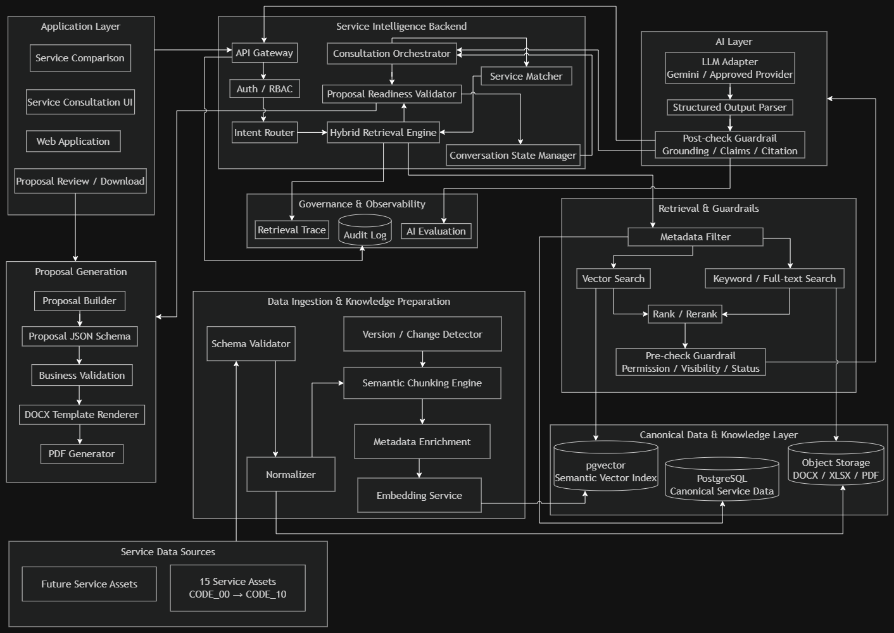

# 🏛️ HỒ SƠ QUẢN TRỊ KIẾN TRÚC HỆ THỐNG (SYSTEM ARCHITECTURE REPOSITORY)

> **Dự án**: GASCOLAE SkyLink — Extra Innovation Project (CT Group Internship 2026)  
> **Thư mục quản lý**: `docs/architecture/`  
> **Tài liệu chuyển hóa**: [docs/GASCOLAE_Kien_Truc_He_Thong_Mermaid.md](../GASCOLAE_Kien_Truc_He_Thong_Mermaid.md)

---

## 🗂️ 1. DANH MỤC TÀI SẢN THIẾT KẾ KIẾN TRÚC

Thư mục này lưu trữ tập trung các tài sản sơ đồ kiến trúc chính thức của hệ thống SkyLink, bảo đảm tính toàn vẹn và khả năng tra cứu dài hạn:

| Tên Tệp | Định Dạng | Bản Chất Kỹ Thuật | Mục Đích Sử Dụng |
| :--- | :---: | :--- | :--- |
| [`diagrams/gascolae-system-architecture.drawio.png`](./diagrams/gascolae-system-architecture.drawio.png) | `.drawio.png` *(Editable PNG)* | Sơ đồ kiến trúc tổng thể 9 tầng của hệ thống GASCOLAE SkyLink. Tệp nhúng sẵn toàn bộ mã XML vector bên trong metadata của hình ảnh PNG. | Chỉnh sửa trực quan trên diagrams.net / VS Code Draw.io extension, xuất ảnh slide báo cáo và in ấn đồ án. |
| [`../GASCOLAE_Kien_Truc_He_Thong_Mermaid.md`](../GASCOLAE_Kien_Truc_He_Thong_Mermaid.md) | `.md` *(Mermaid Code)* | Chuyển hóa 100% nguyên vẹn cấu trúc từ sơ đồ Draw.io sang ngôn ngữ mô tả sơ đồ Mermaid với chuẩn Theme Dark High-Contrast. | Quản lý phiên bản trên Git (Version Control), theo dõi diff từng dòng khi refactor kiến trúc và render tự động trong IDE. |

---

## 🖼️ 2. XEM TRỰC TIẾP SƠ ĐỒ KIẾN TRÚC

---

## 🛠️ 3. HƯỚNG DẪN 3 CÁCH MỞ & CHỈNH SỬA SƠ ĐỒ NGUYÊN BẢN (DRAW.IO)

Tệp `gascolae-system-architecture.drawio.png` sử dụng định dạng **Editable PNG**. Dưới đây là 3 cách mở và chỉnh sửa thuận tiện nhất:

### Cách 1: Chỉnh sửa trực tiếp trên Trình duyệt Web (Khuyến nghị cho mọi máy tính)
1. Mở trình duyệt và truy cập: **[https://app.diagrams.net/](https://app.diagrams.net/)** (hoặc `draw.io`).
2. Chọn **Open Existing Diagram** (hoặc kéo thả trực tiếp tệp `gascolae-system-architecture.drawio.png` từ thư mục máy tính vào cửa sổ trình duyệt).
3. Hệ thống sẽ tự động giải mã khối XML ẩn trong ảnh PNG và mở ra toàn bộ các khối layer, mũi tên kết nối và nhãn văn bản để bạn chỉnh sửa thoải mái.
4. Sau khi chỉnh sửa: Chọn `File` $\to$ `Save as` $\to$ chọn định dạng **PNG** và tích chọn ô **Include a copy of my diagram (Editable PNG)** để lưu đè lại vào thư mục này.

### Cách 2: Chỉnh sửa trực tiếp trong Antigravity IDE / VS Code
1. Vào tab Extensions (`Ctrl + Shift + X`), tìm và cài đặt extension: **Draw.io Integration** (tác giả *Henning Dieterichs*).
2. Sau khi cài đặt, chỉ cần click chuột vào tệp `docs/architecture/diagrams/gascolae-system-architecture.drawio.png`.
3. Editor sẽ lập tức biến thành bàn vẽ đồ họa vector chuyên nghiệp ngay bên trong IDE mà không cần mở trình duyệt hay cài thêm phần mềm ngoài.
4. Nhấn `Ctrl + S` để lưu trực tiếp thay đổi.

### Cách 3: Đối chiếu & Cập nhật mã nguồn Mermaid
- Khi có bất kỳ thay đổi nào trên sơ đồ Draw.io (ví dụ: bổ sung một service mới, đổi cổng gateway, cập nhật luồng Guardrail), lập trình viên có trách nhiệm cập nhật đồng bộ các node tương ứng vào tệp [GASCOLAE_Kien_Truc_He_Thong_Mermaid.md](../GASCOLAE_Kien_Truc_He_Thong_Mermaid.md) để bảo đảm kho mã nguồn luôn là Single Source of Truth.

---

## 📌 4. QUY CHUẨN ĐẶT TÊN VÀ LƯU TRỮ TÀI SẢN TRỰC QUAN
1. **Quy ước đặt tên**: Sử dụng chữ thường phân cách bằng dấu gạch ngang (kebab-case), không sử dụng dấu tiếng Việt, không chứa khoảng trắng và tuyệt đối tránh các ký tự đặc biệt như `[`, `]`, `(`, `)`, `%`, `#`.
2. **Kích thước & Dung lượng**: Ảnh vector hoặc PNG nhúng Draw.io nên giữ dung lượng dưới 1 MB để bảo đảm tốc độ clone và push repo Git.
