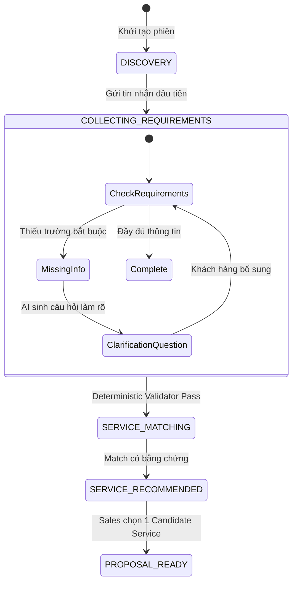

# ĐẶC TẢ MODULE 01: QUY TRÌNH TƯ VẤN & TRÍCH XUẤT NHU CẦU (CONSULTATION WORKFLOW SPEC)

> **Mã hồ sơ**: `SPEC-MOD-01`  
> **Module**: Stateful Consultation Workflow & Requirement Extraction  
> **Vị trí tài liệu**: `docs/spec/01_consultation_workflow_spec.md`  
> **Phụ trách triển khai**: Thành viên B (State Manager NestJS) + Thành viên C (AI Prompt Zod) + Thành viên A (Mobile Chat UI)  
> **Điều hướng liên kết**: [⬅️ Module 00 (Auth)](./00_auth_rbac_spec.md) | [📋 Mục Lục](./README.md) | [Tiếp theo: Module 02 (Retrieval) ➡️](./02_hybrid_retrieval_spec.md)

---

## 1. TỔNG QUAN KIẾN TRÚC MÁY TRẠNG THÁI (STATE MACHINE)
Phiên tư vấn của SkyLink là **quy trình có trạng thái (Stateful Consultation)** do Backend NestJS độc quyền quản lý. 
Ứng dụng Mobile Client chỉ gửi tin nhắn và nhận trạng thái phản hồi từ Backend.



---

## 2. CHI TIẾT ENDPOINT API CHAT TƯ VẤN

### Endpoint: Gửi tin nhắn tư vấn từ Sales
- **Giao thức**: `POST /api/consultations/{session_id}/messages`
- **Headers**: `Authorization: Bearer <JWT_TOKEN>`

#### Payload Request (Client $\to$ Backend):
```json
{
  "session_id": "ses_7f8a9b1c-2d3e-4f5a",
  "content": "Tôi đang tìm giải pháp máy bay không người lái để quét 500 hecta rừng cao su ở Bình Phước nhằm phát hiện sớm bệnh nấm lá rụng.",
  "sender_role": "SALES",
  "client_timestamp": "2026-10-05T10:20:00Z"
}
```

---

## 3. PHẢN HỒI KHI THIẾU THÔNG TIN (MISSING-INFO LOOP)
Khi khách hàng đưa ra yêu cầu chưa đầy đủ các trường bắt buộc, Backend **giữ nguyên trạng thái `COLLECTING_REQUIREMENTS`** và chỉ sinh câu hỏi làm rõ cho đúng trường còn khuyết.

- **HTTP Code**: `200 OK`
- **Payload Response (Backend $\to$ Client)**:
```json
{
  "session_id": "ses_7f8a9b1c-2d3e-4f5a",
  "state": "COLLECTING_REQUIREMENTS",
  "extracted_requirements": {
    "problem": "Phát hiện sớm bệnh nấm lá rụng trên cây cao su",
    "target_area_hectares": 500,
    "location": "Bình Phước",
    "flight_conditions": null,
    "budget_range": null
  },
  "missing_fields": [
    "flight_conditions",
    "budget_range"
  ],
  "clarification_message": "Hệ thống đã ghi nhận nhu cầu bay quét 500ha tại Bình Phước. Để chọn đúng dòng Drone và gói cảm biến phù hợp, xin vui lòng cho biết thêm về địa hình khu vực bay (đồi dốc hay bằng phẳng) và khoảng ngân sách dự kiến của khách hàng?",
  "can_proceed_to_matching": false,
  "created_at": "2026-10-05T10:20:02Z"
}
```

---

## 4. PHẢN HỒI KHI ĐÃ ĐỦ THÔNG TIN BẮT BUỘC
Khi toàn bộ các trường cốt lõi đã được thu thập đầy đủ, Backend tự động chuyển trạng thái sang `SERVICE_MATCHING`.

- **HTTP Code**: `200 OK`
- **Payload Response (Backend $\to$ Client)**:
```json
{
  "session_id": "ses_7f8a9b1c-2d3e-4f5a",
  "state": "SERVICE_MATCHING",
  "extracted_requirements": {
    "problem": "Phát hiện sớm bệnh nấm lá rụng trên cây cao su",
    "target_area_hectares": 500,
    "location": "Bình Phước",
    "flight_conditions": "Đồi dốc thoai thoải, gió cấp 3-4",
    "budget_range": "100-150 triệu VNĐ/tháng"
  },
  "missing_fields": [],
  "clarification_message": "Đã thu thập đầy đủ thông tin yêu cầu. Hệ thống đang tiến hành đối soát và tìm kiếm gói dịch vụ tối ưu...",
  "can_proceed_to_matching": true,
  "created_at": "2026-10-05T10:21:15Z"
}
```

---

## 5. HỢP ĐỒNG TRÍCH XUẤT NHU CẦU TỪ AI (LLM REQUIREMENT EXTRACTION)

### 5.1. Định nghĩa Zod Schema (packages/shared)
```typescript
import { z } from 'zod';

export const CustomerRequirementsSchema = z.object({
  customer_problem: z.string().min(10, 'Mô tả vấn đề phải rõ ràng'),
  business_objective: z.string().min(10, 'Mục tiêu kinh doanh bắt buộc'),
  deployment_context: z.string().min(5, 'Bối cảnh địa bàn bay bắt buộc'),
  constraints: z.object({
    timeline: z.string().nullable(),
    budget_estimated: z.string().nullable(),
    technical_limitations: z.array(z.string()).default([]),
  }),
  required_deliverables: z.array(z.string()).min(1, 'Phải có ít nhất 1 sản phẩm bàn giao mong đợi'),
  is_complete: z.boolean(),
});

export type CustomerRequirements = z.infer<typeof CustomerRequirementsSchema>;
```

### 5.2. Output JSON sinh từ LLM (Google Gemini)
```json
{
  "customer_requirements": {
    "customer_problem": "Lá cao su bị rụng do nấm bệnh, cần phát hiện sớm ở diện tích lớn để phun thuốc kịp thời",
    "business_objective": "Quét định kỳ hàng tuần, tạo bản đồ chỉ số thực vật NDVI độ phân giải cao",
    "deployment_context": "Vùng đồi núi Bình Phước, gió cấp 3-4, diện tích 500 hecta",
    "constraints": {
      "timeline": "Bắt đầu triển khai từ đầu mùa mưa 2026",
      "budget_estimated": "Dưới 150 triệu VNĐ/tháng",
      "technical_limitations": ["Không có trạm phát sóng di động tại tâm đồi"]
    },
    "required_deliverables": [
      "Bản đồ phân bố nhiễm bệnh định dạng GeoJSON",
      "Báo cáo thống kê diện tích cây suy thoái"
    ]
  },
  "is_complete": true
}
```

---

## 6. LỊCH SỬ PHIÊN & TIẾP TỤC TƯ VẤN (SESSION STATE & RESUME)

### 6.1. Endpoint: Lấy danh sách phiên tư vấn của Sales
- **Giao thức**: `GET /api/consultations`
- **Headers**: `Authorization: Bearer <JWT_TOKEN>`
- **Query Params**:
  - `page`: số trang (mặc định: 1)
  - `limit`: số bản ghi/trang (mặc định: 10)
  - `state`: bộ lọc trạng thái (`DISCOVERY`, `COLLECTING_REQUIREMENTS`, `SERVICE_MATCHING`, `PROPOSAL_READY`, `APPROVED`)
  - `from_date`: lọc từ ngày (`YYYY-MM-DD`)

#### Payload Response (HTTP `200 OK`):
```json
{
  "total": 12,
  "page": 1,
  "limit": 10,
  "sessions": [
    {
      "session_id": "ses_7f8a9b1c-2d3e-4f5a",
      "customer_title": "Cao su Bình Phước - Giám sát nấm lá rụng (500ha)",
      "state": "COLLECTING_REQUIREMENTS",
      "created_at": "2026-10-05T09:30:00Z",
      "updated_at": "2026-10-05T10:20:00Z",
      "total_messages": 4,
      "selected_service_id": null,
      "can_resume": true
    },
    {
      "session_id": "ses_1a2b3c4d-5e6f-7a8b",
      "customer_title": "Nông trường Cà phê Đắk Lắk - Dự báo rầy nâu (250ha)",
      "state": "APPROVED",
      "created_at": "2026-10-04T14:10:00Z",
      "updated_at": "2026-10-04T16:45:00Z",
      "total_messages": 8,
      "selected_service_id": "S0112",
      "can_resume": false,
      "proposal_id": "PROP_2026_S0112_0088"
    }
  ]
}
```

---

### 6.2. Endpoint: Khôi phục phiên tư vấn dở dang (Resume Session)
- **Giao thức**: `GET /api/consultations/{session_id}`
- **Headers**: `Authorization: Bearer <JWT_TOKEN>`
- **Mục đích**: Client tải toàn bộ lịch sử tin nhắn, yêu cầu đã trích xuất, và danh sách dịch vụ đề xuất để khôi phục màn hình chat chính xác tại thời điểm tạm dừng.

#### Payload Response (HTTP `200 OK`):
```json
{
  "session_id": "ses_7f8a9b1c-2d3e-4f5a",
  "state": "COLLECTING_REQUIREMENTS",
  "sales_agent_id": "usr_sales_01",
  "created_at": "2026-10-05T09:30:00Z",
  "updated_at": "2026-10-05T10:20:00Z",
  "messages": [
    {
      "id": "msg_001",
      "sender": "SALES",
      "content": "Tôi đang tìm giải pháp máy bay không người lái để quét 500 hecta rừng cao su ở Bình Phước nhằm phát hiện sớm bệnh nấm lá rụng.",
      "timestamp": "2026-10-05T09:30:15Z"
    },
    {
      "id": "msg_002",
      "sender": "AI_ASSISTANT",
      "content": "Hệ thống đã ghi nhận nhu cầu bay quét 500ha tại Bình Phước. Để chọn đúng dòng Drone và gói cảm biến phù hợp, xin vui lòng cho biết thêm về địa hình khu vực bay và khoảng ngân sách dự kiến?",
      "timestamp": "2026-10-05T09:30:18Z"
    }
  ],
  "extracted_requirements": {
    "problem": "Phát hiện sớm bệnh nấm lá rụng trên cây cao su",
    "target_area_hectares": 500,
    "location": "Bình Phước",
    "flight_conditions": null,
    "budget_range": null
  },
  "missing_fields": [
    "flight_conditions",
    "budget_range"
  ],
  "candidate_services": [],
  "selected_service_id": null,
  "can_resume": true
}
```

---

### 6.3. Endpoint: Lưu trữ hoặc Hủy phiên tư vấn
- **Giao thức**: `DELETE /api/consultations/{session_id}`
- **Headers**: `Authorization: Bearer <JWT_TOKEN>`
- **Payload Response (HTTP `200 OK`):**
```json
{
  "status_code": 200,
  "message": "Đã lưu trữ phiên tư vấn thành công",
  "session_id": "ses_7f8a9b1c-2d3e-4f5a",
  "archived_at": "2026-10-05T10:45:00Z"
}
```

