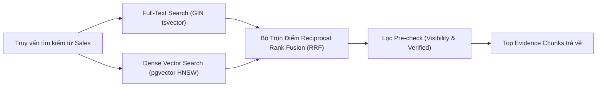

# ĐẶC TẢ MODULE 02: TRUY VẤN LAI & TÌM KIẾM TRI THỨC (HYBRID RETRIEVAL SPEC)

> **Mã hồ sơ**: `SPEC-MOD-02`  
> **Module**: Hybrid Retrieval (PostgreSQL FTS + pgvector)  
> **Vị trí tài liệu**: `docs/spec/02_hybrid_retrieval_spec.md`  
> **Phụ trách triển khai**: Thành viên C (Embedding & RRF Ranker) + Thành viên B (Prisma & pgvector Index)  
> **Điều hướng liên kết**: [⬅️ Module 01 (Workflow)](./01_consultation_workflow_spec.md) | [📋 Mục Lục](./README.md) | [Tiếp theo: Module 03 (Guardrail) ➡️](./03_service_matching_guardrail_spec.md)

---

## 1. TỔNG QUAN KIẾN TRÚC TRUY VẤN LAI
Hệ thống kết hợp 2 phương pháp tìm kiếm bổ trợ cho nhau:
1. **Full-Text Search (FTS)** qua PostgreSQL `tsvector` + GIN Index: Bắt chính xác mã số dịch vụ (`S0112`), thuật ngữ kỹ thuật chuyên ngành (`NDVI`, `LiDAR`, `SLA 24h`).
2. **Dense Vector Search** qua `pgvector` Cosine Distance + HNSW Index: Bắt ngữ nghĩa tương đồng của câu hỏi phức tạp.
3. **Reciprocal Rank Fusion (RRF)**: Hợp nhất và xếp hạng kết quả với hằng số $k = 60$.



---

## 2. CHI TIẾT ENDPOINT API TÌM KIẾM LAI

### Endpoint: Truy vấn tri thức dịch vụ
- **Giao thức**: `POST /api/knowledge/search`
- **Headers**: `Authorization: Bearer <JWT_TOKEN>`

#### Payload Request (Client/Backend $\to$ Hybrid Engine):
```json
{
  "search_query": "máy bay không người lái quét chỉ số thực vật NDVI phát hiện nấm bệnh 500ha đồi dốc",
  "filters": {
    "status": "verified",
    "allowed_visibilities": ["internal", "public"],
    "record_types": ["customer_problem", "capability", "service_level", "condition"]
  },
  "ranking_options": {
    "algorithm": "RECIPROCAL_RANK_FUSION",
    "rrf_k": 60,
    "limit": 5
  }
}
```

---

## 3. PAYLOAD PHẢN HỒI KÈM DANH SÁCH BẰNG CHỨNG (EVIDENCE CHUNKS)

- **HTTP Code**: `200 OK`
- **Payload Response**:
```json
{
  "total_hits": 2,
  "matched_chunks": [
    {
      "chunk_id": "CHK_S0112_CAP_a12f9b8c",
      "service_id": "S0112",
      "service_name": "Dịch vụ Giám sát Không phận Nông nghiệp Công nghệ cao",
      "record_type": "capability",
      "score": 0.892,
      "content": "Sử dụng Drone cánh bằng tầm xa tích hợp cảm biến đa phổ Multispectral NDVI 5 dải sóng, năng lực quét tối đa 1.000 ha/ngày trên địa hình đồi dốc.",
      "source_ids": ["SRC_AGRI_SPEC_2026_01"],
      "status": "verified",
      "visibility": "internal"
    },
    {
      "chunk_id": "CHK_S0112_PROB_7c4d1e2a",
      "service_id": "S0112",
      "service_name": "Dịch vụ Giám sát Không phận Nông nghiệp Công nghệ cao",
      "record_type": "customer_problem",
      "score": 0.854,
      "content": "Giải quyết tình trạng phát hiện trễ sâu bệnh trên nông trường cao su và cây công nghiệp lâu năm nhờ thuật toán AI phân loại điểm bất thường.",
      "source_ids": ["SRC_AGRI_CASE_STUDY_02"],
      "status": "verified",
      "visibility": "internal"
    }
  ]
}
```

---

## 4. CÔNG THỨC TRỘN ĐIỂM RRF & CHỈ SỐ VECTOR
- **Công thức Reciprocal Rank Fusion**:
  $$RRF\_Score(d) = \frac{1}{60 + Rank_{FTS}(d)} + \frac{1}{60 + Rank_{Vector}(d)}$$
- **Cấu hình pgvector Index**:
  - Distance Metric: `vector_cosine_ops`
  - HNSW Parameters: `m = 16`, `ef_construction = 64`.
