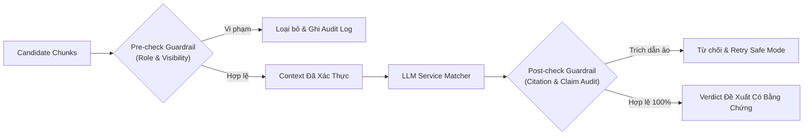

# ĐẶC TẢ MODULE 03: ĐỐI SÁNH DỊCH VỤ & HAI TẦNG GUARDRAIL (SERVICE MATCHING & GUARDRAIL SPEC)

> **Mã hồ sơ**: `SPEC-MOD-03`  
> **Module**: Service Matching Engine & Two-Tier Guardrail Sentinel  
> **Vị trí tài liệu**: `docs/spec/03_service_matching_guardrail_spec.md`  
> **Phụ trách triển khai**: Thành viên C (Guardrail Sentinel) + Thành viên B (Matching Transition API)  
> **Điều hướng liên kết**: [⬅️ Module 02 (Retrieval)](./02_hybrid_retrieval_spec.md) | [📋 Mục Lục](./README.md) | [Tiếp theo: Module 04 (Proposal) ➡️](./04_proposal_pipeline_spec.md)

---

## 1. TỔNG QUAN KIẾN TRÚC PHÒNG VỆ 2 TẦNG (TWO-TIER GUARDRAILS)
Để ngăn chặn hoàn toàn rủi ro ảo giác (Hallucination) trong môi trường B2B của SkyLink:
1. **Pre-check Guardrail**: Lọc sạch tri thức `restricted` và `draft` trước khi tiêm vào Prompt của LLM.
2. **Post-check Guardrail**: Kiểm toán trích dẫn (Citation Audit) và phát hiện từ khóa rủi ro thương mại/pháp lý trái phép.



---

## 2. PAYLOAD ĐỐI SÁNH DỊCH VỤ TỪ LLM (MATCHING VERDICT)

Sau khi LLM phân tích giữa Requirements và các Chunks được nạp, LLM sinh cấu trúc JSON:

```json
{
  "match_verdict": {
    "recommended_service_id": "S0112",
    "service_name": "Dịch vụ Giám sát Không phận Nông nghiệp Công nghệ cao",
    "suitability_score": 0.94,
    "rationale": "Dịch vụ S0112 hoàn toàn đáp ứng nhu cầu quét 500ha của khách hàng nhờ năng lực cảm biến đa phổ NDVI quét 1.000 ha/ngày và đã có tiền lệ xử lý bệnh nấm lá rụng trên cây cao su.",
    "evidence_chunk_ids": [
      "CHK_S0112_CAP_a12f9b8c",
      "CHK_S0112_PROB_7c4d1e2a"
    ],
    "unsupported_requirements": [],
    "commercial_warnings": [
      "Giá triển khai tại Bình Phước phụ thuộc chi phí vận chuyển đội cơ động mặt đất, cần khảo sát chi tiết trước khi chốt giá cuối."
    ]
  }
}
```

---

## 3. PAYLOAD KIỂM TOÁN TỪ POST-CHECK GUARDRAIL

Hệ thống Backend đối chiếu danh sách `evidence_chunk_ids` với cơ sở dữ liệu thực trước khi trả về cho người dùng:

```json
{
  "guardrail_audit": {
    "passed": true,
    "citation_valid": true,
    "hallucinated_claims_detected": false,
    "checked_against_chunk_ids": [
      "CHK_S0112_CAP_a12f9b8c",
      "CHK_S0112_PROB_7c4d1e2a"
    ],
    "violations": [],
    "action": "ALLOW_RECOMMENDATION"
  }
}
```

### Xử lý khi phát hiện vi phạm:
Nếu `evidence_chunk_ids` không tồn tại trong DB hoặc văn bản xuất hiện các mẫu câu cam kết phi thực tế (ví dụ: *"cam kết 100%", "giá chỉ từ 10 triệu"*):
```json
{
  "guardrail_audit": {
    "passed": false,
    "citation_valid": false,
    "hallucinated_claims_detected": true,
    "violations": [
      "[CITATION_HALLUCINATION] Chunk CHK_S0999_FAKE không tồn tại trong cơ sở dữ liệu",
      "[UNAUTHORIZED_CLAIM] Phát hiện cam kết giá không có nguồn căn cứ"
    ],
    "action": "REJECT_AND_RETRY"
  }
}
```
