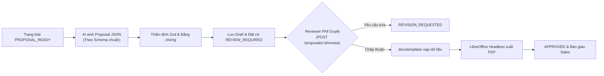

# ĐẶC TẢ MODULE 04: SINH BẢN THẢO & PHÊ DUYỆT PROPOSAL (PROPOSAL PIPELINE SPEC)

> **Mã hồ sơ**: `SPEC-MOD-04`  
> **Module**: Proposal Generation Pipeline & Human Review Approval  
> **Vị trí tài liệu**: `docs/spec/04_proposal_pipeline_spec.md`  
> **Phụ trách triển khai**: Thành viên B (Proposal REST API & Review) + Thành viên A (Mobile Preview & DOCX/PDF)  
> **Điều hướng liên kết**: [⬅️ Module 03 (Guardrail)](./03_service_matching_guardrail_spec.md) | [📋 Mục Lục](./README.md) | [Tiếp theo: Module 05 (Dictionary) ➡️](./05_data_dictionary_risk_matrix.md)

---

## 1. TỔNG QUAN PIPELINE SINH TÀI LIỆU
Proposal của SkyLink **không được sinh tự do từ toàn bộ đoạn chat**. 
Thay vào đó, hệ thống tuân thủ chuỗi xử lý nghiêm ngặt:
$$\text{Requirements} + \text{Selected Service} + \text{Evidence Chunks} \longrightarrow \text{Structured JSON} \longrightarrow \text{DOCX Template} \longrightarrow \text{Headless PDF}$$



---

## 2. CẤU TRÚC STRUCTURED PROPOSAL JSON

Khi phiên tư vấn đạt trạng thái `PROPOSAL_READY`, hệ thống sinh ra bản ghi JSON có cấu trúc hoàn chỉnh:

```json
{
  "proposal_id": "PROP_2026_S0112_0089",
  "session_id": "ses_7f8a9b1c-2d3e-4f5a",
  "created_at": "2026-10-05T10:21:00Z",
  "sales_agent": {
    "user_id": "usr_sales_01",
    "name": "Mai Tấn Giáp",
    "email": "giap.mt@gascolae.ctgroupvietnam.com"
  },
  "customer_info": {
    "company_name": "Công ty Cổ phần Nông nghiệp Cao su Bình Phước",
    "representative": "Nguyễn Văn A",
    "contact_phone": "0901234567",
    "address": "Thị xã Đồng Xoài, Tỉnh Bình Phước"
  },
  "service_package": {
    "service_id": "S0112",
    "service_name": "Dịch vụ Giám sát Không phận Nông nghiệp Công nghệ cao",
    "service_level_code": "SLA_WEEKLY_GOLD",
    "scope_summary": "Bay quét định kỳ 500ha rừng cao su bằng Drone đa phổ NDVI mỗi tuần một lần trong 6 tháng.",
    "deliverables": [
      "Bản đồ phân bố nấm bệnh chỉ số NDVI (định dạng GeoTIFF/GeoJSON)",
      "Báo cáo cảnh báo rủi ro suy thoái cây trồng theo thời gian thực"
    ],
    "deployment_conditions": [
      "Vùng bay được sự cấp phép của cơ quan quản lý không phận địa phương",
      "Thời tiết không vượt quá gió cấp 5 và lượng mưa dưới 15mm/h"
    ]
  },
  "evidence_provenance": [
    {
      "claim": "Năng lực quét tối đa 1.000 ha/ngày trên địa hình đồi dốc",
      "chunk_id": "CHK_S0112_CAP_a12f9b8c",
      "source_id": "SRC_AGRI_SPEC_2026_01"
    }
  ],
  "status": "REVIEW_REQUIRED"
}
```

---

## 3. QUY TRÌNH PHÊ DUYỆT CỦA CON NGƯỜI (HUMAN-IN-THE-LOOP)

### Endpoint: Quản lý / Reviewer phê duyệt Proposal
- **Giao thức**: `POST /api/proposals/{proposal_id}/review`
- **Quyền hạn (RBAC)**: Bắt buộc tài khoản có quyền `PROPOSAL_APPROVE` (Manager / Reviewer)

#### Payload Request (Reviewer $\to$ Backend):
```json
{
  "proposal_id": "PROP_2026_S0112_0089",
  "reviewer_id": "usr_reviewer_09",
  "action": "APPROVE",
  "review_notes": "Đã kiểm tra cấu hình kỹ thuật và cam kết SLA phù hợp với năng lực thiết bị đội bay khu vực miền Đông.",
  "timestamp": "2026-10-05T10:22:00Z"
}
```

#### Payload Response khi Phê Duyệt Thành Công (HTTP `200 OK`):
Hệ thống chuyển đổi trạng thái sang `APPROVED`, kích hoạt pipeline xuất file DOCX và PDF:

```json
{
  "proposal_id": "PROP_2026_S0112_0089",
  "status": "APPROVED",
  "approved_by": "usr_reviewer_09",
  "approval_timestamp": "2026-10-05T10:22:02Z",
  "documents": {
    "docx_url": "/storage/proposals/PROP_2026_S0112_0089_v1.docx",
    "pdf_url": "/storage/proposals/PROP_2026_S0112_0089_v1.pdf",
    "file_size_bytes": 1458920,
    "sha256_checksum": "e3b0c44298fc1c149afbf4c8996fb92427ae41e4649b934ca495991b7852b855"
  },
  "audit_trail_id": "aud_882194a0-12de-44bc-b1c2-90123456789a"
}
```
