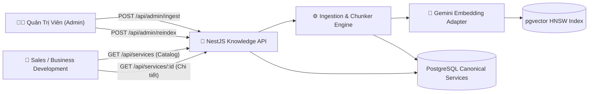

# ĐẶC TẢ MODULE 06: DANH MỤC TRI THỨC & NẠP DỮ LIỆU (KNOWLEDGE CATALOG & INGESTION SPEC)

> **Mã hồ sơ**: `SPEC-MOD-06`  
> **Module**: Knowledge Catalog Management & Ingestion Pipeline API  
> **Vị trí tài liệu**: `docs/spec/06_knowledge_catalog_ingestion_spec.md`  
> **Phụ trách triển khai**: Thành viên C (Data Pipeline & Ingestion Script) + Thành viên B (Admin REST API & Prisma)  
> **Điều hướng liên kết**: [⬅️ Module 05 (Dictionary)](./05_data_dictionary_risk_matrix.md) | [📋 Mục Lục](./README.md) | [Tiếp theo: Module 07 (Comparison) ➡️](./07_service_comparison_spec.md)

---

## 1. TỔNG QUAN KIẾN TRÚC QUẢN TRỊ TRI THỨC

Kiến trúc tri thức của SkyLink tuân thủ nghiêm ngặt nguyên tắc **Canonical Ground Truth**:
- Dữ liệu nghiệp vụ gốc được lưu trữ chuẩn hóa trong bảng `services` và `service_chunks` của PostgreSQL.
- Quản trị viên (Admin) có quyền nạp mới Service Assets và kích hoạt tính toán lại Vector Index (`pgvector`).
- Nhân viên Sales và người dùng nội bộ có thể duyệt danh mục (Catalog), tìm kiếm và xem chi tiết dịch vụ kèm huy hiệu xác minh (`verified`) cùng các liên kết nguồn kiểm chứng (`sources`).



---

## 2. CHI TIẾT CÁC ENDPOINT API DANH MỤC DỊCH VỤ

### 2.1. Endpoint: Lấy danh mục dịch vụ (Service Catalog)
- **Giao thức**: `GET /api/services`
- **Headers**: `Authorization: Bearer <JWT_TOKEN>`
- **Quyền hạn**: `service:read` (Sales, Reviewer, Admin)
- **Query Params**:
  - `domain`: bộ lọc lĩnh vực (`agriculture`, `logistics`, `security`, `infrastructure`)
  - `status`: bộ lọc trạng thái (`verified`, `draft`)
  - `search`: từ khóa tìm kiếm nhanh
  - `page`: số trang (mặc định: 1)
  - `limit`: số bản ghi/trang (mặc định: 20)

#### Payload Response (HTTP `200 OK`):
```json
{
  "total": 4,
  "page": 1,
  "limit": 20,
  "services": [
    {
      "service_id": "S0112",
      "service_name": "Dịch vụ Giám sát Không phận Nông nghiệp Công nghệ cao",
      "domain": "agriculture",
      "short_description": "Giải pháp Drone tầm xa quét cảm biến đa phổ Multispectral NDVI phát hiện sâu bệnh sớm trên nông trường diện tích lớn.",
      "status": "verified",
      "badge": "VERIFIED_CANONICAL",
      "version": 1,
      "total_capabilities": 5,
      "total_sources": 3,
      "updated_at": "2026-10-05T08:00:00Z"
    },
    {
      "service_id": "S0113",
      "service_name": "Dịch vụ Vận chuyển Hàng Khẩn Cấp & Y Tế Liên Đảo",
      "domain": "logistics",
      "short_description": "Hành lang vận chuyển UAV tự hành tải trọng 15kg, bán kính 80km phục vụ cấp cứu y tế và giao hàng biển đảo.",
      "status": "verified",
      "badge": "VERIFIED_CANONICAL",
      "version": 1,
      "total_capabilities": 4,
      "total_sources": 2,
      "updated_at": "2026-10-04T16:30:00Z"
    }
  ]
}
```

---

### 2.2. Endpoint: Xem toàn bộ chi tiết Service kèm nguồn kiểm chứng
- **Giao thức**: `GET /api/services/{service_id}`
- **Headers**: `Authorization: Bearer <JWT_TOKEN>`
- **Quyền hạn**: `service:read`
- **Mục đích**: Hiển thị hồ sơ chi tiết dịch vụ gồm Năng lực, SLA, Điều kiện triển khai và toàn bộ danh mục tài liệu kiểm chứng (`sources`).

#### Payload Response (HTTP `200 OK`):
```json
{
  "service_id": "S0112",
  "service_name": "Dịch vụ Giám sát Không phận Nông nghiệp Công nghệ cao",
  "domain": "agriculture",
  "status": "verified",
  "version": 1,
  "overview": "Dịch vụ ứng dụng công nghệ máy bay không người lái cánh bằng và cảm biến quang phổ hiện đại nhằm tự động hóa công tác giám sát nông nghiệp quy mô công nghiệp.",
  "customer_problems": [
    "Khó phát hiện sâu bệnh trên nông trường cao su rộng hàng trăm hecta bằng tuần tra mặt đất",
    "Thiếu số liệu trắc địa và độ ẩm đất chính xác phục vụ quy hoạch tưới tiêu"
  ],
  "capabilities": [
    {
      "id": "cap_01",
      "name": "Cảm biến đa phổ Multispectral NDVI 5 dải sóng",
      "spec": "Độ phân giải mặt đất GSD 2.5cm/pixel, nhận diện sớm rụng lá nấm nứt trước 10 ngày",
      "evidence_chunk_id": "CHK_S0112_CAP_a12f9b8c"
    },
    {
      "id": "cap_02",
      "name": "Drone cánh bằng tầm xa bay tự hành 120 phút",
      "spec": "Năng lực quét tối đa 1.000 hecta/ngày làm việc trên địa hình đồi dốc"
    }
  ],
  "service_levels": [
    {
      "level_code": "SLA_WEEKLY_GOLD",
      "name": "Gói Giám Sát Tuần Suất Cao (Weekly Gold)",
      "flight_frequency": "1 lần / tuần",
      "report_turnaround_time": "Trong vòng 24 giờ sau khi hạ cánh",
      "support_tier": "24/7 Dedicated Drone Team"
    },
    {
      "level_code": "SLA_MONTHLY_STANDARD",
      "name": "Gói Đánh Giá Định Kỳ (Monthly Standard)",
      "flight_frequency": "1 lần / tháng",
      "report_turnaround_time": "Trong vòng 48 giờ sau khi hạ cánh",
      "support_tier": "Standard Support"
    }
  ],
  "deliverables": [
    "Bản đồ phân bố nhiễm bệnh chỉ số NDVI (định dạng GeoTIFF và GeoJSON)",
    "Báo cáo thống kê diện tích cây suy thoái kèm đề xuất tọa độ phun thuốc chính xác",
    "Bản đồ mô hình độ cao số (DSM) 3D"
  ],
  "deployment_conditions": [
    "Được cơ quan quản lý không phận địa phương cấp phép trước 48h",
    "Sức gió mặt đất không vượt quá cấp 5 (< 38 km/h), không mưa giông"
  ],
  "sources": [
    {
      "source_id": "SRC_AGRI_SPEC_2026_01",
      "title": "Hồ sơ Đặc tả Kỹ thuật Thiết bị Đội Bay Nông Nghiệp GASCOLAE 2026",
      "document_type": "TECHNICAL_SPEC",
      "verified_by": "Vũ Đỗ Tuấn Huy",
      "verification_date": "2026-09-15",
      "document_url": "/storage/sources/SRC_AGRI_SPEC_2026_01.pdf"
    },
    {
      "source_id": "SRC_AGRI_CASE_STUDY_02",
      "title": "Báo cáo Thực nghiệm Giám sát Cao su Bình Phước Mùa Mưa 2025",
      "document_type": "CASE_STUDY",
      "verified_by": "Nguyễn Quyết Giang Sơn",
      "verification_date": "2026-09-20",
      "document_url": "/storage/sources/SRC_AGRI_CASE_STUDY_02.pdf"
    }
  ]
}
```

---

## 3. CHI TIẾT CÁC ENDPOINT ADMIN NẠP TRI THỨC (INGESTION & RE-INDEX)

### 3.1. Endpoint: Trigger nạp Service Asset mới (Trigger Ingestion)
- **Giao thức**: `POST /api/admin/ingest`
- **Headers**: `Authorization: Bearer <JWT_TOKEN>`
- **Quyền hạn (RBAC)**: Bắt buộc tài khoản có quyền `knowledge:ingest` (Admin)
- **Mục đích**: Nhận dữ liệu Service Asset thô dạng JSON chuẩn Canonical, tự động phân rã thành Semantic Chunks, sinh `chunk_id` ổn định và nạp vào DB.

#### Payload Request (Admin $\to$ Backend):
```json
{
  "service_payload": {
    "service_id": "S0114",
    "service_name": "Dịch vụ Tuần Tra An Ninh & Kiểm Tra Đường Ống Năng Lượng",
    "domain": "security",
    "customer_problems": [
      "Khó khăn trong việc kiểm tra rò rỉ khí đốt và ăn mòn kim loại trên hàng trăm km đường ống",
      "Nguy cơ cháy nổ cao tại các trạm van cách ly xa khu dân cư"
    ],
    "capabilities": [
      "Camera ảnh nhiệt hồng ngoại FLIR Boson 640x512",
      "Cảm biến laser phát hiện rò rỉ khí Methane tầm xa OGI"
    ],
    "service_levels": [
      {
        "level_code": "SLA_SECURITY_247",
        "name": "Gói Khẩn Cấp 24/7",
        "sla": "Xuất kích xử lý sự cố trong vòng 60 phút"
      }
    ],
    "deliverables": [
      "Bản đồ nhiệt cảnh báo điểm rò rỉ khí gas",
      "Video quang phổ độ nét cao kèm tọa độ GPS"
    ],
    "conditions": [
      "Bán kính an toàn tối thiểu 50m quanh trạm van năng lượng"
    ]
  },
  "source_metadata": {
    "source_id": "SRC_ENERGY_DOC_01",
    "title": "Quy trình Vận hành Đội Bay Tuần Tra Khí Gas GASCOLAE",
    "verified_by": "Lê Phúc Khang"
  },
  "auto_embed": true
}
```

#### Payload Response khi Nạp Thành Công (HTTP `201 Created`):
```json
{
  "status_code": 201,
  "message": "Nạp dữ liệu Service thành công và đã sinh Semantic Chunks",
  "service_id": "S0114",
  "summary": {
    "total_chunks_created": 7,
    "chunk_breakdown": {
      "overview": 1,
      "customer_problem": 2,
      "capability": 2,
      "service_level": 1,
      "condition": 1
    },
    "embeddings_generated": 7,
    "orphan_sources_detected": 0,
    "execution_duration_ms": 1420
  }
}
```

---

### 3.2. Endpoint: Kích hoạt tính toán lại Vector Embeddings (Trigger Re-index)
- **Giao thức**: `POST /api/admin/reindex`
- **Headers**: `Authorization: Bearer <JWT_TOKEN>`
- **Quyền hạn (RBAC)**: Bắt buộc tài khoản có quyền `knowledge:reindex` (Admin)
- **Mục đích**: Khi cập nhật model embedding (ví dụ: nâng cấp model mới của Google Gemini) hoặc làm mới toàn bộ vector cache.

#### Payload Request:
```json
{
  "target": "ALL_SERVICES",
  "embedding_model": "text-embedding-004",
  "force_recompute": true
}
```

#### Payload Response (HTTP `200 OK`):
```json
{
  "status_code": 200,
  "message": "Quá trình tái lập chỉ mục Vector đã hoàn tất thành công",
  "job_id": "job_reindex_88a9c12e",
  "statistics": {
    "services_reindexed": 4,
    "chunks_processed": 48,
    "vector_dimensions": 768,
    "index_type": "HNSW",
    "total_duration_ms": 3850
  }
}
```
