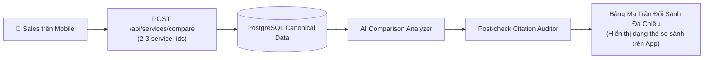

# ĐẶC TẢ MODULE 07: TÍNH NĂNG SO SÁNH DỊCH VỤ P1 (SERVICE COMPARISON SPEC)

> **Mã hồ sơ**: `SPEC-MOD-07`  
> **Module**: Service Comparison Engine & Trade-off Matrix (P1 Capability)  
> **Vị trí tài liệu**: `docs/spec/07_service_comparison_spec.md`  
> **Phụ trách triển khai**: Thành viên C (AI Comparison Prompt & Guardrail) + Thành viên A (Mobile Comparison UI) + Thành viên B (Backend API)  
> **Điều hướng liên kết**: [⬅️ Module 06 (Catalog)](./06_knowledge_catalog_ingestion_spec.md) | [📋 Mục Lục](./README.md) | [Tiếp theo: Module 08 (Audit) ➡️](./08_audit_telemetry_spec.md)

---

## 1. TỔNG QUAN NGHIỆP VỤ SO SÁNH
Trong quá trình tư vấn khách hàng, đội ngũ Sales/BD thường xuyên gặp tình huống khách hàng phân vân giữa 2 hoặc 3 phương án dịch vụ khác nhau (ví dụ: *Nên chọn gói S0112 chỉ giám sát hay kết hợp S0118 vừa giám sát vừa phun thuốc?*).

Tính năng So sánh Dịch vụ (Service Comparison) cho phép:
1. Tiếp nhận danh sách 2 đến 3 `service_ids` từ ứng dụng Mobile.
2. Trích xuất thông tin Canonical đối sánh đa chiều: Năng lực kỹ thuật, SLA thời gian trả kết quả, Điều kiện thời tiết, Sản phẩm bàn giao.
3. Sinh ma trận đối sánh trực quan kèm khuyến nghị tình huống sử dụng thực tế (Use Case Recommendation) có trích dẫn `evidence_chunk_ids` kiểm chứng.



---

## 2. CHI TIẾT ENDPOINT API SO SÁNH DỊCH VỤ

### Endpoint: So sánh đa chiều 2-3 gói dịch vụ
- **Giao thức**: `POST /api/services/compare`
- **Headers**: `Authorization: Bearer <JWT_TOKEN>`
- **Quyền hạn**: `service:read` (Sales, Reviewer, Admin)
- **Ràng buộc**: Mảng `service_ids` bắt buộc phải có từ 2 đến tối đa 3 dịch vụ.

#### Payload Request (Client $\to$ Backend):
```json
{
  "service_ids": ["S0112", "S0118"],
  "target_context": {
    "crop_type": "Cây cao su",
    "area_hectares": 500,
    "primary_goal": "Xử lý triệt để đợt bùng phát bệnh nấm lá rụng trong mùa mưa"
  },
  "comparison_dimensions": [
    "capabilities",
    "service_levels",
    "deployment_conditions",
    "deliverables",
    "operational_feasibility"
  ]
}
```

---

## 3. PAYLOAD PHẢN HỒI MA TRẬN SO SÁNH (COMPARISON MATRIX)

- **HTTP Code**: `200 OK`
- **Payload Response**:
```json
{
  "comparison_summary": "So sánh giữa Giải pháp Giám sát quang phổ S0112 và Giải pháp Phun thuốc dập dịch S0118 cho nông trường 500ha.",
  "services_compared": [
    {
      "service_id": "S0112",
      "service_name": "Dịch vụ Giám sát Không phận Nông nghiệp Công nghệ cao",
      "core_focus": "Phát hiện sớm và đo lường phạm vi nhiễm bệnh"
    },
    {
      "service_id": "S0118",
      "service_name": "Dịch vụ Phun Thuốc & Can Thiệp Chính Xác Bằng Drone",
      "core_focus": "Tác chiến dập dịch trực tiếp trên tán cây theo tọa độ"
    }
  ],
  "comparison_matrix": [
    {
      "dimension": "Năng lực Kỹ thuật Cốt lõi",
      "dimension_name_vi": "Thiết bị & Tải trọng",
      "comparison_details": {
        "S0112": "Drone cánh bằng tầm xa mang cảm biến quang phổ NDVI 5 dải sóng, bay 120 phút",
        "S0118": "Drone đa cánh quạt hạng nặng mang bình chứa thuốc sinh học 50 lít, vòi phun sương áp lực cao"
      },
      "winner_or_neutral": "NEUTRAL",
      "evidence_chunk_ids": ["CHK_S0112_CAP_a12f9b8c", "CHK_S0118_CAP_f4e3d2c1"]
    },
    {
      "dimension": "Tốc độ Bao phủ Diện tích",
      "dimension_name_vi": "Năng suất Triển khai",
      "comparison_details": {
        "S0112": "Quét đến 1.000 ha / ngày làm việc",
        "S0118": "Phun can thiệp từ 80 - 120 ha / ngày làm việc"
      },
      "winner_or_neutral": "S0112_FASTER_COVERAGE",
      "evidence_chunk_ids": ["CHK_S0112_CAP_a12f9b8c"]
    },
    {
      "dimension": "Điều kiện Thời tiết Khắc nghiệt",
      "dimension_name_vi": "Kháng Gió & Mưa",
      "comparison_details": {
        "S0112": "Chịu gió cấp 5, cấm bay khi có mưa giông",
        "S0118": "Chịu gió cấp 6, có thể phun thuốc trong điều kiện mưa phùn nhẹ"
      },
      "winner_or_neutral": "S0118_HIGHER_TOLERANCE"
    },
    {
      "dimension": "Sản phẩm Bàn giao Cuối cùng",
      "dimension_name_vi": "Đầu ra Nghiệp vụ",
      "comparison_details": {
        "S0112": "Bản đồ nhiệt nấm bệnh GeoJSON + Tọa độ cây suy thoái",
        "S0118": "Biên bản hoàn thành phun thuốc + Bản đồ log bay phun thực tế"
      },
      "winner_or_neutral": "NEUTRAL"
    }
  ],
  "key_differences": [
    "S0112 chỉ thực hiện chức năng chẩn đoán và định vị, không can thiệp vật lý.",
    "S0118 đóng vai trò can thiệp xử lý hóa chất sinh học nhưng cần tọa độ chỉ điểm từ S0112."
  ],
  "synergy_opportunity": "Đề xuất khách hàng sử dụng Gói Kết Hợp (Combo): Dùng S0112 bay quét toàn bộ 500ha để khoanh vùng 50ha bị nấm nặng nhất, sau đó điều động S0118 phun thuốc cục bộ đúng 50ha đó giúp tiết kiệm 70% chi phí thuốc trừ sâu.",
  "recommended_choice_rationale": "Nếu khách hàng chưa biết diện tích nhiễm bệnh: Chọn S0112 trước. Nếu dịch bệnh đã bùng phát rõ rệt: Kích hoạt combo S0112 + S0118."
}
```
