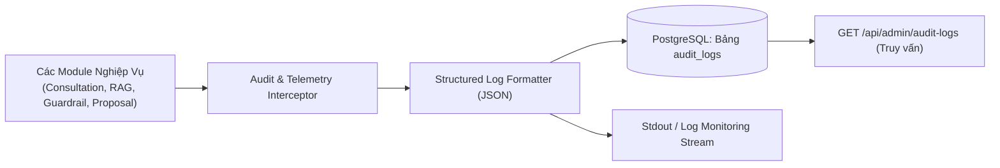

# ĐẶC TẢ MODULE 08: NHẬT KÝ KIỂM TOÁN & GIÁM SÁT (AUDIT & TELEMETRY SPEC)

> **Mã hồ sơ**: `SPEC-MOD-08`  
> **Module**: Audit Logging, System Telemetry & Event Tracing (D6-6 Spec)  
> **Vị trí tài liệu**: `docs/spec/08_audit_telemetry_spec.md`  
> **Phụ trách triển khai**: Thành viên B (Backend Structured Logger) + Thành viên C (AI Tracing & Guardrail Metrics)  
> **Điều hướng liên kết**: [⬅️ Module 07 (Comparison)](./07_service_comparison_spec.md) | [📋 Mục Lục Toàn Bộ Đặc Tả](./README.md)

---

## 1. TỔNG QUAN HỆ THỐNG KIỂM TOÁN (AUDIT TRAIL)
Trong hệ thống B2B như SkyLink, mọi tác vụ quan trọng liên quan đến quyết định tư vấn của AI, thay đổi trạng thái hợp đồng, và phê duyệt đề xuất thương mại **BẮT BUỘC** phải được ghi nhận vết kiểm toán (**Audit Trail**) bất biến để:
1. Phục vụ truy vết khi có tranh chấp thương mại hoặc khiếu nại về năng lực thiết bị.
2. Kiểm toán hành vi AI để phát hiện và khắc phục sớm các ca ảo giác (Hallucinations).
3. Đảm bảo tính tuân thủ quy trình kiểm soát nội bộ của tập đoàn CT Group.



---

## 2. SCHEMA CẤU TRÚC 4 LOẠI SỰ KIỆN CỐT TỬ (EVENT TYPES)

### 2.1. Sự kiện Chuyển Dịch Trạng Thái (Event Type: `STATE_TRANSITION`)
Ghi nhận mỗi khi phiên tư vấn chuyển từ trạng thái này sang trạng thái khác.

```json
{
  "event_id": "evt_st_0192a8b7-c6d5-4e3f",
  "event_type": "STATE_TRANSITION",
  "session_id": "ses_7f8a9b1c-2d3e-4f5a",
  "actor": {
    "user_id": "usr_sales_01",
    "role": "SALES",
    "ip_address": "14.241.120.45"
  },
  "payload": {
    "from_state": "COLLECTING_REQUIREMENTS",
    "to_state": "SERVICE_MATCHING",
    "trigger": "REQUIREMENTS_VALIDATED",
    "requirements_summary": {
      "problem": "Phát hiện sớm bệnh nấm lá rụng trên cây cao su",
      "target_area_hectares": 500,
      "location": "Bình Phước"
    },
    "deterministic_validator_passed": true
  },
  "timestamp": "2026-10-05T10:21:15Z"
}
```

---

### 2.2. Sự kiện Truy Vết Tìm Kiếm Tri Thức (Event Type: `RETRIEVAL_TRACE`)
Ghi nhận chi tiết mỗi lần hệ thống thực thi truy vấn tìm kiếm RAG để đánh giá chất lượng Retrieval.

```json
{
  "event_id": "evt_ret_88b7c6d5-e4f3-2a1b",
  "event_type": "RETRIEVAL_TRACE",
  "session_id": "ses_7f8a9b1c-2d3e-4f5a",
  "actor": {
    "user_id": "usr_sales_01",
    "role": "SALES"
  },
  "payload": {
    "raw_query": "máy bay không người lái quét chỉ số thực vật NDVI phát hiện nấm bệnh 500ha đồi dốc",
    "ranking_algorithm": "RRF",
    "rrf_k": 60,
    "metrics": {
      "fts_hits_count": 8,
      "vector_hits_count": 12,
      "fused_top_count": 2,
      "search_latency_ms": 142
    },
    "returned_chunk_ids": [
      {
        "chunk_id": "CHK_S0112_CAP_a12f9b8c",
        "rrf_score": 0.892,
        "service_id": "S0112"
      },
      {
        "chunk_id": "CHK_S0112_PROB_7c4d1e2a",
        "rrf_score": 0.854,
        "service_id": "S0112"
      }
    ]
  },
  "timestamp": "2026-10-05T10:21:16Z"
}
```

---

### 2.3. Sự kiện Phát Hiện Vi Phạm Guardrail (Event Type: `GUARDRAIL_VIOLATION`)
Ghi nhận mỗi khi bộ lọc Pre-check hoặc Post-check phát hiện dữ liệu nguy hại, trích dẫn ảo hoặc cam kết trái phép.

```json
{
  "event_id": "evt_grd_44c3b2a1-0f9e-8d7c",
  "event_type": "GUARDRAIL_VIOLATION",
  "session_id": "ses_7f8a9b1c-2d3e-4f5a",
  "severity": "WARNING",
  "guardrail_stage": "POST_CHECK",
  "payload": {
    "violation_code": "CITATION_HALLUCINATION_OR_FORBIDDEN_CLAIM",
    "detected_issues": [
      "Chunk CHK_S0999_FAKE được LLM trích dẫn nhưng không hề có trong cơ sở dữ liệu",
      "Văn bản xuất hiện cụm từ cam kết giá trái phép: 'cam kết giá rẻ nhất thị trường'"
    ],
    "model_name": "gemini-1.5-pro",
    "action_taken": "REJECT_OUTPUT_AND_TRIGGER_SAFE_RETRY",
    "retry_attempt": 1
  },
  "timestamp": "2026-10-05T10:21:18Z"
}
```

---

### 2.4. Sự kiện Vòng Đời Proposal & Phê Duyệt (Event Type: `PROPOSAL_EVENT`)
Ghi nhận các mốc sinh bản thảo, phê duyệt hoặc xuất tài liệu chính thức.

```json
{
  "event_id": "evt_prp_99a8b7c6-d5e4-3f2a",
  "event_type": "PROPOSAL_EVENT",
  "proposal_id": "PROP_2026_S0112_0089",
  "session_id": "ses_7f8a9b1c-2d3e-4f5a",
  "action": "PROPOSAL_APPROVED_AND_RENDERED",
  "actor": {
    "user_id": "usr_reviewer_09",
    "role": "REVIEWER",
    "full_name": "Trần Văn Quản Lý"
  },
  "payload": {
    "service_id": "S0112",
    "service_package": "SLA_WEEKLY_GOLD",
    "customer_name": "Công ty Cổ phần Nông nghiệp Cao su Bình Phước",
    "rendered_files": {
      "docx_path": "/storage/proposals/PROP_2026_S0112_0089_v1.docx",
      "pdf_path": "/storage/proposals/PROP_2026_S0112_0089_v1.pdf",
      "pdf_sha256": "e3b0c44298fc1c149afbf4c8996fb92427ae41e4649b934ca495991b7852b855"
    },
    "review_notes": "Đã kiểm tra cấu hình kỹ thuật và cam kết SLA phù hợp với năng lực thiết bị đội bay khu vực miền Đông."
  },
  "timestamp": "2026-10-05T10:22:02Z"
}
```

---

## 3. ENDPOINT TRUY VẤN DÀNH CHO ADMIN

### Endpoint: Truy vấn nhật ký kiểm toán hệ thống
- **Giao thức**: `GET /api/admin/audit-logs`
- **Headers**: `Authorization: Bearer <JWT_TOKEN>`
- **Quyền hạn (RBAC)**: Chỉ dành riêng cho `ADMIN`
- **Query Params**:
  - `event_type`: lọc theo loại sự kiện (`STATE_TRANSITION`, `RETRIEVAL_TRACE`, `GUARDRAIL_VIOLATION`, `PROPOSAL_EVENT`)
  - `session_id`: lọc theo phiên tư vấn cụ thể
  - `user_id`: lọc theo người thao tác
  - `page`: số trang (mặc định: 1)
  - `limit`: số bản ghi (mặc định: 25)

#### Payload Response (HTTP `200 OK`):
```json
{
  "total_records": 154,
  "page": 1,
  "limit": 25,
  "logs": [
    {
      "event_id": "evt_prp_99a8b7c6-d5e4-3f2a",
      "event_type": "PROPOSAL_EVENT",
      "action": "PROPOSAL_APPROVED_AND_RENDERED",
      "session_id": "ses_7f8a9b1c-2d3e-4f5a",
      "actor_name": "Trần Văn Quản Lý (REVIEWER)",
      "summary": "Phê duyệt Proposal PROP_2026_S0112_0089 và xuất PDF thành công",
      "timestamp": "2026-10-05T10:22:02Z"
    }
  ]
}
```
