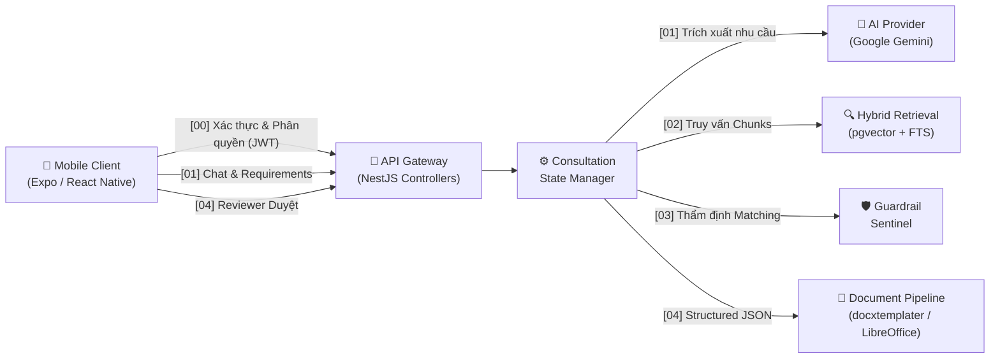

# HỆ THỐNG ĐẶC TẢ HỢP ĐỒNG DỮ LIỆU LIÊN MODULE (SKYLINK DATA SPECIFICATIONS)

> **Dự án**: GASCOLAE SkyLink — Extra Innovation Project (CT Group 2026)  
> **Thực hiện**: Nhóm thực tập sinh 03 (Mai Tấn Giáp, Lê Phúc Khang, Nguyễn Quyết Giang Sơn)  
> **Thư mục đặc tả**: `docs/spec/`  
> **Căn cứ tài liệu**:
> - [docs/SkyLink_Bao_Cao_De_Xuat_Du_An.md](../SkyLink_Bao_Cao_De_Xuat_Du_An.md)
> - [docs/GASCOLAE_Ke_Hoach_MVP_7_Ngay_VI.md](../GASCOLAE_Ke_Hoach_MVP_7_Ngay_VI.md)

---

## 1. TỔNG QUAN KIẾN TRÚC ĐẶC TẢ
Hệ thống tài liệu tại thư mục `docs/spec/` đóng vai trò là **Hợp đồng Dữ liệu Dùng chung (Shared Data Contracts & Interfaces)** chuẩn hóa giao tiếp giữa 3 thành phần cốt lõi của SkyLink:
1. **Mobile Client (Thành viên A)**: Expo / React Native App, Navigation, TanStack Query, SecureStore.
2. **Backend Gateway & Database (Thành viên B)**: NestJS API, PostgreSQL/Prisma, pgvector, Workflow State Manager.
3. **AI & Knowledge Pipeline (Thành viên C)**: Canonical Chunker, Hybrid Retrieval, Gemini LLM Adapter, Guardrail Sentinel.

---

## 2. SƠ ĐỒ ĐIỂM BẮN DỮ LIỆU TOÀN HỆ THỐNG

---

## 3. DANH MỤC CÁC TỆP ĐẶC TẢ CHI TIẾT THEO MODULE

| Mã Hồ Sơ | Tệp Đặc Tả Kỹ Thuật | Mô Tả Phạm Vi Nghiệp Vụ | Phụ Trách Chính |
| :---: | :--- | :--- | :---: |
| **00** | [00_auth_rbac_spec.md](./00_auth_rbac_spec.md) | Đăng nhập, cấp cặp JWT Token, gia hạn Silent Refresh, Decoded Claims và Ma trận 11 quyền RBAC (Sales, Reviewer, Admin). | Thành viên B + A |
| **01** | [01_consultation_workflow_spec.md](./01_consultation_workflow_spec.md) | Vòng đời hội thoại tư vấn, Missing-info loop, trích xuất yêu cầu khách hàng có cấu trúc (Zod Schema), State Transition, và Lịch sử phiên/Khôi phục phiên (Resume Session). | Thành viên B + C + A |
| **02** | [02_hybrid_retrieval_spec.md](./02_hybrid_retrieval_spec.md) | Giao thức truy vấn lai FTS (`tsvector`) + Dense Vector (`pgvector`), thuật toán RRF Ranking và trả về danh sách Chunks kèm `chunk_id`. | Thành viên C + B |
| **03** | [03_service_matching_guardrail_spec.md](./03_service_matching_guardrail_spec.md) | Đối sánh dịch vụ kèm bằng chứng, Pre-check lọc quyền/visibility và Post-check kiểm toán Citation, chặn đứng ảo giác về giá/tiến độ. | Thành viên C + B |
| **04** | [04_proposal_pipeline_spec.md](./04_proposal_pipeline_spec.md) | Đặc tả Proposal Structured JSON, ánh xạ template DOCX, biên dịch PDF headless và quy trình Human-in-the-loop duyệt Proposal. | Thành viên B + A |
| **05** | [05_data_dictionary_risk_matrix.md](./05_data_dictionary_risk_matrix.md) | Từ điển dữ liệu toàn hệ thống, ánh xạ kiểu dữ liệu TypeScript/Prisma và Ma trận quản trị rủi ro cấm đoán sai lệch dữ liệu. | Cả 3 Thành viên |
| **06** | [06_knowledge_catalog_ingestion_spec.md](./06_knowledge_catalog_ingestion_spec.md) | Danh mục Catalog dịch vụ, chi tiết kèm nguồn kiểm chứng (`sources`), API Admin nạp Service Asset mới và trigger re-index vector. | Thành viên C + B |
| **07** | [07_service_comparison_spec.md](./07_service_comparison_spec.md) | Tính năng P1 so sánh đa chiều 2-3 gói dịch vụ, ma trận tính năng, SLA, điều kiện thời tiết, hiệp đồng giải pháp (Synergies) và đề xuất tình huống. | Thành viên C + A + B |
| **08** | [08_audit_telemetry_spec.md](./08_audit_telemetry_spec.md) | Hệ thống Structured Logging & Vết kiểm toán bất biến (Audit Trail): State Transition, Retrieval Trace, Guardrail Violation, Proposal Event. | Thành viên B + C |

---

## 4. QUY CHUẨN KỸ THUẬT BẮT BUỘC DÙNG CHUNG
1. **Mã hóa ký tự**: `UTF-8` tiêu chuẩn.
2. **Định dạng thời gian**: `ISO 8601` dạng chuỗi UTC (`YYYY-MM-DDTHH:mm:ssZ`).
3. **Mã định danh duy nhất (UUID / Hashing)**:
   - User ID, Session ID, Proposal ID sử dụng UUID v4.
   - Chunk ID sử dụng thuật toán băm ổn định: `CHK_{SERVICE_ID}_{RECORD_TYPE}_{HASH}`.
4. **Quy chuẩn mã lỗi HTTP**:
   - `200 OK`: Thành công.
   - `400 Bad Request`: Sai cấu trúc payload hoặc vi phạm Zod validation.
   - `401 Unauthorized`: Thiếu token, token không hợp lệ hoặc đã hết hạn.
   - `403 Forbidden`: Người dùng không có quyền truy cập tài nguyên (ví dụ: Sales cố xem chunk `restricted`).
   - `422 Unprocessable Entity`: Vi phạm ràng buộc quy trình nghiệp vụ (ví dụ: cố chuyển sang `PROPOSAL_READY` khi chưa đủ thông tin).
