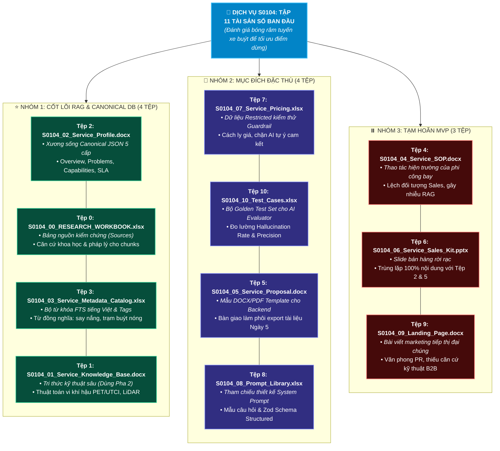

# 📋 BÁO CÁO NGHIÊN CỨU & ĐỊNH HƯỚNG SỬ DỤNG SERVICE DATA ASSETS (S0104)
### ĐÁNH GIÁ CHI TIẾT 11 TỆP TÀI SẢN SỐ (TỪ TỆP 0 ĐẾN TỆP 10) CHO HỆ THỐNG SKYLINK
> **Thư mục báo cáo**: `reports/day-01/Bao_Cao_Nghien_Cuu_Data_Ingestion_S0104.md`  
> **Trục kỹ thuật**: AI Intelligence & Knowledge Pipeline (Thành viên C)  
> **Người thực hiện**: Nguyễn Quyết Giang Sơn  
> **Ngày nghiên cứu**: Ngày 1 (05/10/2026) — Buổi Nghiên Cứu Kỹ Thuật (R2, R3 & D1-3)  
> **Đối tượng khảo sát**: Toàn bộ 11 tệp tài sản số của Dịch vụ **S0104: Đánh giá bóng râm tuyến xe buýt để tối ưu điểm dừng**  
> *(Bus-stop shade analysis for passenger comfort)*  

---

## 🎯 1. TỔNG QUAN BÀI TOÁN & TIÊU CHÍ LỰA CHỌN DỮ LIỆU

Trong kiến trúc của trợ lý di động **GASCOLAE SkyLink**, dữ liệu nạp vào hệ thống RAG không thể nhồi nhét bừa bãi. Việc phân loại và chọn lọc từng tệp dựa trên **3 nguyên tắc kỹ thuật cốt tử**:
1. **Chống loãng vector (Anti-Semantic Dilution)**: Loại bỏ các tài liệu trùng lặp (duplicate content) hoặc mang văn phong quảng cáo marketing để bảo đảm điểm Cosine Similarity và xếp hạng RRF ($k=60$) phản ánh đúng bản chất kỹ thuật.
2. **Kỷ luật Guardrail & Cách ly giá (Data Sanitization)**: Tuyệt đối không để AI tự do truy cập bảng giá chi tiết nhằm ngăn ngừa 100% ảo giác tự chốt giá hoặc rò rỉ chi phí nội bộ.
3. **Phân định đúng vai trò nghiệp vụ (Persona Alignment)**: SkyLink phục vụ **Sales / BD tư vấn giải pháp B2B và lập Proposal**. Các tài liệu thuần thao tác kỹ thuật hiện trường của phi công mặt đất không thuộc phạm vi tư vấn bán hàng.

---

## 🏛️ 2. SƠ ĐỒ MERMAID PHÂN LOẠI TOÀN BỘ 11 TỆP (TỪ 0 ĐẾN 10)

---

## 📊 3. BẢNG MA TRẬN QUẢN TRỊ CHI TIẾT TỪ TỆP 0 ĐẾN TỆP 10

| Mã Tệp | Tên Tệp & Dung Lượng | Trạng Thái Sử Dụng | Phân Vai Trong Hệ Thống SkyLink | Lý Do Quyết Định Kỹ Thuật |
| :---: | :--- | :---: | :--- | :--- |
| **0** | `S0104_00_RESEARCH_WORKBOOK.xlsx` *(24.7 KB)* | **SỬ DỤNG (BẮT BUỘC - P0)** | **Nguồn kiểm chứng (Evidence Sources)** | Trích xuất Sheet `02_NGUON_THAM_KHAO` để tạo tầng `Source` trong Canonical Model. Bắt buộc có để mỗi chunk được gắn mã dẫn chứng, chống lỗi "mồ côi nguồn". |
| **1** | `S0104_01_Service_Knowledge_Base.docx` *(43.7 KB - 573 đoạn)* | **SỬ DỤNG (CHỌN LỌC - P1)** | **Tri thức kỹ thuật chuyên sâu (Deep Knowledge)** | Trích xuất các đoạn về chỉ số nhiệt vi khí hậu PET/UTCI, cảm biến LiDAR đo tán cây để phục vụ Evidence Drawer khi khách hàng hỏi sâu về công nghệ. |
| **2** | `S0104_02_Service_Profile.docx` *(42.7 KB - 257 đoạn)* | **SỬ DỤNG (BẮT BUỘC - P0)** | **Xương sống dữ liệu Canonical JSON** | Chứa đầy đủ: Overview, Problem, Target Customer, Capability, SLA, Deliverables, Conditions. Đây là tệp cô đọng và chuẩn mực nhất để sinh các vector cốt lõi. |
| **3** | `S0104_03_Service_Metadata_Catalog.xlsx` *(18.0 KB - 5 sheets)* | **SỬ DỤNG (BẮT BUỘC - P0)** | **Từ khóa FTS & Tags lọc Metadata** | Cung cấp từ khóa tìm kiếm tiếng Việt/Anh, từ đồng nghĩa và domain tags (`smart_city`, `transportation`), giúp PostgreSQL Full-Text Search (`tsvector`) bắt trúng ý định người dùng. |
| **4** | `S0104_04_Service_SOP_Template_Checklist.docx` *(46.2 KB - 328 đoạn)* | ❌ **KHÔNG DÙNG TRONG MVP** | *Tài liệu vận hành bay hiện trường* | Thuần thao tác kỹ thuật của phi công UAV (sạc pin, lắp cánh, checklist an toàn). Lệch hoàn toàn với đối tượng Sales/BD và sẽ gây nhiễu kết quả tư vấn giải pháp. |
| **5** | `S0104_05_Service_Proposal.docx` *(46.2 KB - 295 đoạn)* | **CHUYỂN GIAO CHO BACKEND** | **Mẫu chuẩn cho Pipeline sinh DOCX/PDF** | KHÔNG nạp vào Vector DB (tránh trùng lặp với Tệp 2). Chuyển giao cho Thành viên B & A làm phôi template DOCX gắn biến placeholder cho `docxtemplater` / LibreOffice. |
| **6** | `S0104_06_Service_Sales_Kit.pptx` *(63.5 KB)* | ❌ **KHÔNG DÙNG TRONG MVP** | *Slide trình chiếu bán hàng* | Trùng lặp nội dung với Tệp 2 và Tệp 5. Cấu trúc slide PowerPoint vụn vặt, không theo luồng văn bản ngữ nghĩa, dễ tạo ra vector rác (garbage vectors). |
| **7** | `S0104_07_Service_Pricing.xlsx` *(10.8 KB - 3 sheets)* | 🔒 **DÙNG CÓ CÁCH LY PHÒNG VỆ** | **Dữ liệu Restricted kiểm thử Guardrail** | Nạp tên các gói dịch vụ vào danh mục lựa chọn, nhưng cách ly toàn bộ đơn giá chi tiết bằng nhãn `restricted` để kiểm thử Pre-check Guardrail (chặn AI tự ý báo giá). |
| **8** | `S0104_08_Service_AI_Prompt_Library.xlsx` *(16.0 KB - 4 sheets)* | **THAM KHẢO THIẾT KẾ** | **Tài liệu tham chiếu Prompt Engineering** | Không nạp vào DB. Dùng làm tài liệu tham khảo cho Giang Sơn khi soạn thảo System Prompt, Few-shot Examples và Zod Schema cho Gemini LLM. |
| **9** | `S0104_09_Service_Landing_Page_Content.docx` *(32.9 KB - 274 đoạn)* | ❌ **KHÔNG DÙNG TRONG MVP** | *Bài viết truyền thông marketing* | Văn phong quảng cáo kêu gọi hành động (CTA), thiếu các thông số kỹ thuật chính xác và căn cứ pháp lý cần thiết cho quy trình tư vấn giải pháp B2B có kiểm chứng. |
| **10** | `S0104_10_Service_AI_Agent_Config_Test_Cases.xlsx` *(17.5 KB - 7 sheets)* | 🧪 **DÙNG CHO AI EVALUATION** | **Bộ Golden Test Set thẩm định AI** | Chuyển đổi thành 15-20 test cases định lượng đo lường tỷ lệ ảo giác (Hallucination Rate), độ chính xác tìm kiếm (Retrieval Precision) cho Ngày 6 và Ngày 7. |

---

## 📝 4. BÓC TÁCH CHI TIẾT TỪNG TỆP: DÙNG ĐỂ LÀM GÌ HOẶC VÌ SAO KHÔNG DÙNG?

### 🔹 TỆP 0: `S0104_00_RESEARCH_WORKBOOK.xlsx` (BẮT BUỘC DÙNG)
- **Nội dung bên trong**: Chứa các báo cáo khảo sát và Sheet `02_NGUON_THAM_KHAO` liệt kê các bài báo khoa học, tiêu chuẩn kỹ thuật vi khí hậu và quyết định quy hoạch đô thị.
- **Dùng để làm gì?**: 
  - Trích xuất dữ liệu để tạo bảng `sources` trong cơ sở dữ liệu.
  - Cung cấp mã định danh `source_id` (ví dụ: `SRC_S0104_STUDY_01`) để liên kết vào trường `evidence_source_ids` của từng Semantic Chunk.
  - Khi ứng dụng Mobile hiển thị ngăn kéo dẫn chứng (Evidence Drawer) hoặc xuất Proposal, tệp này giúp chứng minh giải pháp có cơ sở khoa học thực tế, không phải AI tự bịa.

---

### 🔹 TỆP 1: `S0104_01_Service_Knowledge_Base.docx` (DÙNG CHỌN LỌC Ở PHA 2)
- **Nội dung bên trong**: 573 đoạn văn giải thích cặn kẽ thuật toán tính chỉ số nhiệt PET/UTCI, cảm biến LiDAR đo tán cây, mô hình 3D bóng râm theo thời gian thực.
- **Dùng để làm gì?**:
  - Không nạp ồ ạt ngay Ngày 1. Ở Pha 2, ta sẽ trích xuất chọn lọc khoảng 10-15 đoạn chuyên sâu về kỹ thuật cốt lõi để làm giàu tri thức cho RAG.
  - Giúp trả lời chính xác khi khách hàng hoặc chuyên viên kỹ thuật của Sở GTVT hỏi sâu: *"Hệ thống dùng thuật toán gì để tính độ râm mát?", "Độ sai số bao nhiêu mét?"*.

---

### 🔹 TỆP 2: `S0104_02_Service_Profile.docx` (BẮT BUỘC DÙNG - CỐT LÕI NHẤT)
- **Nội dung bên trong**: 257 đoạn văn chuẩn mực bao quát toàn bộ dịch vụ: Tên, Mô tả một câu, 3 vấn đề lớn của khách hàng, 3 nhóm khách hàng mục tiêu, Năng lực kỹ thuật, 2 gói SLA, Sản phẩm bàn giao (bản đồ bóng râm 3D, tọa độ dời trạm buýt) và Điều kiện bay.
- **Dùng để làm gì?**:
  - Là nguồn dữ liệu duy nhất dùng để ánh xạ thành tệp chuẩn hóa `S0104_canonical.json`.
  - Được phân rã thành các Semantic Chunks mang mã băm tất định: `CHK-S0104-OVER-...`, `CHK-S0104-PROB-...`, `CHK-S0104-CAPA-...`, `CHK-S0104-SLA-...`, `CHK-S0104-COND-...`.
  - Đây là nền tảng phục vụ cho máy trạng thái tư vấn (Consultation State Machine) và bộ khớp dịch vụ (Service Matcher).

---

### 🔹 TỆP 3: `S0104_03_Service_Metadata_Catalog.xlsx` (BẮT BUỘC DÙNG)
- **Nội dung bên trong**: 5 sheets danh mục phân loại metadata, từ đồng nghĩa, từ khóa tìm kiếm và luật search AI.
- **Dùng để làm gì?**:
  - Làm giàu chỉ mục tìm kiếm văn bản đầy đủ **PostgreSQL Full-Text Search (`tsvector`)**: Khi người dùng gõ từ đời thường như *"say nắng"*, *"nắng nóng trạm buýt"*, *"chỗ chờ xe nóng quá"*, tệp 3 cung cấp từ điển đồng nghĩa để ánh xạ chính xác về dịch vụ S0104.
  - Cung cấp Domain Tags chuẩn (`smart_city`, `transportation`, `bus_stop`) cho bộ lọc Metadata Filter, giúp Hybrid Retrieval đạt độ chính xác tối đa.

---

### ❌ TỆP 4: `S0104_04_Service_SOP_Template_Checklist.docx` (KHÔNG DÙNG TRONG MVP)
- **Nội dung bên trong**: 328 đoạn văn quy định nhiệm vụ phi công bay, kỹ thuật viên mặt đất, quy trình sạc pin, kiểm tra motor cánh quạt, checklist an toàn trước khi cất cánh.
- **Tại sao KHÔNG DÙNG?**:
  1. *Lệch đối tượng người dùng*: Trợ lý SkyLink phục vụ đội ngũ **Sales/BD tư vấn giải pháp và ký hợp đồng với khách hàng**. Sales không cần quan tâm phi công mặt đất phải cắm dây sạc pin thế nào.
  2. *Gây nhiễu vector nghiêm trọng*: Nếu đưa vào RAG, khi Sales hỏi *"Điều kiện triển khai là gì?"*, AI có thể trích dẫn nhầm quy trình kiểm tra ốc vít của phi công thay vì điều kiện thời tiết/giấy phép bay.

---

### 🔹 TỆP 5: `S0104_05_Service_Proposal.docx` (CHUYỂN GIAO CHO BACKEND / KHÔNG NẠP RAG)
- **Nội dung bên trong**: 295 đoạn văn trình bày một bản đề xuất thương mại hoàn chỉnh gửi cơ quan quản lý đô thị.
- **Dùng để làm gì?**:
  - **Cấm nạp vào RAG**: Vì nội dung của nó tổng hợp lại từ Profile (Tệp 2) và Pricing (Tệp 7). Nạp vào Vector DB sẽ gây trùng lặp 100%, làm sai lệch xếp hạng tìm kiếm.
  - **Mục đích thực sự**: Bàn giao cho **Thành viên B (Khang - Backend)** và **Thành viên A (Giáp - Mobile)** làm mẫu phôi DOCX Template. Nhóm sẽ chèn các biến placeholder (`{customer_name}`, `{#capabilities}...{/capabilities}`, `{sla_level}`) để worker `docxtemplater` và LibreOffice xuất file PDF ở Ngày 5-6.

---

### ❌ TỆP 6: `S0104_06_Service_Sales_Kit.pptx` (KHÔNG DÙNG TRONG MVP)
- **Nội dung bên trong**: Slide thuyết trình tóm tắt dành cho khách hàng.
- **Tại sao KHÔNG DÙNG?**:
  1. *Nội dung hoàn toàn trùng lặp*: Không có bất kỳ thông tin mới nào ngoài những gì đã có trong Profile (Tệp 2) và Proposal (Tệp 5).
  2. *Định dạng slide rời rạc*: File PowerPoint (.pptx) chứa văn bản vụn vặt trong các text box đồ họa, không có cấu trúc phân đoạn mạch lạc. Nếu băm mảnh sẽ tạo ra các vector rác (junk vectors) làm giảm độ chính xác của hệ thống.

---

### 🔒 TỆP 7: `S0104_07_Service_Pricing.xlsx` (DÙNG CÓ KIỂM SOÁT BẢO MẬT)
- **Nội dung bên trong**: Bảng giá chi tiết, đơn giá theo km tuyến đường, bảng phân tích chi phí nhân công, thiết bị, điều khoản thanh toán.
- **Dùng để làm gì?**:
  - **Quy tắc cách ly phòng vệ**: Trích xuất **tên các gói dịch vụ** đưa vào danh mục lựa chọn. Riêng các con số giá tiền cụ thể BẮT BUỘC gán nhãn `visibility: "restricted"`.
  - Tệp này dùng làm ca kiểm thử then chốt cho **Pre-check Guardrail**: Chứng minh hệ thống chặn đứng không cho Sales xem giá gốc nội bộ, và chặn AI tự ý cam kết giá chốt với khách hàng. Trong Proposal, giá chỉ được thể hiện ở dạng khung dự toán hoặc chuyển sang mục `items_to_confirm`.

---

### 💡 TỆP 8: `S0104_08_Service_AI_Prompt_Library.xlsx` (THAM KHẢO THIẾT KẾ)
- **Nội dung bên trong**: Thư viện prompt mẫu và kịch bản hỏi đáp thử nghiệm.
- **Dùng để làm gì?**:
  - Không nạp vào cơ sở dữ liệu tri thức.
  - Giang Sơn sử dụng tệp này làm tài liệu tham chiếu khi viết System Prompt, hướng dẫn phong cách đàm phán và thiết kế Zod Schema Structured Output cho Google Gemini LLM Adapter.

---

### ❌ TỆP 9: `S0104_09_Service_Landing_Page_Content.docx` (KHÔNG DÙNG TRONG MVP)
- **Nội dung bên trong**: 274 đoạn văn viết theo phong cách marketing truyền thông, bài PR website, các câu giật tít và nút kêu gọi hành động (Call to Action).
- **Tại sao KHÔNG DÙNG?**:
  1. *Văn phong tiếp thị quảng cáo*: Thiếu tính chính xác về thông số kỹ thuật, thiếu chiều sâu nghiệp vụ và không có giá trị làm căn cứ pháp lý cho một bản Proposal B2B.
  2. *Nguy cơ gây ảo giác phong cách*: Nếu nạp vào prompt, AI sẽ có xu hướng trả lời ba hoa, sáo rỗng kiểu quảng bá đại chúng thay vì tư vấn giải pháp kỹ thuật có dẫn chứng khoa học.

---

### 🧪 TỆP 10: `S0104_10_Service_AI_Agent_Config_Test_Cases.xlsx` (DÙNG CHO AI EVALUATOR)
- **Nội dung bên trong**: 7 sheets chứa cấu hình agent, quy tắc guardrail hành vi và các ca kiểm thử hỏi đáp thực tế.
- **Dùng để làm gì?**:
  - Đây là kho báu kỹ thuật để Giang Sơn chuyển đổi thành **Golden Test Set** (15-20 test cases).
  - Dùng trong Ngày 6 và Ngày 7 kết hợp kỹ năng [`ai-golden-evaluator`](../../.agents/plugins/skylink-service-intelligence/skills/ai-golden-evaluator/SKILL.md) để đo lường định lượng: Retrieval Precision, Retrieval Recall, Grounded Response Rate, và khẳng định Tỷ lệ Ảo giác (Hallucination Rate) đạt chuẩn kiểm định < 2%.

---

## 🚀 5. KẾ HOẠCH HÀNH ĐỘNG CỤ THỂ CHO GIANG SƠN (TIẾP THEO)

Sau khi đã chốt danh mục 11 tệp, hành động kỹ thuật tiếp theo gồm 3 bước:
1. **Bước 1 (Ngay lập tức)**: Viết parser script trích xuất dữ liệu từ **Bộ Ba Cốt Lõi (Tệp 2 + Tệp 0 + Tệp 3)** để sinh tệp chuẩn hóa `knowledge/canonical/S0104_canonical.json`.
2. **Bước 2**: Thực thi hàm băm tất định cấp mã định danh `chunk_id` (`CHK-S0104-OVER-...`, `CHK-S0104-PROB-...`) kèm gắn nhãn `evidence_source_ids` từ Tệp 0.
3. **Bước 3**: Bàn giao cấu trúc JSON cho Thành viên B (Khang - Backend) để cấu hình migration PostgreSQL và nạp vector embeddings.

---
*Báo cáo được chuẩn hóa và lưu trữ chính thức tại: `reports/day-01/Bao_Cao_Nghien_Cuu_Data_Ingestion_S0104.md`.*
