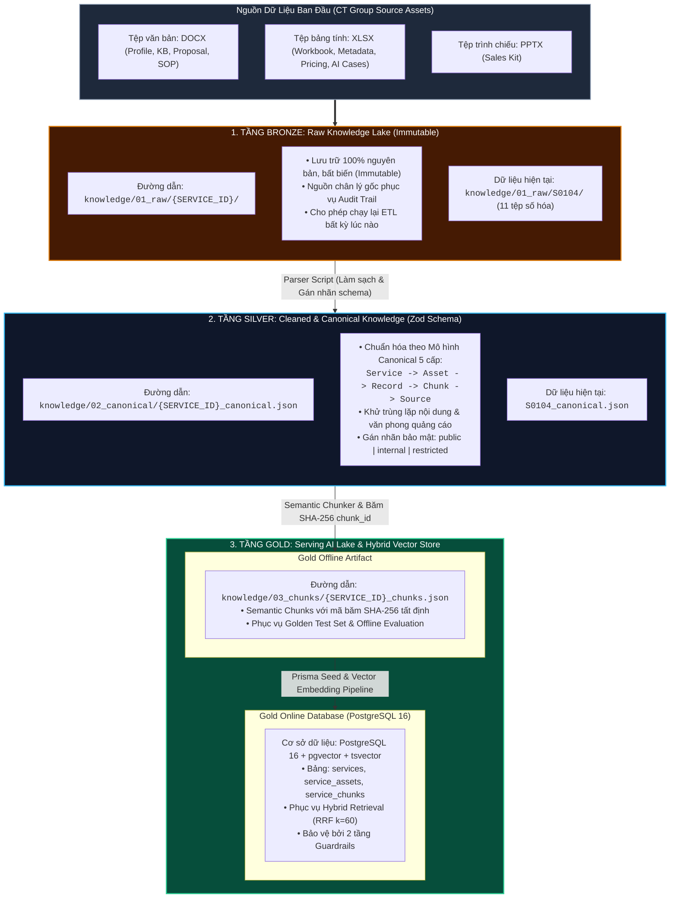

# 🏛️ BÁO CÁO THIẾT KẾ KIẾN TRÚC LƯU TRỮ KNOWLEDGE LAKEHOUSE & ĐỊNH HƯỚNG TRÍCH XUẤT DỮ LIỆU
### QUY HOẠCH HỆ THỐNG LƯU TRỮ MEDALLION (BRONZE - SILVER - GOLD) CHO DỊCH VỤ S0104 & KHẢ NĂNG MỞ RỘNG TOÀN DIỆN SKYLINK
> **Thư mục báo cáo**: `reports/day-01/Bao_Cao_Thiet_Ke_Kien_Truc_Luu_Tru_Lakehouse.md`  
> **Trục kỹ thuật**: AI Intelligence & Knowledge Pipeline (Thành viên C)  
> **Người thực hiện**: Nguyễn Quyết Giang Sơn  
> **Ngày nghiên cứu**: Ngày 1 (05/10/2026) — Buổi Nghiên Cứu Kỹ Thuật (R2, R3 & D1-3)  
> **Mục tiêu**: Thiết lập nền tảng kiến trúc lưu trữ dữ liệu tri thức dài hạn, giải quyết bài toán mở rộng từ 1 dịch vụ thử nghiệm (S0104) lên hàng trăm dịch vụ tương lai của CT Group.

---

## 🎯 1. BỐI CẢNH & ĐẶT VẤN ĐỀ (PROBLEM FORMULATION)

Trong giai đoạn Ngày 1 của dự án **GASCOLAE SkyLink**, hệ thống bắt đầu với 11 tệp tài liệu số thuộc Dịch vụ **S0104: Đánh giá bóng râm tuyến xe buýt để tối ưu điểm dừng** bao gồm đủ loại định dạng: DOCX, XLSX, PPTX.

Tuy nhiên, câu hỏi kiến trúc cốt tử được đặt ra là:
1. **Lựa chọn mô hình lưu trữ nào?**: Nên thiết kế theo mô hình **Data Warehouse (DWH)**, **Data Lake** hay **Lakehouse (Knowledge Lakehouse)** để hôm nay phục vụ thử nghiệm 1 dịch vụ S0104 nhưng ngày mai có thể mở rộng lên hàng chục, hàng trăm dịch vụ khác (`S0101`, `S0102`, `S0201`...) của tập đoàn mà không phải đập đi xây lại?
2. **Định dạng dữ liệu sau trích xuất là gì?**: Dữ liệu sau khi parse từ các tài liệu thô nên được lưu dưới dạng file gì (JSON, Parquet, SQLite, Markdown hay CSV) để tối ưu cho hệ thống RAG Hybrid Retrieval, Mobile App và Backend NestJS?

Báo cáo này phân tích cơ sở lý thuyết, so sánh định lượng và chuẩn hóa thiết kế lưu trữ chính thức cho toàn bộ dự án.

---

## ⚖️ 2. PHÂN TÍCH SO SÁNH: DATA WAREHOUSE vs DATA LAKE vs KNOWLEDGE LAKEHOUSE

Để tìm ra kiến trúc tối ưu, nhóm kỹ thuật tiến hành phân tích ma trận 7 tiêu chí trong bối cảnh đặc thù của trợ lý tư vấn RAG:

| Tiêu chí kỹ thuật | Data Warehouse (DWH) truyền thống | Data Lake đơn thuần | **Knowledge Lakehouse (Lựa chọn của SkyLink)** |
| :--- | :--- | :--- | :--- |
| **1. Bản chất dữ liệu xử lý** | Dữ liệu có cấu trúc dạng bảng phẳng (SQL, quan hệ, OLAP). | Lưu trữ tệp thô dạng blob/object bất kỳ (S3, MinIO, Blob). | **Xử lý toàn diện**: Tệp phi cấu trúc gốc + Dữ liệu cấu trúc hóa 5 cấp. |
| **2. Khả năng phục vụ AI & RAG** | **Kém**: Không parse được văn bản tự nhiên, không thể semantic chunking. | **Kém**: Không có index, không hỗ trợ vector search hay hybrid search. | **Tối ưu tuyệt đối**: Hỗ trợ Full-Text Search (tsvector) + pgvector với RRF. |
| **3. Tính toàn vẹn & Schema Control** | Rất cao (Schema strict, ACID). | Rất thấp: Dễ biến thành "Data Swamp" (đầm lầy dữ liệu rác không kiểm soát). | **Rất cao**: Kiểm soát bằng Zod Schema (Silver) và ràng buộc quan hệ PostgreSQL (Gold). |
| **4. Tốc độ truy vấn API Real-time** | Nhanh với truy vấn SQL thống kê, nhưng không truy vấn được ngữ nghĩa. | Rất chậm: Phải quét toàn bộ bucket hoặc parse file tại runtime. | **Siêu tốc**: Truy vấn lai pgvector kết hợp tsvector dưới 50ms qua NestJS API. |
| **5. Khả năng Re-process (Tính bất biến)** | Kém: Dữ liệu gốc thường bị biến đổi hoặc mất cấu trúc khi nạp. | Tốt: File gốc còn nguyên. | **Hoàn hảo**: Giữ 100% file gốc ở Bronze; khi đổi thuật toán Chunking chỉ cần chạy lại script tạo Gold mới. |
| **6. Chi phí lưu trữ & Tính toán** | Rất đắt nếu lưu trữ nội dung văn bản dài và vector embedding. | Chi phí lưu trữ rất rẻ nhưng chi phí tính toán khi đọc cao. | **Tách biệt Storage & Compute**: Lưu file tĩnh rẻ tiền ở Bronze/Silver; chỉ nạp các chunk tinh gọn vào Database phục vụ API. |
| **7. Độ phù hợp mở rộng (Scale)** | Bị giới hạn bởi cấu trúc bảng phẳng cứng nhắc. | Dễ mở rộng file nhưng không quản trị được phiên bản nội dung. | **Thiết kế phân tầng Medallion**: Dễ dàng thêm dịch vụ mới theo folder mà không ảnh hưởng dịch vụ cũ. |

### 📌 Kết luận kiến trúc:
- **Không dùng Data Warehouse đơn lẻ**: Vì tri thức của CT Group bắt đầu từ văn bản tự nhiên, bảng giá nhiều sheet, slide trình chiếu. DWH không thể ingest trực tiếp dạng dữ liệu này cho AI.
- **Không dùng Data Lake đơn thuần**: Vì Data Lake chỉ đóng vai trò "kho chứa thụ động", thiếu khả năng tìm kiếm ngữ nghĩa và không thể phục vụ các luồng tư vấn real-time của Sales trên ứng dụng di động.
- **CHỌN KNOWLEDGE LAKEHOUSE (Kiến trúc Medallion 3 tầng)**: Đây là mô hình hiện đại nhất kết hợp sự linh hoạt lưu trữ vô hạn của Data Lake với năng lực kiểm soát schema và truy vấn tốc độ cao của Data Warehouse / Vector Database.

---

## 🏛️ 3. THIẾT KẾ CHI TIẾT KIẾN TRÚC MEDALLION 3 TẦNG CHO SKYLINK

Hệ thống lưu trữ của SkyLink được phân định thành 3 tầng chức năng độc lập:



### 3.1. Tầng 1 - Bronze Layer (Raw Lake - Nguồn Chân Lý Gốc)
- **Đường dẫn**: `knowledge/01_raw/{SERVICE_ID}/` (ví dụ `knowledge/01_raw/S0104/`).
- **Đặc tính**: **Bất biến (Immutable) & Nguyên bản (100% Bit-for-Bit)**.
- **Nội dung lưu trữ**: Toàn bộ các file DOCX, XLSX, PPTX, PDF do các khối phòng ban của CT Group cung cấp.
- **Giá trị cốt lõi**:
  - Đóng vai trò là "chứng cứ nguồn" phục vụ đối soát, kiểm toán pháp lý.
  - Khi hệ thống nâng cấp thuật toán tách đoạn (Chunking) hoặc đổi mô hình Embedding (ví dụ nâng cấp từ Gemini Text Embedding sang mô hình mới), ta chỉ việc chạy lại pipeline từ Bronze mà không bao giờ sợ mất mát dữ liệu gốc.

### 3.2. Tầng 2 - Silver Layer (Cleaned & Canonical - Dữ Liệu Chuẩn Hóa 5 Cấp)
- **Đường dẫn**: `knowledge/02_canonical/{SERVICE_ID}_canonical.json`.
- **Đặc tính**: **Cấu trúc hóa chặt chẽ theo Zod Schema & Đã được làm sạch**.
- **Nhiệm vụ chuyển đổi**:
  - Trích xuất thông tin có cấu trúc từ Tệp 2 (`Service_Profile`), Tệp 0 (`RESEARCH_WORKBOOK`), Tệp 3 (`Metadata_Catalog`).
  - Khử bỏ các đoạn văn bản thừa, định dạng rác và văn phong quảng cáo tiếp thị (từ Tệp 9).
  - Phân loại cấp bảo mật rõ ràng: `visibility: "public" | "internal" | "restricted"` (cách ly bảng giá Tệp 7 vào nhóm restricted).
  - Chuẩn hóa mô hình quan hệ 5 tầng:
    $$\text{Service} \longrightarrow \text{Asset} \longrightarrow \text{Record} \longrightarrow \text{Chunk} \longrightarrow \text{Source}$$

### 3.3. Tầng 3 - Gold Layer (Serving Lake & AI Store - Tầng Phục Vụ Truy Vấn)
Tầng Gold được thiết kế theo cấu trúc **kép (Dual-Layer)** để vừa phục vụ đánh giá ngoại tuyến (Offline Eval), vừa phục vụ truy vấn trực tuyến (Online Production):
1. **Lớp File Tĩnh (Gold Offline Artifact)**:
   - File: `knowledge/03_chunks/{SERVICE_ID}_chunks.json`.
   - Chứa toàn bộ các Semantic Chunks đã được cắt theo ranh giới ngữ nghĩa (Boundary-Aware), kèm mã định danh tất định `chunk_id` dạng `CHK-S0104-OVER-001` băm SHA-256 từ nội dung.
   - Phục vụ trực tiếp cho bộ công cụ đánh giá [`ai-golden-evaluator`](../../.agents/plugins/skylink-service-intelligence/skills/ai-golden-evaluator/SKILL.md) để đo lường độ chính xác (Precision, Recall, Hallucination Rate).
2. **Lớp Cơ Sở Dữ Liệu (Gold Online Store)**:
   - Hệ quản trị: **PostgreSQL 16** kết hợp tiện ích mở rộng **pgvector** và chỉ mục **Full-Text Search (tsvector)**.
   - Quản trị ORM: Prisma Schema.
   - Phục vụ thuật toán tìm kiếm lai **Hybrid Retrieval** kết hợp điểm RRF (Reciprocal Rank Fusion, hằng số $k=60$):
     $$\text{RRF\_Score}(d) = \frac{1}{60 + \text{Rank}_{\text{FTS}}(d)} + \frac{1}{60 + \text{Rank}_{\text{Dense}}(d)}$$

---

## 📄 4. PHÂN TÍCH ĐỊNH DẠNG TRÍCH XUẤT: TẠI SAO CHỌN JSON?

Khi trích xuất từ tầng Bronze sang Silver và Gold, định dạng dữ liệu đầu ra tối ưu nhất là **JSON (Strict Zod-Validated JSON)**.

Dưới đây là bảng so sánh kỹ thuật giữa các định dạng ứng viên:

| Định dạng | Độ tương thích Monorepo | Khả năng biểu diễn phân cấp 5 tầng | Tương thích Gemini LLM | Khả năng Audit & Diff trên Git | Kết luận |
| :--- | :--- | :--- | :--- | :--- | :--- |
| **JSON** | **Hoàn hảo (100%)**: Native TypeScript, Zod, Prisma, React Native. | **Hoàn hảo**: Biểu diễn tự nhiên cấu trúc cây lồng nhau (Nested tree). | **Hoàn hảo**: Native Zod Structured Output (`zodToJsonSchema`). | **Rất tốt**: Text-based, diff rõ từng dòng trên GitHub. | **LỰA CHỌN SỐ 1 CHO MVP & DÀI HẠN** |
| **Parquet** | Trung bình: Cần thư viện trung gian (arrow/duckdb). | Kém: Phù hợp bảng phẳng hơn cấu trúc cây phân cấp phức tạp. | Kém: LLM không đọc trực tiếp binary parquet. | Không: Định dạng nhị phân, không diff được trên Git. | Dùng làm lớp phân tích OLAP khi dữ liệu đạt hàng triệu chunks. |
| **SQLite** | Trung bình: Cần SQLite client trong worker. | Trung bình: Phải chuẩn hóa ra nhiều bảng khóa ngoại 1-N. | Trung bình: Cần chuyển sang JSON trước khi inject vào prompt. | Không: File nhị phân, dễ xung đột khi nhiều người commit. | Không phù hợp làm file trung gian RAG. |
| **Markdown** | Rất tốt: Dễ đọc hiểu. | Kém: Không kiểm soát được kiểu dữ liệu, thiếu metadata schema. | Tốt: Dễ nhồi vào context prompt. | Rất tốt: Diff văn bản rõ ràng. | **Chỉ dùng làm nội dung văn bản bên trong trường `content` của chunk JSON**. |
| **CSV/Excel** | Kém: Bị nhân đôi dữ liệu khi biểu diễn quan hệ 1-N. | Rất kém: Không thể biểu diễn danh sách nguồn dẫn `evidence_source_ids`. | Kém: Dễ lỗi định dạng dấu phẩy, nhảy cột. | Kém: Hay conflict khi sửa đổi. | Loại bỏ. |

### 4 Lý Do Cốt Tử Chọn JSON Làm Định Dạng Trích Xuất:
1. **Tính Đồng Nhất Tuyệt Đối Xuyên Suốt Monorepo**: Toàn bộ dự án SkyLink từ Frontend Mobile (Expo React Native), Backend (NestJS / Prisma) đến AI Engine (Google Gemini SDK) đều nói chung "ngôn ngữ" JSON. Không phát sinh chi phí chuyển đổi định dạng.
2. **Biểu Diễn Tự Nhiên Cấu Trúc 5 Cấp Canonical**: Một dịch vụ có nhiều Assets, mỗi Asset có nhiều Records, mỗi Record có nhiều Chunks và Sources. Cấu trúc cây này biểu diễn qua JSON là tối ưu và trong sáng nhất.
3. **Cơ Chế Bảo Vệ Kiểu Dữ Liệu Bằng Zod**: Tệp JSON được kiểm định tự động bằng Zod Schema trước khi ghi vào đĩa, đảm bảo không bao giờ có trường bị thiếu (missing fields) hay sai kiểu dữ liệu.
4. **Dễ Đọc Bằng Mắt & Kiểm Toán**: Giang Sơn và các thành viên có thể mở trực tiếp tệp JSON trên IDE để kiểm tra tính chính xác của dữ liệu trước khi nạp vào cơ sở dữ liệu.

---

## 📂 5. QUY HOẠCH CẤU TRÚC THƯ MỤC LƯU TRỮ CHUẨN (`knowledge/` Layout)

Cấu trúc thư mục được thiết kế theo chuẩn modular, sẵn sàng mở rộng từ 1 dịch vụ hiện tại (S0104) lên hàng trăm dịch vụ trong tương lai:

```text
knowledge/
├── 01_raw/                                <--- [TẦNG BRONZE: TỆP GỐC NGUYÊN BẢN]
│   ├── S0104/                             <--- Dịch vụ Drone UAV S0104
│   │   ├── S0104_00_RESEARCH_WORKBOOK.xlsx
│   │   ├── S0104_02_Service_Profile.docx
│   │   ├── S0104_03_Service_Metadata_Catalog.xlsx
│   │   ├── S0104_07_Service_Pricing.xlsx
│   │   └── S0104_10_Service_AI_Agent_Config_Test_Cases.xlsx
│   ├── S0101/                             <--- Dịch vụ mở rộng tiếp theo (ví dụ: Drone Giao hàng)
│   └── S0201/                             <--- Dịch vụ mở rộng tiếp theo (ví dụ: Trắc địa Nông nghiệp)
│
├── 02_canonical/                          <--- [TẦNG SILVER: DỮ LIỆU ĐÃ LÀM SẠCH 5 CẤP]
│   ├── S0104_canonical.json               <--- Hồ sơ chuẩn hóa hoàn chỉnh của S0104
│   ├── S0101_canonical.json
│   └── schemas/                           <--- Zod Schema định nghĩa hợp đồng dữ liệu
│       ├── canonical_service.schema.ts
│       └── service_chunk.schema.ts
│
├── 03_chunks/                             <--- [TẦNG GOLD: SEMANTIC CHUNKS ĐÃ BĂM SHA-256]
│   ├── S0104_chunks.json                  <--- Tập chunks đã sẵn sàng nạp Vector DB
│   └── S0101_chunks.json
│
└── scripts/                               <--- [BỘ CÔNG CỤ ETL INGESTION PIPELINE]
    ├── extractors/                        <--- Công cụ bóc tách tệp thô Bronze -> Silver
    │   ├── extract_docx_profile.ps1       <--- Parse DOCX Profile thành JSON
    │   ├── extract_xlsx_workbook.ps1      <--- Parse Research Workbook
    │   └── extract_xlsx_catalog.ps1       <--- Parse Metadata Catalog
    ├── chunkers/                          <--- Công cụ băm cắt Silver -> Gold
    │   └── semantic_chunker.ts            <--- Cắt semantic chunks & băm SHA-256 chunk_id
    └── loaders/                           <--- Công cụ nạp Gold -> Database
        └── seed_postgres_vectors.ts       <--- Nạp dữ liệu vào pgvector và tsvector
```

---

## 🚀 6. KẾ HOẠCH HÀNH ĐỘNG TRIỂN KHAI CHO GIANG SƠN (D1 - D3)

| Giai đoạn | Mục tiêu kỹ thuật | Đầu ra cụ thể |
| :--- | :--- | :--- |
| **Ngày 1 (Hiện tại)** | • Thiết lập cấu trúc thư mục Lakehouse `knowledge/`.<br/>• Viết script trích xuất Tệp 2, 0, 3 của S0104. | Sinh ra tệp `knowledge/02_canonical/S0104_canonical.json` tuân thủ Zod Schema 5 cấp. |
| **Ngày 2** | • Áp dụng kỹ năng `canonical-chunker` để băm cắt semantic chunks.<br/>• Tạo mã `chunk_id` tất định từ SHA-256 kèm `evidence_source_ids`. | Sinh ra tệp `knowledge/03_chunks/S0104_chunks.json` hoàn chỉnh. |
| **Ngày 3** | • Phối hợp với Thành viên B (Khang - Backend) cấu hình migration PostgreSQL.<br/>• Thực hiện seed dữ liệu và kiểm thử độ chính xác Hybrid Retrieval. | 100% dữ liệu S0104 được chỉ mục thành công trong pgvector & tsvector. |

---
*Báo cáo kiến trúc lưu trữ được chuẩn hóa và phê duyệt lưu trữ chính thức tại: `reports/day-01/Bao_Cao_Thiet_Ke_Kien_Truc_Luu_Tru_Lakehouse.md`.*
