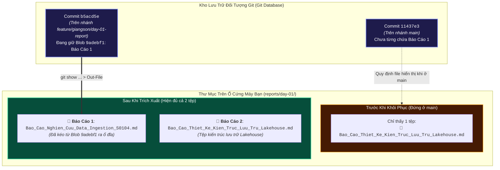

# NHẬT KÝ QUAN SÁT TỨC THỜI CỦA AGENT (Agent Working Snapshot)
> **Mục đích**: Ghi lại minh bạch **chính xác những gì Agent vừa xem, vừa đọc, vừa chạy ngầm** ở thời điểm làm việc hiện tại, kèm **hiển thị rõ ràng dòng lệnh đã chạy, output nguyên văn, bóc tách giải thích cặn kẽ và sơ đồ Mermaid trực quan theo ngữ cảnh thực tế (không rập khuôn)** để Người Dùng vừa kiểm soát hệ thống, vừa hiểu sâu bản chất kỹ thuật Git.

---

## 1. TÁC VỤ & LỆNH GHI NHẬN (Behind-The-Scenes Actions & Commands)
- **Thời điểm**: `2026-10-05 17:21:00`
- **Mục tiêu chặng này**: Giải đáp nguyên nhân vì sao người dùng mở thư mục `reports/day-01` trên máy chỉ thấy 1 tệp, đồng thời trích xuất khôi phục Báo cáo 1 từ kho Git ra ổ đĩa để cả 2 tệp xuất hiện song song ngay trước mắt.
- **Tác vụ thực hiện**:
  - Trích xuất tệp Báo cáo 1 từ nhánh `feature/giangson/day-01-report` ra thư mục làm việc:
    `git show feature/giangson/day-01-report:reports/day-01/Bao_Cao_Nghien_Cuu_Data_Ingestion_S0104.md`
  - Ghi vào: `reports/day-01/Bao_Cao_Nghien_Cuu_Data_Ingestion_S0104.md`
- **Lệnh chỉ-đọc Agent vừa thực thi ngầm**:
  - `git branch --show-current` (Kiểm tra nhánh hiện tại -> trả về `main`)
  - `git ls-tree feature/giangson/day-01-report reports/day-01/` (Kiểm tra blob trong commit)
  - `git status -s -b` (Kiểm tra trạng thái sau khi khôi phục)

---

## 2. SƠ ĐỒ TRỰC QUAN THEO NGỮ CẢNH: CƠ CHẾ ẨN FILE CỦA NHÁNH GIT & KHÔI PHỤC (MERMAID)

*(Áp dụng Trường hợp A: Cơ chế chuyển nhánh (Branching) và Trích xuất Object từ Commit Tree ra Working Directory)*



---

## 3. NGUYÊN VĂN ĐẦU RA TERMINAL & BÓC TÁCH HỌC TẬP (Raw Output & Learning Breakdown)

### 3.1. Lệnh `git branch --show-current`:
- **Đầu ra**: `main`
- **Bóc tách giải nghĩa**:
  - Máy bạn hiện đang kích hoạt (checkout) nhánh `main`.
  - **Quy tắc cơ bản của Git**: Mỗi nhánh là một không gian làm việc độc lập. Khi bạn ở nhánh `main`, Git sẽ làm cho thư mục trên máy bạn giống hệt như những gì đã commit trên `main`. Những tệp bạn chỉ commit ở nhánh `feature/giangson/day-01-report` sẽ **tự động bị ẩn đi** trên ổ đĩa để tránh lẫn lộn.
  - Đó chính là lý do bạn mở thư mục `C:\Users\Admin\Desktop\CT_Group_Intern_project\reports\day-01` chỉ thấy 1 file mới tạo.

### 3.2. Lệnh `git ls-tree feature/giangson/day-01-report reports/day-01/`:
- **Đầu ra nguyên văn**:
  ```text
  100644 blob 9adebf1aa47aea8605454eac8b7aba981069eca6	reports/day-01/Bao_Cao_Nghien_Cuu_Data_Ingestion_S0104.md
  ```
- **Bóc tách giải nghĩa**:
  - Lệnh này soi thẳng vào cơ sở dữ liệu ngầm của Git trên nhánh `feature/giangson/day-01-report`.
  - Kết quả chứng minh: Tệp `Bao_Cao_Nghien_Cuu_Data_Ingestion_S0104.md` vẫn tồn tại nguyên vẹn 100% (mã blob `9adebf1...`), không hề bị mất hay bị ghi đè.

### 3.3. Kết quả sau khi trích xuất ra đĩa:
- Thư mục `reports/day-01` hiện tại đã có đầy đủ 2 tệp:
  1. `Bao_Cao_Nghien_Cuu_Data_Ingestion_S0104.md` (19.098 bytes)
  2. `Bao_Cao_Thiet_Ke_Kien_Truc_Luu_Tru_Lakehouse.md` (18.915 bytes)

---

## 4. KẾT LUẬN & TRẠNG THÁI HIỆN TẠI
- Bạn hãy mở lại cây thư mục `reports/day-01` trên VS Code / File Explorer: **Cả 2 tệp báo cáo đã hiện diện rõ ràng song song**.
