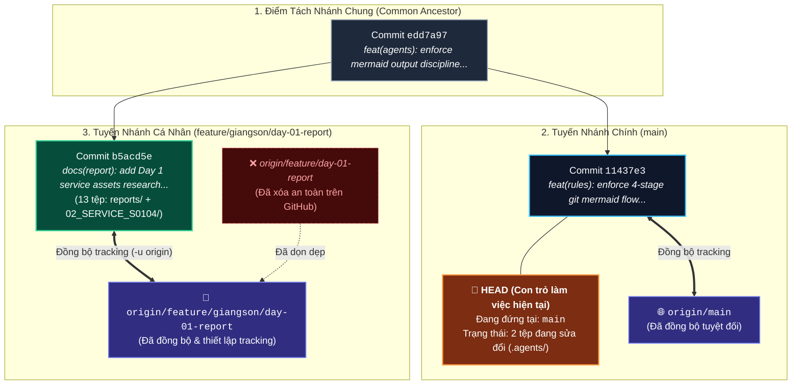

# NHẬT KÝ QUAN SÁT TỨC THỜI CỦA AGENT (Agent Working Snapshot)
> **Mục đích**: Ghi lại minh bạch **chính xác những gì Agent vừa xem, vừa đọc, vừa chạy ngầm** ở thời điểm làm việc hiện tại, kèm **hiển thị rõ ràng dòng lệnh đã chạy, output nguyên văn, bóc tách giải thích cặn kẽ và sơ đồ Mermaid trực quan theo ngữ cảnh thực tế (không rập khuôn)** để Người Dùng vừa kiểm soát hệ thống, vừa hiểu sâu bản chất kỹ thuật Git.

---

## 1. TÁC VỤ & LỆNH GHI NHẬN (Behind-The-Scenes Actions & Commands)
- **Thời điểm**: `2026-10-05 16:32:00`
- **Mục tiêu chặng này**: Cập nhật kỷ luật đa dạng hóa sơ đồ Mermaid theo ngữ cảnh Git thực tế (xóa bỏ vẽ cứng 4 trạm rập khuôn) và cập nhật sơ đồ Topology phân nhánh cho phiên làm việc của Giang Sơn.
- **Tác vụ Người Dùng vừa thực thi**:
  1. `git branch -m feature/giangson/day-01-report` (Đổi tên nhánh local)
  2. `git push -u origin feature/giangson/day-01-report` (Đẩy nhánh cá nhân lên GitHub)
  3. `git push origin --delete feature/day-01-report` (Dọn dẹp nhánh cũ trên GitHub)
  4. `git checkout main` (Chuyển về nhánh chính)
- **Lệnh chỉ-đọc Agent vừa thực thi ngầm**:
  - `git status -s -b` (Kiểm tra trạng thái nhánh hiện tại & tệp sửa đổi)
  - `git branch -a` (Kiểm tra toàn bộ nhánh local & remote)
  - `git log -n 5 --oneline --graph --all` (Quét cây phân nhánh commit)

---

## 2. SƠ ĐỒ TRỰC QUAN THEO NGỮ CẢNH: TOPOLOGY PHÂN NHÁNH & LIÊN KẾT REMOTE (MERMAID)

*(Áp dụng Trường hợp A - Thao tác Nhánh & Đồng bộ Remote: Trực quan hóa cấu trúc rẽ nhánh thực tế, vị trí con trỏ `HEAD` và sự khác biệt giữa Local vs GitHub)*



---

## 3. NGUYÊN VĂN ĐẦU RA TERMINAL & BÓC TÁCH HỌC TẬP (Raw Output & Learning Breakdown)

### 3.1. Lệnh `git branch -a` (Kiểm tra mạng lưới nhánh):
- **Đầu ra nguyên văn**:
  ```text
    feature/giangson/day-01-report
  * main
    remotes/origin/HEAD -> origin/main
    remotes/origin/feature/giangson/day-01-report
    remotes/origin/main
  ```
- **Bóc tách giải nghĩa cho người mới**:
  1. Dấu sao `*` trước `main`: Báo hiệu con trỏ `HEAD` đang ở nhánh `main`. Mọi thao tác commit tiếp theo sẽ gắn vào `main`.
  2. `feature/giangson/day-01-report`: Nhánh cục bộ (Local Branch) lưu trên ổ cứng của bạn.
  3. `remotes/origin/feature/giangson/day-01-report`: Nhánh tham chiếu từ xa (Remote Tracking Branch), phản ánh chính xác trạng thái trên máy chủ GitHub.
  4. Nhánh cũ `feature/day-01-report` đã hoàn toàn biến mất trên cả Local và Remote.

### 3.2. Lệnh `git log -n 5 --oneline --graph --all` (Cây phân nhánh commit):
- **Đầu ra nguyên văn**:
  ```text
  * 11437e3 feat(rules): enforce 4-stage git mermaid flow in observations and update agent core
  | * b5acd5e docs(report): add Day 1 service assets research and data ingestion strategy
  |/  
  * edd7a97 feat(agents): enforce mermaid output discipline and reorganize architecture assets
  * 36bdbd9 initial project
  * 1cdd6f1 docs(readme): add comprehensive agent pair programming guide for all 3 members
  ```
- **Bóc tách giải nghĩa cho người mới**:
  1. Ký hiệu `|/`: Đây là điểm rẽ nhánh (Fork). Tại commit `edd7a97`, lịch sử được tách làm 2 nhánh độc lập:
     - Nhánh bên phải `b5acd5e`: Chứa báo cáo Ngày 1 và tài liệu S0104 của Giang Sơn.
     - Nhánh bên trái `11437e3`: Chứa các quy tắc chuẩn hóa Agent của toàn đội.
  2. Hai nhánh hoạt động độc lập giúp báo cáo của bạn được bảo vệ riêng biệt, sẵn sàng tạo Pull Request (PR) sau này mà không bị xung đột với mã nguồn của các thành viên khác.

### 3.3. Lệnh `git status -s -b` (Trạng thái rút gọn cây làm việc):
- **Đầu ra nguyên văn**:
  ```text
  ## main...origin/main
   M .agents/AGENTS.md
   M .agents/rules/mermaid_output_discipline.md
  ```
- **Bóc tách giải nghĩa**:
  - `## main...origin/main`: Bạn đang ở nhánh `main` và đang đồng bộ hoàn toàn với remote (`origin/main`).
  - ` M` (chữ M lùi một khoảng trắng): Tệp đã bị chỉnh sửa trong **Working Directory** nhưng **chưa đưa vào Staging Area** (chưa chạy `git add`).

---

## 4. KẾT LUẬN & ĐỀ XUẤT BƯỚC TIẾP THEO
- Toàn bộ thay đổi về quy tắc kỷ luật đa dạng hóa sơ đồ Mermaid đã được cập nhật chuẩn xác vào `.agents/AGENTS.md`, `.agents/rules/mermaid_output_discipline.md` và `scratch/agent_observations.template.md`.
- Sơ đồ trực quan tại sổ tay này đã chuyển đổi linh hoạt sang **Sơ đồ Topology Nhánh & Remote Tracking**, loại bỏ triệt để tính rập khuôn.
