# NHẬT KÝ QUAN SÁT TỨC THỜI CỦA AGENT (Agent Working Snapshot)
> **Mục đích**: Ghi lại minh bạch **chính xác những gì Agent vừa xem, vừa đọc, vừa chạy ngầm** ở thời điểm làm việc hiện tại, kèm **hiển thị rõ ràng dòng lệnh đã chạy, output nguyên văn, bóc tách giải thích cặn kẽ và sơ đồ Mermaid trực quan luồng 4 trạm Git** để Người Dùng vừa kiểm soát hệ thống, vừa hiểu sâu bản chất kỹ thuật Git.

---

## 1. TÁC VỤ & LỆNH VỪA GHI NHẬN (Behind-The-Scenes Actions & Commands)
- **Thời điểm**: `2026-10-05 16:18:50`
- **Tác vụ Người Dùng vừa thực thi thành công**:
  1. `git add reports/ 02_SERVICE_S0104/`
  2. `git commit -m "docs(report): add Day 1 service assets research and data ingestion strategy"`
  3. `git branch -m feature/giangson/day-01-report` (Đổi tên nhánh local sang tên Giang Sơn)
  4. `git push -u origin feature/giangson/day-01-report` (Đẩy nhánh mới lên GitHub)
  5. `git push origin --delete feature/day-01-report` (Xóa nhánh cũ trên GitHub)
- **Tác vụ Agent vừa cập nhật**:
  - Bổ sung quy định bắt buộc vẽ sơ đồ Mermaid luồng 4 trạm Git vào `.agents/AGENTS.md`, `.agents/rules/mermaid_output_discipline.md` và mẫu template `scratch/agent_observations.template.md`.

---

## 2. SƠ ĐỒ TRỰC QUAN LUỒNG 4 TRẠNG THÁI GIT (MERMAID FLOW)

```mermaid
flowchart LR
    %% =========================================================================
    %% SƠ ĐỒ BẢN ĐỒ DỮ LIỆU GIT 4 TRẠM: TỪ MÁY CÁ NHÂN LÊN GITHUB
    %% =========================================================================

    subgraph WD ["1. Working Directory<br/><i>(Thư mục làm việc trên máy)</i>"]
        direction TB
        WD_Files["Các tệp cấu hình Agent đang sửa:<br/>• <code>.agents/AGENTS.md</code><br/>• <code>.agents/rules/mermaid_output_discipline.md</code><br/>• <code>docs/architecture/</code>"]
    end

    subgraph SA ["2. Staging Area<br/><i>(Vùng đệm chờ Commit - Index)</i>"]
        direction TB
        SA_State["Trạng thái hiện tại:<br/><b>ĐÃ COMMITTED HẾT</b><br/><i>(Không có tệp nào đang xếp hàng)</i>"]
    end

    subgraph LR ["3. Local Repository<br/><i>(Kho lưu trữ trên máy cá nhân)</i>"]
        direction TB
        LR_Commit["Commit mã <code>b5acd5e</code><br/>Nhánh: <code>feature/giangson/day-01-report</code><br/>• 13 tệp reports & data S0104"]
    end

    subgraph RR ["4. Remote Repository<br/><i>(Máy chủ GitHub: chickenitcode/Skylink)</i>"]
        direction TB
        RR_Branch["Nhánh Remote đã cập nhật:<br/>🚀 <code>origin/feature/giangson/day-01-report</code><br/>❌ <i>Đã xóa: origin/feature/day-01-report</i>"]
    end

    %% Các mũi tên biểu thị thao tác vừa diễn ra
    WD -. "1. git add" .-> SA
    SA -. "2. git commit" .-> LR
    LR == "3. git push -u origin" ==> RR

    classDef stageNode fill:#0f172a,stroke:#38bdf8,stroke-width:1.5px,color:#ffffff;
    classDef activeNode fill:#064e3b,stroke:#34d399,stroke-width:2px,color:#ffffff;
    classDef remoteNode fill:#1e1b4b,stroke:#818cf8,stroke-width:2px,color:#ffffff;

    class WD,SA stageNode;
    class LR activeNode;
    class RR remoteNode;
```



---

## 3. NGUYÊN VĂN ĐẦU RA TERMINAL & BÓC TÁCH HỌC TẬP (Raw Output & Learning Breakdown)

### 3.1. Thao tác Commit Báo cáo Nghiên cứu:
- **Đầu ra nguyên văn**:
  ```text
  [feature/day-01-report b5acd5e] docs(report): add Day 1 service assets research and data ingestion strategy
   13 files changed, 231 insertions(+), 6 deletions(-)
   create mode 100644 02_SERVICE_S0104/S0104_00_RESEARCH_WORKBOOK.xlsx
   create mode 100644 02_SERVICE_S0104/S0104_01_Service_Knowledge_Base.docx
   ...
   create mode 100644 reports/day-01/Bao_Cao_Nghien_Cuu_Data_Ingestion_S0104.md
  ```
- **Bóc tách giải nghĩa**:
  - Dữ liệu báo cáo và 11 tệp S0104 đã được đóng gói thành công thành commit mang mã băm ngắn `b5acd5e`. Dữ liệu đã chuyển an toàn từ **Staging Area** vào **Local Repository**.

### 3.2. Thao tác Đổi tên Nhánh & Xóa Nhánh Cũ trên GitHub:
- **Đầu ra nguyên văn**:
  ```text
  To https://github.com/chickenitcode/Skylink.git
   * [new branch]      feature/giangson/day-01-report -> feature/giangson/day-01-report
  branch 'feature/giangson/day-01-report' set up to track 'origin/feature/giangson/day-01-report'.

  To https://github.com/chickenitcode/Skylink.git
   - [deleted]         feature/day-01-report
  ```
- **Bóc tách giải nghĩa**:
  1. `git branch -m`: Nhánh ở máy cá nhân (Local) đổi tên tức thì từ `feature/day-01-report` thành `feature/giangson/day-01-report`.
  2. `git push -u origin`: Toàn bộ lịch sử commit đã được đồng bộ lên **Remote Repository** trên GitHub và thiết lập tracking.
  3. `git push origin --delete`: Nhánh cũ không có tên bạn đã bị dọn dẹp khỏi máy chủ GitHub, kho lưu trữ giữ được sự sạch sẽ tuyệt đối.

---

## 4. KẾT LUẬN & TRẠNG THÁI HIỆN TẠI
- Nhánh làm việc của Giang Sơn trên GitHub: `feature/giangson/day-01-report` đã chứa đầy đủ báo cáo Ngày 1 và 11 tệp S0104.
- Nhánh `main` sẵn sàng nhận các tệp cấu hình Agent khi bạn muốn commit tiếp.
