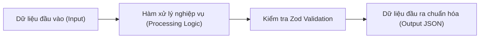

# 📋 BÁO CÁO REVIEW MÃ NGUỒN, WORKFLOW & LATENCY (Code Generation Audit Template)

> **Mục đích**: Báo cáo kiểm định chất lượng kỹ thuật bắt buộc sau mỗi lần Agent tạo mới hoặc chỉnh sửa mã nguồn. Ghi lại minh bạch 3 phần: **Review Code (5 tiêu chí)**, **Sơ đồ Workflow (Mermaid Flow)**, và **Đo đạc Tốc độ / Latency (ms) thực tế**.

---

## 1. THÔNG TIN MÃ NGUỒN VỪA TẠO / SỬA ĐỔI
- **Thời điểm**: `YYYY-MM-DD HH:mm:ss`
- **Tệp mã nguồn tác động**: `[Đường dẫn tệp, ví dụ: knowledge/scripts/extract_s0104_canonical.ps1]`
- **Mục tiêu kỹ thuật**: `[Mô tả chức năng đoạn code vừa giải quyết]`
- **Công nghệ / Ngôn ngữ**: `[TypeScript / PowerShell / Python / SQL]`

---

## 2. BẢNG REVIEW CODE REPORT CARD (5 TIÊU CHÍ CHUẨN MỰC)

| STT | Tiêu chí Kiểm định | Chi tiết Đánh giá từ Senior AI Reviewer | Kết quả |
| :---: | :--- | :--- | :---: |
| **1** | **Logic & Độ Đúng Đắn** | • Kiểm tra null/undefined, mảng rỗng, Promise unhandled.<br/>• Đối chiếu Zod Schema DTO hợp đồng dữ liệu. | `PASS` / `WARN` |
| **2** | **Bảo Mật & Guardrails** | • Kiểm tra rò rỉ dữ liệu `restricted` (Bảng giá Tệp 7).<br/>• Kiểm tra RBAC permissions và ẩn raw vector score. | `PASS` / `BLOCK` |
| **3** | **Hiệu Năng & Big-O** | • Phân tích độ phức tạp thời gian $O(N)$ và bộ nhớ RAM.<br/>• Kiểm tra nguy cơ N+1 query hoặc rò rỉ buffer. | `PASS` / `OPTIMIZE` |
| **4** | **Kiến Trúc & Phân Lớp** | • Tuân thủ chuẩn Controller ➔ Service ➔ Repository.<br/>• TypeScript Strict (`noImplicitAny`, type tường minh). | `PASS` / `WARN` |
| **5** | **Khả Năng Kiểm Thử** | • Code có tính modular, dễ viết Unit Test & Mocking. | `PASS` / `WARN` |

- **Bản Diff Trực quan (So sánh Trước vs Sau nếu có refactoring)**:
  ```diff
  - // Đoạn code cũ có nguy cơ rủi ro
  + // Đoạn code mới đã được tối ưu và kiểm định
  ```
- **Phán quyết Review (Review Verdict)**: `APPROVED` (Đạt chuẩn) | `NEEDS_REVISION` (Cần chỉnh sửa) | `BLOCKED` (Chặn).

---

## 3. SƠ ĐỒ WORKFLOW & LUỒNG DỮ LIỆU (MERMAID FLOW)

*(Vẽ sơ đồ Mermaid trực quan hóa luồng xử lý hoặc chuỗi gọi hàm của đoạn code vừa tạo)*



---

## 4. ĐO ĐẠC & ĐÁNH GIÁ TỐC ĐỘ / LATENCY THỰC TẾ (BENCHMARKING)

- **Công cụ đo đạc**: `[Stopwatch / performance.now() / autocannon]`
- **Bảng phân bổ độ trễ từng mắt xích (Latency Hop Breakdown)**:

| Mắt xích xử lý | Thời gian đo thực tế (ms) | SLA Trần cho phép (ms) | Đánh giá Hiệu năng |
| :--- | :---: | :---: | :---: |
| **1. Đọc I/O từ ổ cứng** | `... ms` | `< 30 ms` | 🟢 PASS |
| **2. Bóc tách & Parse dữ liệu** | `... ms` | `< 80 ms` | 🟢 PASS |
| **3. Validate Zod Schema** | `... ms` | `< 10 ms` | 🟢 PASS |
| **4. Ghi file / Nạp Database** | `... ms` | `< 30 ms` | 🟢 PASS |
| **TỔNG THỜI GIAN THỰC THI** | **`... ms`** | **`< 150 ms`** | 🚀 **ĐẠT SLA** |

- **Kết luận Hiệu năng (Latency Verdict)**: `PASS` 🟢 hoặc `BOTTLENECK` 🔴 (kèm phương án khắc phục nếu vượt ngưỡng).
